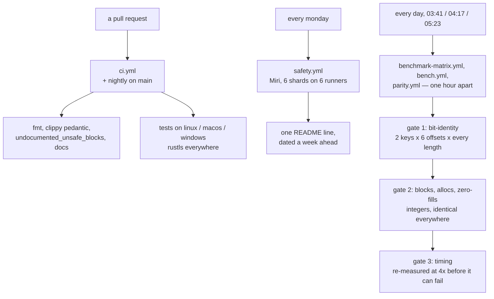

# Ferrox

FERROX — Fast Efficient Relay Router Overlay X: *ferro*, iron, for Rust; *X*, for Xray.

A from-scratch proxy core, built to be **bit-identical to the implementations it replaces** and **verifiably not slower than any of them**.

## Status

Every row names the run that produced it. Per-architecture rows come from jobs whose names state the architecture.

| claim | checked by | verdict |
| --- | --- | --- |
| compiles | `ci.yml`: `cargo test --workspace` on linux x86_64, macos aarch64, windows x86_64; `clippy` clean under `pedantic` | green |
| `record::fill_exact` bit-identical | `bench.yml` gate 1 — 7200 shapes per runner over both entry points, `fill_exact` and `fill_exact_with_head` (every byte 0–256 then M-1/M/M+1 per multiple), on all four runners | green |
| `chacha::avx2`, `chacha::sse2` executed | `bench.yml` gates 1 and 2, 7200 shapes on both `x86_64` runners | green |
| not slower at any measured length ≥ 65 B | `bench.yml` gate 3, 235 of 300 lengths; 1–64 B are a tie by construction, identity-checked only | green |
| `VLESS` request header encode | `bench.yml` gate 4, three address families: bytes asserted equal before timing; counts and identity green, no timed CI verdict yet | partial |
| aarch64 `AES-GCM` backends | `aes`/`polyval` ARMv8-Crypto selected via `--cfg aes_armv8 --cfg polyval_armv8`, with runtime dispatch to soft code; 173 tests green under `-D warnings`. Soft → hardware on an M2: `VMess` header seal 1228 → 101 ns, client request 10289 → 7101 ns, `Cipher::Aes` 8 KB frame 45008 → 3745 ns; `SHA-256` `kdf` unmoved at 1130 ns. Timings measured locally, checked by no CI job; the `macos aarch64` job proves bit-identity on the hardware path | green locally |
| TLS backend | `rustls`, built in `ci.yml`; `tls::rustls_backend::tests::handshake_connects_and_echoes`, `…mismatched_certificate_name_fails`, `…refused_alpn_fails` | green |
| `?ed=N` early data on `ws` / `httpupgrade` | one parse (`transport::EarlyData`) for both roles, under one allocation per encode; both `xray-rust` oracle rows green in `conformance.yml` `37249695646`. See [`docs/function/early-data.md`](docs/function/early-data.md) | green |
| upstream conformance | 2 of 12 pinned suites run against `ferrox-app`, by `conformance.yml`: `zeronet` 8 of 17 `xray_oracle`, `xray-rust` 7 of 23 `local_xray_interop_tests`, each count checked by `run-upstream-suite.sh` against libtest's `running N tests`. The other ten have no seam — [`docs/conformance.md`](docs/conformance.md) | green for the subset |
| upstream pins | twelve sources pinned by commit; `check-upstream-pins.sh` resolves all twelve in `pins.yml`, and `run-upstream-suite.sh` finds each of the twelve `path` fields present at its rev. `upstream/` checkouts are re-derived by `fetch-upstream.sh` and never committed | green |
| memory safety | Miri nightly on the safe-Rust core, 6 shards on 6 runners: PASS 2026-10-05 — next check 2026-10-12 03:11 UTC (SIMD cores: differential test, not Miri) |
| parsers never panic on untrusted bytes | `cargo test --workspace`: 4096 seeded cases each over `mux::decode`, `VlessLink::parse`, `Addr::take` (exhaustive: 256 families × every length), `EarlyData::split` and the config reader; `mux::decode` additionally may never report a consumed count past its input. Seeded by `SplitMix64` and printed on failure, so a red run replays on any machine. `cargo test -p ferrox-core --test parsers` | green |
| dependency licence and provenance | `deny.toml` over the resolved graph in `deps.yml` (`cargo-deny check advisories bans licenses sources`), plus the manifest half in `scripts/check-dependency-policy.sh`, which `ci.yml` and `check.sh` both run. `sing-box` (GPL-3.0) and `v2ray-rust` are refused as dependencies; comparators are read at their pins under `upstream/` | green |
| claim audit | every claim with its checker and verdict: [`docs/claims.md`](docs/claims.md). Audited by hand; nothing runs the audit | read |

## What is claimed

| claim | checked by |
| --- | --- |
| byte-identical output, every length, every device | differential test against the pinned reference, run before any timing |
| no worse than 0.95x of the reference at any measured length from 65 B up; 1–64 B are a tie by construction | benchmark gate over the timed sweep; one regressing length fails the job, after a re-measure |
| no use-after-free, no leak | Miri nightly for safe-Rust paths; differential tests for the rest |
| no work generated and discarded | the ladder returns the blocks it generated; gate 2 compares that against `ceil(len / 64)` at every length and offset |
| no heap allocation, no zero-fill | counting global allocator, gated at exactly 0 |
| the `VMess` auth id key is expanded once per session, not per connection | `AuthKey` in `crates/ferrox-app/src/vmess.rs`; **no timed gate** — a count of operations, not a number |

Not claimed: that this is the fastest implementation. A benchmark measures a configuration at a point in time and decays. What is built instead is the machinery that notices — `bench.yml` runs daily on one native runner per ISA and fails on any regressing length. See [`docs/methodology.md`](docs/methodology.md).

## Benchmarks: five engines, one matrix

<!-- benchmark-matrix:start -->
_First full matrix run pending — this section fills in when the daily
`benchmark-matrix.yml` refresh lands. See [`docs/benchmarks/matrix.md`](docs/benchmarks/matrix.md) for the catalog._
<!-- benchmark-matrix:end -->

## How it is built

```bash
./scripts/check.sh    # fmt, clippy, doc, the three gates, the prompt library, tests
```

That is what `ci.yml` runs, and running it first is how a lint stops costing a queue. **Nothing here runs on a merge.** A merge cannot break anything a pull request did not already prove, so every gate fires on the pull request and `main` is covered by schedules instead. That also means the two workflows that push to `main` themselves no longer start four runners each time they publish a row.

`ci.yml` gates a pull request that touches Rust, and it has a `paths` filter, so a Markdown edit outside `crates/` starts nothing. `prompts.yml` covers the one Markdown file with a build attached. `pins.yml` spends twelve clones only when `upstream/pins.toml` changes, and `deps.yml` reads the dependency graph only when a manifest does. `compare.yml` and `speedtest.yml` are dispatch-only. `bench.yml`, `parity.yml` and `benchmark-matrix.yml` are dispatch-only plus a **daily** cron — one hour apart, so they never read each other's load as a regression. `benchmark-matrix.yml` and `conformance.yml` also fire on a pull request touching Rust. `safety.yml` interprets Miri **once a week**, split across six runners so it is the slowest shard rather than all of them in sequence.

What is left in CI exists because a laptop cannot answer it: a number is only evidence on a runner whose architecture is named in the job, because a number produced locally describes the machine that produced it.



**One algorithm, four widths.** The record layer is a single generic function over a `Lanes` trait, instantiated for portable arrays, NEON, SSE2 and AVX2, so backends execute the *same source* and cannot disagree about the algorithm. Because the portable backend is safe Rust, Miri interprets the ladder, the counter arithmetic and every store offset through it, leaving the SIMD modules five instructions each whose only failure mode is a wrong answer.

| backend | blocks per iteration | Miri |
| --- | --- | --- |
| portable `[u32; 4]` | 4 | yes, in full |
| NEON `uint32x4_t` | 8 | no — differential test |
| SSE2 `__m128i` | 1 (the one-block tail) | yes, in full |
| AVX2 `__m256i` | 8 (two states per register) | no — differential test |

Rewrite, not port: the minimal subset covering the matrix — a superset of connection ways, a subset of code — proven faster down to the parsing. Fixes leave no trace: one line of comment per item at most, no changelogs. The full philosophy is the shared protocol in [`prompts.md`](crates/ferrox-prompt/prompts.md); the comment rule is checked by `scripts/check-comments.sh`.

**The reference is not as fast as it looks.** `chacha` 0.9.1 selects NEON behind a cfg nothing sets, so on aarch64 it runs a scalar one-block core while on x86_64 it runs four-block AVX2. Much of any aarch64 speedup is the reference not using its SIMD path, not this repository's work — so every report prints both backends in the header. A ratio quoted without both names is not a measurement.

**Which one-block core is fastest is a question about the CPU, not the ISA.** One ChaCha block is a dependency chain with nothing to overlap, and the vector rotates sit between every pair of rounds on the critical path — so a core with one vector pipe pays for them in latency where one with spare issue slots does not. That is not something `CPUID` reports, and aarch64 servers, phones and desktops disagree about it. `chacha/calibrate.rs` measures both cores once per process and memoises the answer in an `AtomicU8`; a tie inside 5 % goes to the scalar core, which is the architecture-neutral one and the one Miri interprets. The clock read cannot reach the output — both cores are the same twenty rounds through the same generic function, which is why that file is the core's second named exception in `scripts/check-leak-surface.sh` and why being wrong is a performance bug and never a correctness one.

**One TLS stack, one interface.** `TlsProvider` is implemented by the rustls backend, and the provider *is* `Read + Write`, so nothing above can depend on the stack underneath. There is no feature to select and no build without TLS.

**Quiche is the default QUIC, not a preference.** When a rung needs QUIC — `superset.md` rows 8 and 9 — the stack is **quiche**, whenever available and feasible. A rung may choose something else only where an alternative has a faster or safer implementation *for that specific thing*, and the diff says which rung, which library, and the measurement that made it win; "quinn was easier to write" is not a reason. quiche is preferred because it already ships and runs at scale what most of those rows need (HTTP/3, 0-RTT, connection migration, key updates, batched datagram I/O).

Details: [`chacha-xor-blocks.md`](docs/function/chacha-xor-blocks.md), [`unsafe-policy.md`](docs/unsafe-policy.md), [`tls-provider.md`](docs/function/tls-provider.md), [`early-data.md`](docs/function/early-data.md).

## Goals

**1 — prove everything shipped is faster and leaner.** Bit-identical output, fewer operations, zero surviving copies, no allocation. The math in [`unsafe-policy.md`](docs/unsafe-policy.md), the method in [`methodology.md`](docs/methodology.md). Most of this is done and gated. Durations suggest; counts prove: instruction counts are gated exact in [`operation-counts.md`](docs/function/operation-counts.md), because a diff that removes one operation changes a number every runner reproduces, while a faster stopwatch changes nothing checkable. No new hot path lands without its counts written down first.

**2 — be a drop-in replacement for Xray-core and sing-box.** Not "implement their protocols": take their pinned repositories' own test suites, run them unmodified against a Ferrox binary in CI, and get them green. That is the only claim of this kind worth making, and it is checked by [`conformance.md`](docs/conformance.md) — currently **2 of 12** pins, and both of the two with a seam. Every way either can connect parses and every protocol surface it serves dials, one rung at a time, each with its differential proof and its benchmark gate.

**3 — be a drop-in replacement for zeptun**, the `tun2socks` engine: `TUN` to TCP/UDP/ICMP through a SOCKS5 or direct handler, `userspace` / `hybrid` / `system` stacks. Goal 2 first — zeptun is a subset of the same record path plus one device.

**4 — be feature-complete in what quiche, slipstream and aether are ahead on.** QUIC and MASQUE, DNS-tunnel carriers, nested tunnels, multi-path schedulers, domain fronting. These are **not** drop-in targets: they are libraries and product surfaces, licensed differently and shaped differently, and matching their CLIs would be a worse use of this tree than having the capability. They are read for the technique and implemented on Ferrox's own terms.

**5 — spoof SNI without root.** DPI circumvention by injecting a fake TLS ClientHello carrying an allowlisted SNI ahead of the real handshake. `VpnService` TUN plus a userspace TCP stack does it in user space: no `CAP_NET_RAW`, no `SOCK_RAW`, no root on Android. Nothing in CI checks this yet.

```bash
cargo run -p ferrox-bench -- --config 'vless://...'   # the comparison table for a link
cargo run -p ferrox-app -- check 'vless://...'     # parse offline; `run` dials TCP, sends nothing
```

Offline by default; a live comparison needs `live=true` in `compare.yml`, which is dispatch-only. Credentials never reach a report.

## Connection methods: every way, who supports it

Every row parses, exactly one dials today, and a row moves to dials only with its differential proof and its benchmark gate. The `Ferrox` column is read from `vless::support()` / `transport.rs` where a `vless://` link can express the row; the rest mirror `transport.rs` until their rung lands. `Supported today by` means the pinned rev contains that transport — not that CI runs it.

Upstream suites are never copied here (licence-clean): sing-box is GPL-3.0, Xray-core/xray-rust are MPL-2.0, PattNG is GPL-3.0, Aether is AGPL-3.0, mqvpn/slipstream are Apache-2.0, quiche is BSD-2.0, zeptun/ZeroNet are MIT.

Twelve pins, all resolving, all re-derivable by `scripts/fetch-upstream.sh`:
`xray-core` (`b26a91de`), `sing-box` (`c9922979`), `amneziawg-go` (`b5928efb`),
`amnezia-client` (`94b51df2`), `xray-rust` (`7a4fb2dd`, `crates/`), `pattng` (`ad6f747c`, `V2rayNG/`),
`zeronet` (`97a99734`, `crates/`), `mqvpn` (`b11a2f69`), `aether` (`21e7150a`),
`zeptun` (`5620e57c`), `slipstream` (`397850b1`), `quiche` (`3fc9bc1c`, `quiche/`, `master`).
Quiche is pinned as the default QUIC for the MASQUE/H3 rungs, not a preference.

Read but not pinned (learnings only): `WhiteDNS/CottenDNS`, `masterking32/MasterDnsVPN`, `mlmvpn/mlmvpn_android`, and the local `configer` project.

### A — proxy protocols (the share-link world)

| # | method | Ferrox | supported today by |
| --- | --- | --- | --- |
| 1 | VLESS TCP REALITY `xtls-rprx-vision` | implemented (`vless-tcp-reality-vision`) | Xray-core, sing-box, xray-rust, PattNG, ZeroNet/Zray |
| 2 | VLESS TCP TLS (Vision optional) | planned | Xray-core, sing-box, xray-rust, PattNG, ZeroNet |
| 3 | VLESS TCP none, private/loopback only | implemented (`vless-tcp-none`, plus `UDP` over raw `TCP` both roles) | Xray-core, sing-box, xray-rust, PattNG, ZeroNet |
| 4 | VLESS/TROJAN `security=none` to public (PattNG ext.) | unsafe opt-in (`allow_plaintext_to_public`) | PattNG only — upstream Xray-core refuses it |
| 5 | TROJAN TCP TLS | implemented (`trojan-tcp`, raw `TCP` only, plus `UDP ASSOCIATE` over raw `TCP` both roles) (conformance 37132662374) | Xray-core, sing-box, PattNG, ZeroNet |
| 6 | VMess TCP (AEAD) | implemented (`vmess-tcp-aead`, plus `UDP` over raw `TCP` both roles) | Xray-core, sing-box, PattNG, ZeroNet — xray-rust explicitly has none |
| 7 | Shadowsocks TCP/UDP (+2022) | implemented (three ciphers, every `Xray-core` spelling, `UDP` both roles; no `2022`) (conformance 37132662374) | Xray-core, sing-box, PattNG, ZeroNet |
| 8 | VLESS over WS / XHTTP / gRPC / HTTPUpgrade / HTTP masquerade | implemented, one rung each | Xray-core, sing-box, PattNG, ZeroNet — xray-rust TCP only |
| 9 | VLESS over QUIC (dial) | implemented, pooled one handshake per server; serve refused | quiche pin |
| 10 | KCP and the rest (Hysteria / TUIC / AnyTLS / ShadowTLS / Snell / Naive / SSH / OpenConnect/OpenVPN) | refused with a reason | sing-box, Xray-core (`proxy/hysteria`), PattNG |
| 11 | `cipherSuites` + `unsafe-*` fingerprints (PattNG ext.) | unsafe opt-in (`allow_unsafe_fingerprint`) | PattNG only — parsed and carried, never default |
| 12 | `?ed=N` early data on `ws` / `httpupgrade`, both roles | implemented (`EarlyData`) | Xray-core, sing-box, xray-rust, PattNG, ZeroNet — the only row where all four carry it and this tree carried none |

### B — PattNG in full (what the fork wires)

| # | method | Ferrox | supported today by |
| --- | --- | --- | --- |
| 13 | `PROXYCHAIN` ordered member list | planned (see chaining below) | PattNG only — at most one `AETHER` member per chain |
| 14 | `POLICYGROUP` / routing groups | planned | PattNG only |
| 15 | Psiphon client as its own program (`AETHER_PSIPHON_BIN`) | planned | PattNG, mlmvpn |
| 16 | Pluggable transports via lyrebird (`obfs4` / `snowflake` / `webtunnel` / `meek`) | planned | PattNG, Aether |
| 17 | hev-socks5-tunnel TUN (`libhev-socks5-tunnel.so`) | planned | PattNG |

### C — VPN / tunnel carriers

| # | method | Ferrox | supported today by |
| --- | --- | --- | --- |
| 18 | WireGuard (UDP) | planned (rung 9) | Xray-core, sing-box, Aether, PattNG, ZeroNet WARP paths, mlmvpn |
| 19 | AmneziaWG (WireGuard with obfuscation) | planned | amneziawg-go, amnezia-client, mlmvpn |
| 20 | MASQUE CONNECT-IP over QUIC, RFC 9484 | planned (rung 9, quiche by default) | mqvpn, Aether, sing-box, Xray-core, PattNG, configer `masque` lane |
| 21 | MASQUE over HTTP/3 vs HTTP/2 carriers | planned | Aether, mqvpn, configer |
| 22 | Multipath QUIC, draft-ietf-quic-multipath | planned | mqvpn, slipstream, quiche |
| 23 | quiche itself: QUIC + HTTP/3, 0-RTT, migration, key updates, batched datagram I/O | planned (provider, not a lane) | quiche pin |
| 24 | Multipath schedulers `minrtt` / `wlb` / `wlb_udp_pin` / `backup-fec` | planned | mqvpn |
| 25 | Hybrid TCP lane (local TCP termination over an H3 request stream) | planned | mqvpn |
| 26 | Reorder buffer (datagram lane) + reinjection (`deadline` / `idle` / `dgram`) | planned | mqvpn |
| 27 | Nested WireGuard (`gool`, two hops) | planned | Aether |
| 28 | Nested MASQUE (`mim`, tunnel inside a tunnel) | planned | Aether |
| 29 | TCP-over-DNS covert channel (base32 domain + TXT) | planned | slipstream |
| 30 | Multi-resolver parallel + port-53 impersonation, DCUBIC/BBR | planned | slipstream |
| 31 | tun2socks engine (TUN to TCP/UDP/ICMP; `userspace` / `hybrid` / `system` stacks) | planned | zeptun |

### D — DNS-tunnel ways (learned from CottenDNS / MasterDnsVPN, not pinned)

Custom ARQ, ~5–7 B header overhead, session multiplexing; compatibility kept across the MasterDNS/StormDNS/CottenDNS lineage (MIT).

| # | method | Ferrox | learned from |
| --- | --- | --- | --- |
| 32 | DNS carriers UDP/53 + TCP/53 + DoT/853 + DoH/443, per-resolver `auto` / `udp` / `tcp` / `dot` / `doh` + per-path override | planned | CottenDNS |
| 33 | Record-type rotation + QNAME reshaping + ID/cookie randomization | planned | CottenDNS |
| 34 | Reliability: ARQ + ACK/NACK, adaptive duplication, Reed-Solomon FEC, MTU discovery, ZSTD/LZ4/ZLIB, request packing | planned | CottenDNS, MasterDnsVPN |
| 35 | Balancing across resolvers: round-robin / least-loss / lowest-latency / hybrid + health checks, failover | planned | CottenDNS, MasterDnsVPN |
| 36 | Local DNS service + cache + DNS-over-SOCKS5 + hijack guards; SOCKS4/5 with auth; CIDR resolver lists | planned | CottenDNS, MasterDnsVPN |
| 37 | Server egress direct / upstream-SOCKS5 chaining + flood/abuse protection | planned | CottenDNS, MasterDnsVPN |
| 38 | Encryption methods 0–5 (none / XOR / ChaCha20 / AES-128/192/256-GCM) + auto-detect | planned | CottenDNS |

### E — circumvention engines (learned from mlmvpn_android, not pinned)

| # | method | Ferrox | learned from |
| --- | --- | --- | --- |
| 39 | SoftEther / L2TP + WireGuard via `kittoku`; VPN Gate public relays | planned | mlmvpn |
| 40 | GST / EDG relay engines; GitHub Tunnel + Quick Connect pool; OpenVPN with TunnelBear | planned | mlmvpn |
| 41 | MLM Adaptive Engine: per-app route learning on one Xray tunnel + 5-step repair ladder | planned | mlmvpn |
| 42 | Config Studio + Config Arena: user Cloudflare Worker panel raced across panels on one clean IP | planned | mlmvpn |
| 43 | Game Booster: DNS/latency racing + pass-through DNS-only VPN | planned | mlmvpn |
| 44 | Sanction-domain smart routing | planned | mlmvpn |
| 45 | Server-less domain fronting (on-device CA, local TLS termination, re-establish under unblocked SNI) | planned | mlmvpn |
| 46 | Serverless / mihomo / superdns / pdoq / openvpn / http-injector / tunnel-wg / oblivion / auto lanes | planned | configer |
| 47 | Three-tier Emergency fallback | planned | mlmvpn |

### F — configer `https-proxy` (free) + `foxy` lanes (learned, not pinned)

| # | method | Ferrox | learned from |
| --- | --- | --- | --- |
| 48 | Free HTTPS-proxy lane: anonymous `POST /v3/launch/` mints a token, server list yields HTTPS proxies exported as `http://` URIs + Clash/sing-box profiles | planned | configer |
| 49 | Foxy lane: FxA account + Guardian proxy-pass over a Fastly H2 CONNECT edge, country-pinned at dial, Bearer rotation, failover, SPKI pins, split-tunnel | planned | configer |

### G — chaining: lanes stack, not just single dials

Today exactly one method dials. The engine to build stacks them as an ordered list of hops, each hop dialling through the previous hop's local SOCKS / HTTP CONNECT / TUN front.

- `foxy` first, then a `vless://`: the VLESS dial goes through the Foxy H2 CONNECT tunnel, so the VLESS server sees the Foxy exit — the same shape as Aether `--mim` and `--gool`, PattNG `PROXYCHAIN` member ordering and Aether `--upstream`, generalized to every lane in this matrix.
- Rules, from the references: the control plane stays DIRECT unless a hop explicitly chains; each hop names its own upstream; at most one core-needing member per chain; every hop verifies its own exit; teardown runs before redial; headless runs take the first attempt and log the reasoning.
- Anything chains with anything: `https-proxy` → `vless`, `foxy` → `trojan`, `tor` → `masque-h2` (Tor carries TCP only, so the upper hop must be a TCP carrier), `dns-tunnel` → `shadowsocks`. A chain needing a capability its carrier lacks is refused with the reason, never silently downgraded.

### H — arti (Tor) + onionmasq

- `arti`: Aether carries it (`tor` feature) for `--tor`, `--tor-reverse` (MASQUE-H2 only, since Tor carries TCP only) and `--tor-only`, with bridges from bridgedb and `lyrebird` transports. Ferrox supports the same three shapes plus configer's Tor-lane synthesis (`torrc` rendering, bridge lines, `ClientTransportPlugin`, entry/exit pinning, control port, SNI verdicts).
- `onionmasq` (MIT/Apache-2.0): the experimental TUN interface for Arti — userspace TCP/UDP over Tor on an `onion0` device with its own DNS resolver, the piece `oniux` uses for per-app namespace isolation. Ferrox supports it as the Tor-family TUN lane with binary-level exit-country pinning.

One day every box above is checked: each row keeps its `planned` until its differential proof and its benchmark gate are green, exactly as rows 1–12 already do in [`superset.md`](docs/arch/superset.md).

### I — SNI spoofing without root (learned, not pinned)

| # | method | Ferrox | learned from |
| --- | --- | --- | --- |
| 50 | Fake-ClientHello SNI spoofing (DPI allowlist bypass, no root) | planned — nothing in CI checks it yet | `UAC-SNI-Spoofer-Android`; `sni-spoofing-rust` author statement that desktop needs raw packets while Android's route is a `VpnService` app |

- `VpnService` TUN intercepts device traffic; a userspace TCP stack owns the connection, so no `SOCK_RAW` is ever opened.
- The stack sends a fake ClientHello with a spoofed SNI and a deliberately wrong sequence number first: DPI sees the allowlist entry and permits the flow, the real server discards the bad-seq packet, and the legitimate handshake proceeds — which nothing in CI checks yet.

## Scope

A drop-in for Xray-core and sing-box (Goal 2) is not one program — it is two surfaces with different wire formats, config schemas and APIs, plus zeptun's device (Goal 3). This repository builds the primitives they share and proves each one before adding a surface, because a surface built on an unproven primitive inherits its bugs and its silence.

## Layout

```
crates/ferrox-core       record layer, ChaCha20 core, TLS interface + its rustls backend,
                         vless parser, transport superset, failure taxonomy, proof policy
crates/ferrox-bench      counting allocator, gates, benchmark report, comparator
crates/ferrox-app        ZeroNet-compatible app on ferrox-core (MIT)
crates/ferrox-prompt     roadmap advisor; reads prompts.md, the only place a slice is written down
docs/arch                 architecture + superset matrix, with diagrams
docs/function             one page per function, with diagrams
docs/zeronet-comparison.md  what the ZeroNet pin has that this does not, and what to take
upstream/                 pins plus derived reading copies, re-fetched by scripts/fetch-upstream.sh
scripts/                  pin checking, upstream fetching, comment-trace and policy checks
```

## Driving this with an agent

The roadmap is a file, [`prompts.md`](crates/ferrox-prompt/prompts.md), and every slice carries a status, a leverage, an effort, the gates that would prove it finished, and the slices it blocks.

```bash
cargo run -p ferrox-prompt -- next        # the slice, the reason, prompt → clipboard
cargo run -p ferrox-prompt -- list        # the roadmap, with what is ready now
cargo run -p ferrox-prompt -- check       # is the library still coherent?
```

`next` prints its reasoning above the prompt: highest leverage whose dependencies are done, ties broken towards the smaller slice, what it unblocks, and the gates that must be green before it counts as done. It refuses to hand over a slice whose required inputs are unfilled, printing the exact `--set` command instead.

Pinned checkouts under `upstream/` are for reading only: an agent starts every rung in the corresponding upstream implementation and ends in CI. A number produced off a named runner is not evidence about any runner.

The loop:

```bash
cargo run -p ferrox-prompt -- next --rotate   # a different slice than last time
# ... hand the prompt to an agent, push the branch, read CI ...
# then record what happened: edit **Status:** in prompts.md
cargo run -p ferrox-prompt -- check           # optional — see below
```

`check` is a CI step, so skip it when it is unavailable: it needs a `cargo build` that succeeds, and if you cannot build, CI runs the same command. If you can, run it: it is the only thing that catches a `**Touches:**` path you renamed without meaning to.

Three properties make this unattended rather than advisory, and each is enforced:

- **The library cannot silently rot.** `check` runs in `ci.yml` and fails on a duplicate id, a slice with no gate, a dependency on a prompt that does not exist, a cycle, or a `**Touches:**` path that has been renamed.
- **Progress is recorded once.** Status is the only field to edit, and a slice is `done` when its gates are green, not when its diff looks finished. Every handout is logged to `.ferrox/slices.log`.
- **Nothing is handed over half-finished.** A slice that exposes a larger problem becomes a new slice in `prompts.md` with the same fields every other slice has.

Adding a slice is a section of Markdown — no schema, nothing to recompile. The fields are what make a slice answerable: `**When to use:**` stops an agent picking the wrong one, `**Gates:**` stops it calling something done on a local run, and `**Depends on:**` stops it starting something whose predecessor never landed. See [`prompt-next-slice.md`](docs/function/prompt-next-slice.md).

## Contributing

```bash
./scripts/new-worktree.sh <name>      # isolated worktree: shared build cache, linked upstreams
./scripts/fetch-upstream.sh           # only what the links missed
cargo run -p ferrox-prompt -- next  # the slice
./scripts/check.sh                    # everything ci.yml runs, in seconds, before the push
```

Worktree first, so branches never share a working tree. The fetch is step zero before the prompt tool: every rung starts in the corresponding upstream implementation, and `upstream/` checkouts are re-derived, never committed, never trusted past their pins. Re-run the fetch whenever `upstream/pins.toml` changes under you.

`check.sh` before every push is the whole friction policy: a lint found locally is free, and a lint found in CI is a runner somebody else is waiting behind.

Upstream suites are executed, never copied. Add a conformance check to the CI harness rather than vendoring tests here: sing-box is GPL-3.0 and Xray-core is MPL-2.0, so a copied test would make this work's licence undecidable.

## Licence

`MIT OR Apache-2.0` — see [`LICENSE-MIT`](LICENSE-MIT) and [`LICENSE-APACHE`](LICENSE-APACHE). Every dependency permits both, and Apache-2.0 contributes the express patent grant that a cryptographic core should carry.