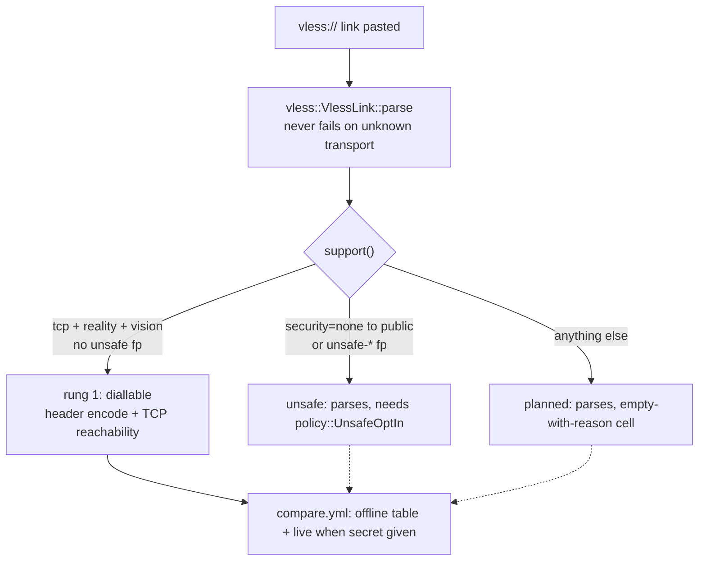

# The superset matrix: every way PattNG can connect, one rung at a time

Ferrox-core is a superset of Xray-core, sing-box, xray-rust and PattNG's Xray fork. The matrix below is the set of transports the core *parses*; a row moves from "parses" to "dials" only with its differential proof and its benchmark gate — never with the parser alone.

## The order (do not reorder without the proof)

| # | transport | code status | proof |
| - | --------- | ----------- | ----- |
| 1 | VLESS TCP REALITY `xtls-rprx-vision` | `Implemented` — parse + `encode_into` + TCP reachability | differential header golden + identity gate + offline compare |
| 2 | VLESS TCP TLS (Vision optional) | `Planned` — parses, `support()` names the reason | TLS handshake differential vs Xray-core pin |
| 3 | VLESS TCP none (private) | `Implemented` — parse + `encode_into` + TCP reachability, same bytes as row 1 without the session; the `UDP` command rides raw `TCP` framed (`u16` length plus payload), both roles | header golden in `vless::tests` + loopback datagram relay in `proxy::tests` |
| 4 | VLESS/TROJAN `security=none` to public (PattNG ext.) | `UnsafeRequiresOptIn` — parses, dials only with `UnsafeOptIn::allow_plaintext_to_public` | policy sign-off + isolated test net only |
| 5 | TROJAN TCP TLS | `Implemented` — password framing over raw `TCP`, plus `UDP ASSOCIATE` over raw `TCP` in both roles | `xray_oracle::trojan_over_raw_tcp_matches_the_oracle` (conformance 37132662374) |
| 6 | VMess TCP | `Implemented` — `vmess.rs` carries both roles over raw `TCP` | golden vectors + loopback relays in `vmess.rs` and `proxy::tests` |
| 7 | Shadowsocks TCP/UDP | `Implemented` — `aes-128-gcm`, `aes-256-gcm` and `chacha20-ietf-poly1305` over raw `TCP`, with every spelling `Xray-core` accepts, plus `UDP` over raw `TCP` in both roles; no `2022` | `xray_oracle::shadowsocks_over_raw_tcp_matches_the_oracle` (conformance 37132662374) for the framing; the cipher table and its key derivation in `shadowsocks.rs`'s own vectors; gate 9 for the per-chunk cost of the two added ways against the one that shipped |
| 8 | VLESS WS / XHTTP / gRPC / HTTPUpgrade / HTTP masquerade | `Implemented` — `ws.rs`, `xhttp.rs`, `grpc.rs`, `httpupgrade.rs`, `httpheader.rs` | loopback relays per carrier, one rung each |
| 9 | QUIC (dial) / KCP / Hysteria / MASQUE (H2+H3) / XDRive | `Implemented` (dial) for QUIC — one stream per connection over `quiche`, pooled to one handshake per server; serve refused, no silent downgrade. KCP and the rest: every named variant parses, is carried as its own `Carrier` cell, and refuses all serve/dial arms | QUIC: loopback and pool-sharing tests in `proxy::tests`; KCP: scripted-clock oracle in `ferrox-core::kcp` |
| 9a | WireGuard / Hysteria2 / Aether (`sing-box` protocols) | `Planned` — named refusals land with row 9; the ZeroNet WARP paths | the ZeroNet WARP paths; after XHTTP |
| 10 | `cipherSuites` + `unsafe-*` fingerprints (PattNG ext.) | `UnsafeRequiresOptIn` — parsed, carried, never default | `policy::UnsafeOptIn::allow_unsafe_fingerprint` + ClientHello differential |
| 11 | multiplex over every row above | `Implemented` — `mux.rs` frame codec and session table, reached from `vless::Command::Mux`; serve demultiplexes every session of a raw-`TCP` connection, dial carries one session per uplink | hand-derived golden frames + a 256-domain-length round trip + a refusal table, all in `mux::tests`; gate 6 for cost; interleaved-session and refusal loopbacks in `proxy::tests` (no oracle exists for this format — see [`../conformance.md`](../conformance.md) and [`../function/mux-frames.md`](../function/mux-frames.md)) |
| 12 | `?ed=N` early data on `ws` / `httpupgrade` | `Implemented` — both roles, one parse (`transport::EarlyData`) | 22 rewrite and `Atoi` vectors, the `RFC 4648` digits and a round trip at every length 0–192, in `transport::tests`; the request's exact bytes and the budget's boundary in `ws`/`httpupgrade` tests; **two upstream oracle rows** in `conformance.yml` against real `Xray-core`; gate 8 for cost — [`../function/early-data.md`](../function/early-data.md) |

## Why row 12 is a row and not two

Early data is one mechanism wearing two carriers, and it is where the four implementations copy the most: `Xray-core` writes the same `url.Parse`/`Get`/`Del`/`Encode` block in `WebSocketConfig.Build` and again in `HttpUpgradeConfig.Build`, `xray-rust` writes its version in `parse_websocket_settings` and again in `parse_httpupgrade_settings`, and `sing-box` sidesteps the copy by making the budget a config field no share link can spell. It is [`EarlyData::split`](../../crates/ferrox-core/src/transport.rs) here, called from both carriers and once — and on `httpupgrade` it adds no wire behaviour at all, because there the key only has to come off the path.

It is also the row with the strongest proof in the matrix: two oracle tests written by someone else name the format, run unmodified from the `xray-rust` pin against real `Xray-core`, and had been failing here before this row existed.

## Why row 11 is not a transport

Rows 1-10 are each one way to reach a server. Multiplexing puts many conversations inside one of them, so it composes with every row instead of competing with it: landing it turns ten rows into ten families. There is no `type=mux` to parse, because a link asks for multiplexing by composing protocol and security layers, not by naming a transport — which is why `transport::TransportKind` has no variant for it.

It is also the row that was most conspicuously missing. Xray-core, sing-box and `PattNG` all carry multiplexing; this workspace carried none of it; and xray-rust rejects `{"mux": {"enabled": true}}` at config-parse time. A refusal is the shape this gap had here too, and a worse one.

## What PattNG contributes (and where it lives in code)

- **`cipherSuites` and `unsafe-*` fingerprints in settings and share-links.** Preserved verbatim in `VlessLink::params`, reported by `VlessLink::fingerprint()` / `wants_unsafe_fingerprint()`. Enabling one is a `policy::UnsafeOptIn` value at the call site, never a default.
- **Plaintext VLESS/TROJAN to public addresses.** Upstream Xray-core refuses `security=none` off-loopback; PattNG's fork allows it. `transport::Security` splits `None` from `NoneToPublic` at parse time so the dial path cannot silently fall back to plaintext — the failure mode `tls/mod.rs` already refuses for TLS backends.
- **Aether core.** Listed as rung 9. No Aether source is vendored; when the rung lands, its suite runs from the `aether` pin in CI (see [`../conformance.md`](../conformance.md)).

## What "superset" does not mean

It does not mean every row dials. It means every row *parses* and every comparison table shows every row — implemented cells with numbers, unimplemented cells empty *with the reason*. An omitted row reads as "not measured"; an empty-with-reason row reads as "measured, unsupported". The second is honest; the first is how a 0.83x survives to a release.

## What the two upstream sets still name that this tree does not dial

Enumerated against the pins (`upstream/pins.toml`), not from memory: `Xray-core`'s `transport/internet/` and `sing-box`'s `transport/` directory listings at `b26a91de` and `c9922979`.

| way | Xray-core | sing-box | here |
| --- | --- | --- | --- |
| `tcp` | `tcp` | `v2ray` | raw TCP for vless/trojan/vmess/shadowsocks |
| `websocket` | `websocket` | `v2raywebsocket` | `ws.rs` (`ws` and the `websocket` spelling) |
| `httpupgrade` | `httpupgrade` | `v2rayhttpupgrade` | `httpupgrade.rs` |
| `splithttp` (`xhttp`) | `splithttp` | — | `xhttp.rs` (both spellings parse) |
| `grpc` | `grpc` | `v2raygrpc` | `grpc.rs` |
| `http` (HTTP/1.1 masquerade) | `tcp` + `header.type=http`, `headers/http/` | `transport/v2rayhttp` | ✓ `httpheader.rs` |
| `quic` | `quic` (removed at this pin) | `v2rayquic` | `Carrier::Quic` — dial implemented over `quiche`, serve refused |
| `kcp` (`raw`) | `kcp`/`mkcp` | dropped upstream | `Carrier::Kcp` — named, refused at the proxy seam; core ported in `ferrox-core::kcp` with scripted-clock oracle green |
| `hysteria` | `hysteria` | `hysteria`, `hysteria2` | `Carrier::Hysteria` — named, refused |
| `masque` | `masque` | `masque` | `Carrier::Masque` — named, refused |
| `xdrive` | `xdrive` | — | `Carrier::Xdrive` — named, refused |
| removed spellings `h2`/`h3`/`http`, anything unknown | `PrintRemovedFeatureError` / "unknown transport protocol" | config error | `Carrier::Unknown` — named, refused |

**Correction, `superset-3`:** this table said `http` was missing, and it was wrong. `httpheader.rs` has carried the one-shot request/response masquerade all along — "one `GET` before the first protocol bytes and one `200` before the first reply bytes, then raw bytes both ways" — and `Carrier::HttpHeader` reaches it from eight call sites. The table was built from the two upstream directory listings and this repository's *matrix*, and the matrix does not list `http`, so the one file that does implement it was never consulted. Enumerating a gap from the upstreams and a document is not enumerating it from the code.

The intersection of "both name it and we still do not dial" is **`kcp`** — its core is ported and oracle-proven, and the proxy seam is the one remaining piece.

**Correction, `quic-gate`:** the sentence above is stale at the current pins. `Xray-core` at `b26a91de` has no `quic/` transport left (only `masque` mentions it); `sing-box` at `c9922979` keeps the legacy `transport/v2rayquic` (350 lines of glue over `quic-go`, behind the `with_quic` build tag, with an empty `V2RayQUICOptions` — the security rides `TLS`); `xray-rust` and `PattNG` carry none. And this tree no longer falls through either: `network=quic` maps to `Carrier::Quic`, whose every serve and dial arm refuses outright, because the previous shape — falling through to `Carrier::Raw` — silently downgraded a `QUIC` outbound to plaintext `TCP`. Dialling `QUIC` for real needs a `QUIC` stack: the pinned `quiche` builds `BoringSSL`, a `C` toolchain `ci.yml` does not install, against the workspace's pure-`Rust` `rustls` policy. So the dial half of this row stays `Planned`, with the refusal as its proof that nothing dials by accident.

**Follow-up, `quic-dial`:** the decision is taken and the dial half is landed.
`quiche` `0.30.0` is a dependency (the workspace's only `C` one — the policy in
the workspace manifest says so), `VLESS` dials one stream on one connection
with `ALPN h3`, and trust stays explicit: `tlsSettings.caCertFile` anchors the
dial, nothing is inherited from any system store, and no anchor means no dial.
Serve, `UDP` and mux-over-`QUIC` stay refused; the loopback test proves the
wire against a `quiche` peer with a byte-exact header.

**Follow-up, pooled `QUIC`:** concurrent dials to one server share a single
handshake, socket and pump thread, one `QUIC` stream per `VLESS` session —
no mux framing, because streams already are that. One handshake where
`sing-box` pools the same way, with less code around it: a server-keyed pool,
an id allocator, a demuxing pump, and eviction when the last session ends
(no idle linger — an idle pool needs a reaper, which is its own slice).

### Why `quic` is the next one, and what is left to make `http` leaner

`headers/http/http.go` is 320 lines and its whole mechanism is a **one-shot HTTP/1.1 request in front of the stream and a one-shot response in front of the reply**. `Xray-core` builds it with `buf.Buffer` and `strings.Join` per line; `sing-box`'s `transport/v2rayhttp` builds the same shape on `net/http`, defaults `Method` to `PUT` and `Path` to `/`, and switches to HTTP/2 only when TLS is configured. Neither needs a handshake, a certificate or a second protocol: the proxy bytes follow the blank line exactly as they follow a `101`.

`quic` is the opposite: `Xray-core`'s `quic/` needs a QUIC stack, a TLS 1.3 handshake it drives itself, packet protection and stream framing. It is its own rung and its own proof, which is why the matrix puts it after `grpc` rather than next to it.

`http` being implemented does not make it lean, and the four costs below are still there in `httpheader.rs`. Two are fixed — the private head reader becomes [`proxy::read_http_head`] and the path compare becomes a borrow — and the two that are not fixed yet are the interesting ones: the module keeps its own `HeadReader` and its own two-thread relay, where `ws.rs`, `xhttp.rs`, `grpc.rs` and `httpupgrade.rs` each keep one too. **Five copies of one relay** is the largest remaining redundancy in the carriers.

**Done, in `relay3`.** The five copies are now **two functions and four `CHUNK`
constants fewer**. `httpupgrade.rs` and `httpheader.rs` turned out to be
byte-identical and became [`proxy::relay_carried`]; `ws.rs` and `grpc.rs` were
byte-identical too and became [`proxy::relay_sink`], over a
[`proxy::CarrierSink`] **generic** rather than a `dyn` so the per-chunk
`sink.send` is still a direct call. `xhttp.rs` was the last one, and it is the
one that makes the argument for a parameter instead of a guess: its teardown is a
different **order**, not a different set, because its sink close is the *zero
chunk* and a zero chunk that wins the race against the uplink thread ends the
peer's reader before the last reply arrives — a clean but empty stream, not an
error. So the order is a `const` parameter,
[`proxy::relay_sink_drained`] picks the one it needs, and the two orders are
asserted against each other in `proxy.rs` rather than assumed.

The claim is codegen, not timing: on `macos aarch64`, `lto = "thin"`, the `grpc`
and `xhttp` monomorphised bodies are **instruction-for-instruction identical** to
the two functions they replaced, and `ws`'s differs only in a **32-byte-smaller
stack frame** and one merged load pair. That is the strongest statement available
for a change whose premise is that there was nothing to gain — the loop did not
move, so it cannot have got slower.

### Four places the four implementations pay for the same bytes twice

The wastes worth naming before writing anything, because they are what "leaner" would mean here:

1. **The request is parsed twice.** `HeaderReader.Read` calls `readRequest` inside
   the accumulate loop purely to test completeness, and then calls it *again* on
   the same accumulated bytes after `\r\n\r\n` is found (`http.go:110` and
   `http.go:100`). Go's `http.ReadRequest` builds a map per header both times.
   `httpheader.rs` did the same *second* parse by calling its own `request_target`
   after `read_head` had already scanned the head, and returned a `String` for a
   value the caller only compared.
2. **The head is copied twice.** Each accumulation step appends the whole
   `buffer` into `headerBuf`, and then the terminator branch appends
   `buffer.BytesRange(0, n+len(ENDING))` into `headerBuf` *again* — the bytes
   that were already appended in the previous iteration go in a second time.
   `httpheader.rs` had the same shape without `buf`: it read into a growing `Vec`
   and then copied the tail into a second allocation with `head[end..].to_vec()`,
   where `proxy::read_http_head` peeks and leaves the tail in the kernel.
3. **A one-time latch costs a branch on every I/O for the life of the connection.**
   `Conn.Read` tests `c.oneTimeReader != nil` and `Conn.Write` tests
   `c.oneTimeWriter != nil` on **every** call, for an event that happens once.
   The server's `expectThisRequest` also re-parses on each `Read`.
4. **`Date` is formatted per connection** with `time.Now().Format(http.TimeFormat)`,
   which allocates a `[]byte` per connection for one header line.

A one-pass scan for the terminator with the remainder kept in place answers all four: one parse, one copy, the latch consumed rather than tested, and the date written into the caller's buffer.

### What the matrix should say next

`http` belongs in row 8, between `grpc` and `quic`, and it is the rung the existing `grpc.rs` frame codec does **not** help with — that one is HTTP/2, `http` is HTTP/1.1 text, so the reuse is the `relay` shape and nothing else. The row is `Planned` until its differential exists; there is no upstream oracle for `header.type=http` in the pinned `ZeroNet` suite, so the proof is hand-derived vectors plus a self-referential loopback, and [`../claims.md`](../claims.md) will have to say which is which.
