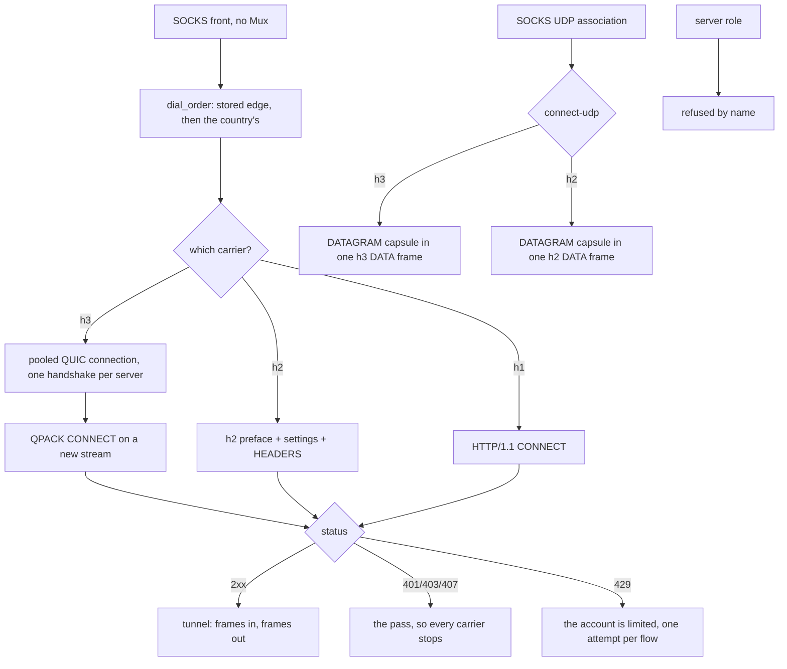

# The Foxy lane

The Foxy lane is an account-authenticated CONNECT tunnel to a CDN edge: a
Firefox Accounts login, a Guardian proxy pass, an edge list pinned to one
country, and then the tunnel. The page above it is the account plane; this one
is the four ways the tunnel's bytes can be carried, because that is what a
connection method is:

| carrier | ALPN | what it is |
| --- | --- | --- |
| `h1` | `http/1.1` | CONNECT, then the target's own bytes |
| `h2` | `h2` | one stream per flow over one TLS session |
| `h3` | `h3` | one stream per flow over one shared QUIC connection |
| `auto` | — | `h3`, then `h2`, then `h1` |

UDP rides the same lane as **CONNECT-UDP** (RFC 9298), over `h2` and over `h3`,
`h3` first: one capsule stream per destination. HTTP/1.1 has no extended
CONNECT, so it is never asked to carry a datagram, which
`the_carriers_are_ordered_by_what_the_edge_can_answer` gates.

One shape for all of them, and it is the whole design: open a stream, send
seven header fields, read one status, relay. The parts that decide rather than
move bytes live in `ferrox_core::foxy` (the codecs, the window arithmetic, the
UDP path and template), and the app crate owns the socket, the pool and the
TLS session. A caller that relays bytes does not know which carrier produced
its `Read + Write`.

## Data path



## Measured

<!-- counts:begin -->
| key | value | checked by |
| --- | --- | --- |
| ops-retired-instructions | UNBLESSED | scripts/count-ops.sh |
| payload-staging-copies-per-byte-written | 0 | ferrox-app-foxy::loopback::a_relayed_byte_is_copied_once_on_its_way_through_the_lane |
| payload-staging-copies-per-byte-read | 0 | ferrox-app-foxy::loopback::a_relayed_byte_is_copied_once_on_its_way_through_the_lane |
| read-buffer-bytes-per-staged-remainder | 1 | ferrox-app-foxy::loopback::a_read_leaves_only_what_the_callers_buffer_had_no_room_for |
| carriers-dialled | 3 | ferrox-app-foxy::tests::the_carriers_are_ordered_by_what_the_edge_can_answer |
| udp-carriers-dialled | 2 | ferrox-app-foxy::tests::the_carriers_are_ordered_by_what_the_edge_can_answer |
| datagram-frames-per-capsule | 1 | ferrox-app-foxy::loopback::the_masque_carrier_opens_connect_udp_over_quic_and_echoes_a_datagram |
| capsules-reassembled-across-frames | 1 | ferrox-app-foxy::loopback::a_capsule_split_over_frames_reassembles_as_one_datagram |
| stream-write-staging-copies-per-byte | 0 | ferrox-app-foxy::loopback::the_quic_carrier_sends_the_block_reads_the_status_and_carries_the_bytes |
| server-roles | 0 | ferrox-app-proxy::tests::quic_serve_closes_without_handshake |
| dialled-without-ca-cert-file | 0 | ferrox-app-proxy::tests::quic_outbound_reads_ca_cert_file |
<!-- counts:end -->

`payload-staging-copies-per-byte-written 0` and
`payload-staging-copies-per-byte-read 0` are the two rows this page exists to
name, and the checker for both is the lane's own buffers: `carry` is the read
buffer and `out` the write one, and a lane that stages a payload before handing
it over has grown the buffer it staged in. Capacity is the witness, because the
bytes are identical either way — the byte-level tests pass whether the copy is
there or not, which is exactly why they cannot see it.

Two honest bounds on those rows. The TLS library still copies the payload into
its own record buffer, so a *relayed* byte crosses userspace once for that
reason; these rows count the copies this lane makes, which is what the
capacity gate observes. And `read-buffer-bytes-per-staged-remainder` is 1
rather than 0 because a caller whose buffer is smaller than the frame it is
reading has its remainder staged once — the only copy that cannot be avoided
without changing how many times `read` returns.

## Ops

```bash
./scripts/count-ops.sh report \
  foxy::loopback::a_relayed_byte_is_copied_once_on_its_way_through_the_lane 'Tls2::write'
```

`ops-retired-instructions` is `UNBLESSED`. `ops.yml` reports every symbol in
`scripts/method-ops.txt` on each run and never blocks, so the row is open, not a
figure.

## Time

**Not measured on this branch.** The lane's throughput is what
`.github/workflows/foxy-relay.yml` measures — it downloads 1 MB per carrier
(`h1`, `h2`, `h3`, `auto`) against the real edge on all three runners, and the
ubuntu job adds a second exit country, the `http` front and the UDP datagram
path. A duration from a machine behind a VPN measures the tunnel, not the lane.

## What we removed

Against the two clients this lane is a port of, and named with their paths so
the comparison can be re-read:

- **The HTTP/3 refusal.** `FoxyVPN` speaks HTTP/2 only and says so in its
  README ("HTTP/3 implementation (Not Planned Yet)"), and its README states the
  consequence: general UDP cannot be relayed at all, so QUIC is out by
  construction. `firefox-vpn-client` does dial HTTP/3 when asked
  (`-h3`, `newH3ProxySession`), but its uplink is a CONNECT stream with no
  datagram, capsule or extended CONNECT anywhere in the tree, and its server
  list prints `MASQUE` as a protocol name that nothing dialles. So a datagram
  over the account's own edge is a superset of both, not a port of either, and
  the MASQUE CONNECT-IP row in `docs/xray-parity.md` stays refused — this page
  claims CONNECT-UDP, not IP-over-QUIC.

- **A second TLS record per CONNECT-UDP frame.** Writing the frame header and
  its capsule as two writes made two TLS records, and a record boundary is on
  the wire. `write_parts` hands the header and the payload to the same
  fragmenter in one call, which is the record a concatenated write would have
  produced: the same plaintext in the same order, one record instead of two.

- **Two copies of every relayed byte.** The lane used to stage a DATA frame's
  payload in its read buffer and then copy it into the caller's, and stage the
  caller's payload in its write buffer before handing it to the TLS session.
  The frame payload now goes straight into the caller's buffer, and the caller's
  payload straight into the record.
- **A second copy of every byte written on the HTTP/3 carrier.** A frame's
  varints and its payload were joined in the lane's write buffer before quiche
  copied that buffer into its send queue, so the payload was copied twice.
  The varints are their own `stream_send` now and the payload keeps the
  caller's buffer; a loopback edge that walks whole frames or not at all says
  the bytes are still the frame they were.

- **Two buffers per UDP flow.** A CONNECT-UDP request used to build the URI
  template's path in one `Vec` and the `Bearer` value in another. Both are
  written where they are read now, because their lengths are known before they
  are written, which is what `a_named_path_length_is_the_length_of_the_bytes_that_follow`
  holds the two halves of.

What is **not** removed, named rather than claimed: 0-RTT, connection
migration, key updates and batched datagram I/O are quiche's, and this tree has
not made them run. The HTTP/3 DATAGRAM frame form (RFC 9297 over QUIC
unidirectional streams) is not carried — the capsule form is, because it is the
one an edge answers on the same stream it opened CONNECT on. The server role is
refused by name. And the published MASQUE edge answers TCP on port 2499 rather
than QUIC, which is why `h3` is tried first and `h2` is not a downgrade.

## Pins

| what | where |
| --- | --- |
| the QUIC + HTTP/3 stack behind `h3` | `upstream/quiche` @ `3fc9bc1c` |
| the Android client this lane ports | `/tmp/foxyvpn` (`com.vauth.foxyvpn`) |
| the Go reference client this lane ports | `/tmp/firefox-vpn-client` |
