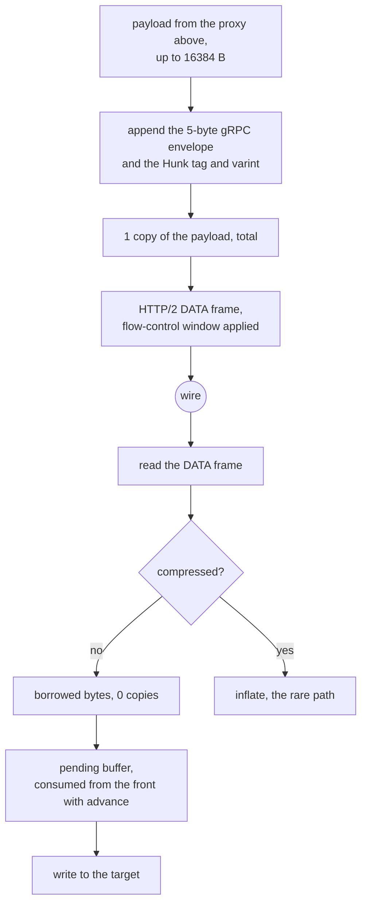

# The gRPC carrier

gRPC is the most expensive carrier in the matrix and it is expensive because of
HTTP/2, not because of anything this tree does. What this tree controls is the
envelope: a 5-byte gRPC length prefix, a compressed-flag byte, and a
protobuf `Hunk` carrying one `bytes Data = 1` field. There is no chunking in the
envelope — one `Hunk` is exactly one buffer that came from above, at most
`HUNK = 16384` bytes.

Write assembles the message once, in place, in a buffer whose frozen slices go
straight to HTTP/2. The payload is copied exactly once, into the message
buffer; before that it was copied into a `Hunk`, then into an envelope, then
once more per flow-control window. That is the win Zray recorded and the shape
this tree uses.

Read appends into a pending buffer and consumes from the front with `advance`,
because `Vec::drain` shifted the whole remainder for every message. An
uncompressed message is handled as borrowed bytes.

## Data path



## Measured

<!-- counts:begin -->
| key | value | checked by |
| --- | --- | --- |
| ops-retired-instructions | UNBLESSED | scripts/count-ops.sh |
| hunk-payload-bytes | 16384 | ferrox-app-grpc::tests::hunks_carry_the_xray_schema_bytes |
| user-space-copies-per-byte-written | 1 | ferrox-app-grpc::tests::hunks_carry_the_xray_schema_bytes |
| user-space-copies-per-byte-read | 1 | ferrox-app-grpc::tests::tunnel_carries_an_echo_over_loopback |
<!-- counts:end -->

## Ops

```bash
./scripts/count-ops.sh report \
  grpc::tests::hunks_carry_the_xray_schema_bytes 'grpc::encode_message'
```

`UNBLESSED`, as above.

## Time

**Not measured on this branch.** `tunnel_carries_an_echo_over_loopback` is the
flakiest loopback test in the tree — the roadmap records it failing 23 times in
200 runs with nothing else running, where `read_body` sees EOF after a 9-byte
frame header, which is a torn write or an RST with data queued rather than a
framing error. That is an open row and no duration is quoted from this carrier
until it is closed.

## What we removed

- **The envelope chain.** Xray's `transport/internet/grpc/encoding/hunkconn.go`
  copies the hunk into the caller's buffer on every `Read` (`:68-82`), adopts
  the protobuf's slice only when `cap(h.buf) >= buf.Size` (`:97`) and copies
  otherwise, and allocates a `&Hunk{...}` per write (`:108-118`). The HTTP/2
  side then does its own copy into a 32 KiB `bufWriter`
  (`grpc@v1.84.0/internal/transport/http_util.go:328-353`), and the read side
  allocates a fresh buffer per DATA frame (`:545-556`). sing-box's
  `transport/v2raygrpc/conn.go:37-52` does `copy(b, hunk.Data)` into the
  caller's buffer and stashes the tail in a cache, through grpc-go, so a
  `Hunk{Data: b}` is a protobuf marshal per write.
- **The quadratic drain.** Consuming a pending buffer with `Vec::drain` moves
  every remaining byte for every message, so a burst of N messages in one
  window costs O(N²) bytes moved. `advance` moves nothing.
- **A second allocation per message.** The message buffer is reused across
  writes, and the HTTP/2 layer takes it by `split().freeze()` so the refcount,
  not a copy, is what crosses the boundary.

What is **not** removed: HTTP/2's own framing. `T_DATA`, `T_HEADERS` and
`T_SETTINGS`, HPACK and the flow-control window are the cost of the carrier,
and they are the same cost Xray and sing-box pay. The 32 KiB HTTP/2 write buffer
and the 4 MiB session window are named here rather than claimed as ours.

## Pins

| what | where |
| --- | --- |
| `Hunk` encoding, per-write allocation, 32 KiB bufWriter | `upstream/xray-core/transport/internet/grpc/encoding/` |
| `copy(b, hunk.Data)`, per-write protobuf marshal | `upstream/sing-box` → `transport/v2raygrpc/conn.go` |
| one in-place assembly, `advance` instead of `drain` | `upstream/zeronet/crates/zero-transport/src/grpc.rs` |