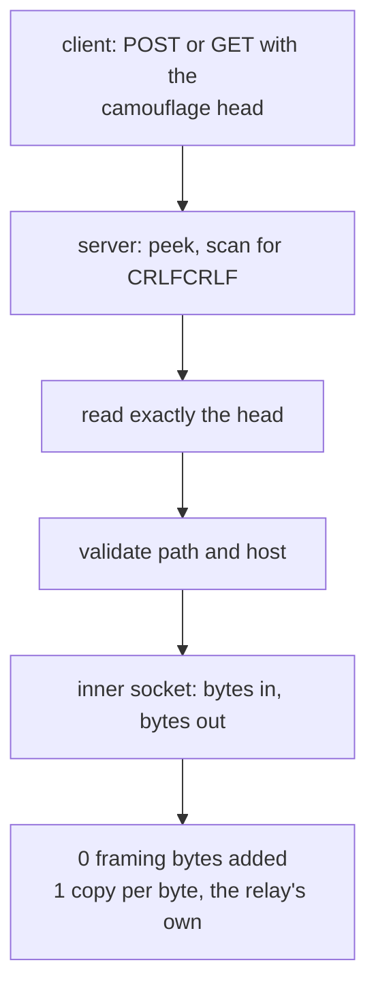

# The HTTP masquerade carrier

VLESS and VMess and Shadowsocks and Trojan all ride this carrier, which is the
cheapest one in the matrix: a request head with `Connection: upgrade` and a
matching response, and then no framing at all. It exists so a connection looks
like HTTP to something in the middle, and it costs one `memcmp`-shaped scan.

`read_http_head` is the interesting part and it is shared with every carrier
that has a handshake head. It uses `peek` to find `\r\n\r\n` and then reads
exactly that many bytes, so it never over-reads into the payload. The price is
one syscall for the `peek` and one for the `read`, per handshake. That is the
cost of *not* over-reading, which is the right trade at the head and the wrong
one per frame — see [the WebSocket page](carrier-websocket.md) for where the
per-frame cost was removed instead.

## Data path



## Measured

<!-- counts:begin -->
| key | value | checked by |
| --- | --- | --- |
| ops-retired-instructions | UNBLESSED | scripts/count-ops.sh |
| framing-bytes-added | 0 | ferrox-app-httpheader::tests::header_carries_an_echo_over_loopback |
| user-space-copies-per-byte-relayed | 1 | ferrox-app-proxy::tests::carried_streams_round_trip_behind_the_http_camouflage |
<!-- counts:end -->

## Ops

```bash
./scripts/count-ops.sh report \
  httpheader::tests::header_carries_an_echo_over_loopback 'proxy::read_http_head'
```

`UNBLESSED`, as above.

## Time

**Not measured on this branch.** The HTTP camouflage scenarios run in
`benchmark-matrix.yml` and `parity.yml`; no artefact from this branch has been
read.

## What we removed

Nothing on the data path. Two things are named because they are easy to get
wrong rather than because they were fixed:

- The 8 KiB head limit (`HEAD_LIMIT = 8192`) is a *limit*, not a buffer. A
  carrier that reads its head into a 64 KiB window to be safe pays 64 KiB of
  allocation per handshake to reject the same request one round later.
  `header_rejects_a_wrong_path` and the shared `read_http_head` limit check are
  the gate.
- `read_http_head`'s `peek`-then-`read` is two syscalls and one allocation per
  round (`vec![0u8; take]`, zero-filled and then immediately overwritten by the
  read). This is per *handshake*, once per connection. Replacing it with a
  single `read` plus a carried-over remainder would save one syscall and one
  allocation per connection and would touch every carrier's client path at
  once, which is a wider change than this page describes; it is left as an open
  row rather than done quietly.

## Pins

| what | where |
| --- | --- |
| head read, `BufferedReader`, `http.ReadRequest` | `upstream/xray-core/transport/internet/headers/` |
| head read, pooled buffer | `upstream/sing-box` → `transport/v2rayhttp/` |
| `scanned` head scan, no over-read | `upstream/zeronet/crates/zero-transport/src/httpupgrade.rs` |