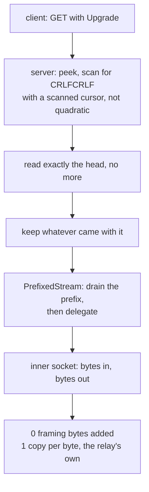

# The HTTPUpgrade carrier

After the 101, HTTPUpgrade is not a carrier. It is a byte pipe with a
handshake in front of it, and the cheapest correct implementation is the one
that stops framing the moment the handshake ends.

There is no frame header, no length, no type. `PrefixedStream` drains whatever
the handshake reader over-read, then delegates every byte to the inner socket.
The relay adds **zero** framing bytes and the only copy is the relay's own.

The one thing worth writing down is the head scan. `find_head_end` carries a
`scanned` cursor, so searching for `\r\n\r\n` is not quadratic. That matters
because the server side runs this scan *before any authentication*: a client
that drips one byte per packet would otherwise make one connection cost billions
of comparisons before anything is checked. Zray records the same hazard and the
same fix; sing-box's httpupgrade server instead does `buf.NewSize(reader.Buffered())`
plus a `ReadFullFrom` to preserve its coalesced bytes, which spends an
allocation to achieve the same thing.

## Data path



## Measured

<!-- counts:begin -->
| key | value | checked by |
| --- | --- | --- |
| ops-retired-instructions | UNBLESSED | scripts/count-ops.sh |
| framing-bytes-after-the-101 | 0 | ferrox-app-httpupgrade::tests::upgrade_carries_an_echo_over_loopback |
| user-space-copies-per-byte-relayed | 1 | ferrox-app-httpupgrade::tests::upgrade_carries_an_echo_over_loopback |
<!-- counts:end -->

## Ops

```bash
./scripts/count-ops.sh report \
  httpupgrade::tests::upgrade_carries_an_echo_over_loopback 'httpupgrade::PrefixedStream::read'
```

`UNBLESSED`, as above.

## Time

**Not measured on this branch.** `.github/workflows/benchmark-matrix.yml` runs
the HTTPUpgrade scenarios and `parity.yml` runs the paired comparison. No
artefact from this branch has been read.

## What we removed

Nothing on the data path, which is the point. What is recorded here is that
nothing needed removing, and which two claims about this carrier are false:

- Xray's `transport/internet/httpupgrade/connection.go` is a 19-line
  pass-through over `net.Conn` with no framing and no data-path allocations —
  the same as here. The cost is all in the handshake: `bufio.NewReader` on both
  sides, with the client sized from the caller's buffer and clamped to 16 bytes
  when `Ed == 0`, and `http.ReadRequest` allocating the request, the header map
  and every value string. That is a per-connection cost, once, and it is not
  where a connection spends its time.
- `?ed=N` early data is **parsed and not carried** on this carrier. `Ed` is
  stripped from the path and the budget is a path-level test only
  (`an_early_data_budget_leaves_the_request_unchanged`). An earlier README here
  claimed "both roles" for early data; that was true for WebSocket and false
  here, and the WebSocket page is where early data is claimed.

## Pins

| what | where |
| --- | --- |
| 19-line pass-through, `bufio` handshake | `upstream/xray-core/transport/internet/httpupgrade/` |
| `buf.NewSize(Buffered())` to preserve coalesced bytes | `upstream/sing-box` → `transport/v2rayhttpupgrade/server.go` |
| `scanned` cursor, `PrefixedStream` | `upstream/zeronet/crates/zero-transport/src/httpupgrade.rs` |