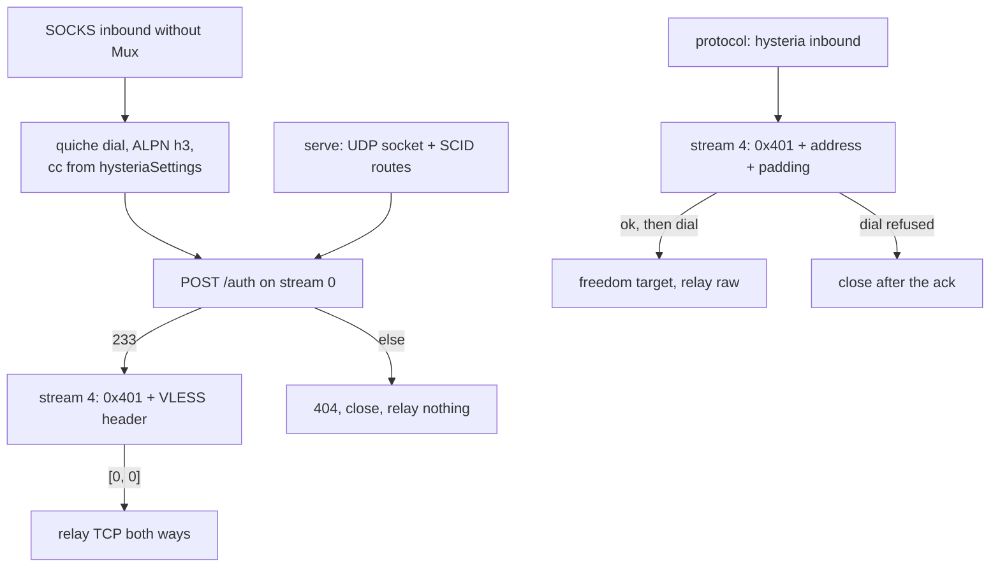

# The Hysteria carrier

Hysteria v2 is a **both-roles, both-shapes** row. As the transport it dials
from a SOCKS inbound without Mux and serves a `streamSettings` inbound that
names a `tlsSettings.certificates[0]` chain, carrying the inner protocol
(VLESS) on each `0x401` stream. As the protocol it serves a
`protocol: hysteria` inbound: the stream's request itself names the
destination as a varint string, the server acknowledges before it dials, and
a refused dial closes after the acknowledgement. Both run over quiche — the
default QUIC stack for this rung, pinned at `upstream/quiche` for reading.

The wire shape is small: every TCP flow is one client-bidirectional QUIC
stream opening with the `0x401` varint, and the connection opens with an
HTTP/3 `POST` to `/auth` carrying `hysteria-auth`, answered `233`.
`ferrox-core::hysteria` owns those bytes and proves them bit-exact
(`ferrox-core-hysteria::*` unit tests); `ferrox-app/src/hysteria.rs` owns the
sockets: a `Router` keyed by server SCID on the serve side, one QUIC
connection per dial on the dial side.

A wrong password is refused with `404` then `CONNECTION_CLOSE` and relays
nothing: `hysteria_refuses_a_wrong_password_without_relaying` is the gate.
Settings parse with guarded fallbacks — unknown congestion spellings pace as
`bbr`, and only `version: 2` or absent names this carrier, anything else is
`Unknown`: `hysteria_settings_parse_with_guarded_fallbacks` is the gate. The
full path, dial plus auth plus one VLESS echo, is
`hysteria_carries_vless_echo_over_loopback`, serialised on the shared QUIC
mutex and retried like the other loopback socket tests, because a socket test
that passes twice and fails the third is testing the scheduler. The protocol
shape's gate is the pinned one: `xray-rust-hysteria` in `upstream/pins.toml`
runs the pinned client's wrong-password and failed-destination verdicts
against `ferrox-app` in `scripts/run-upstream-suite.sh`, which is also where
the server's SETTINGS-before-auth order is proven — the pinned client's H3
stack posts its auth only once the server's SETTINGS arrive.

## Data path



## Measured

<!-- counts:begin -->
| key | value | checked by |
| --- | --- | --- |
| ops-retired-instructions | UNBLESSED | scripts/count-ops.sh |
| tcp-flows-per-handshake | 1 | ferrox-app-proxy::tests::hysteria_carries_vless_echo_over_loopback |
| wrong-password-bytes-relayed | 0 | ferrox-app-proxy::tests::hysteria_refuses_a_wrong_password_without_relaying |
| non-v2-configs-carried | 0 | ferrox-app-proxy::tests::hysteria_settings_parse_with_guarded_fallbacks |
| pinned-hysteria-client-verdicts | 1 | scripts/run-upstream-suite.sh |
<!-- counts:end -->

## Ops

```bash
./scripts/count-ops.sh report \
  proxy::tests::hysteria_carries_vless_echo_over_loopback 'hysteria::connect'
```

`UNBLESSED`, as above. `scripts/expected-ops.txt` still blesses exactly one
symbol in the whole tree, `der_to_pem 2653`, which is a PEM formatting helper
rather than a carrier. That is why the whole ops row in this table is open.

## Time

**Not measured on this branch.** Every duration in this repository comes from a
named runner, and a number produced off a machine behind a VPN measures the
tunnel. No artefact from this branch has been read.

## What we removed

- **Upstream UDP session management.** Both pinned implementations keep a UDP
  session table beside the streams (`conn.go:udpSessionManager`,
  `protocol/hysteria2` inbound/outbound UDP paths). This tree parses the
  datagram framing bit-exact (`wrap_dgram`/`open_dgram` in core) but carries no
  UDP flows: the serve path answers TCP (`cmd != 1` refused) and the link
  reason string says so rather than letting a parse read like a capability.
- **Salamander obfuscation and the masquerade site.** The keys are never read;
  nothing on the wire pretends otherwise.
- **A custom brutal sender.** `brutal` and `force-brutal` pace as quiche `bbr`
  (`Congestion::quiche_name`), stated in the settings test. That is a
  narrower congestion loop, not a second implementation of one.
- **A per-chunk relay clone.** The relay direction held its `Flow` behind one
  clone for the whole direction rather than cloning the backlog `Vec` per
  16 KiB chunk.

What is **not** removed, and is named rather than claimed: one handshake per
flow (the vless-quic pool is not shared here, so `tcp-flows-per-handshake`
is 1, not 0); 0-RTT, migration and key updates are quiche's; the server keeps
one UDP socket per inbound with a per-connection route map and a linear scan
over routes per Initial.
