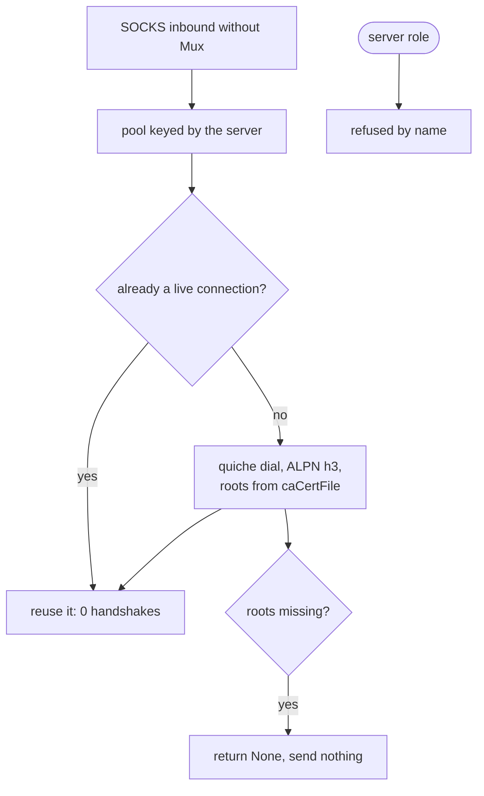

# The QUIC carrier

QUIC is a **client-only** row in the matrix. The server role is refused by name
(`refused_carriers!`), and this page says so rather than letting a "0"
syscall count read like a capability.

quiche is the default QUIC stack for this rung, and that is a rule rather than a
preference: whenever a rung needs QUIC and quiche is feasible, quiche. The pin
`upstream/quiche` at `3fc9bc1c` exists for reading.

The one thing this carrier actually decides is how many handshakes a connection
costs. A naive dialer handshakes per stream; this one dials once per server and
shares the connection, so N streams on one server cost one handshake, not N.
`quic_pool_shares_one_connection_between_two_streams` is the gate.

Roots are required. A dial without `caCertFile` returns `None` and sends
nothing, which `quic_outbound_reads_ca_cert_file` covers — the refusal is
deliberate, not a fallback to the system store.

## Data path



## Measured

<!-- counts:begin -->
| key | value | checked by |
| --- | --- | --- |
| ops-retired-instructions | UNBLESSED | scripts/count-ops.sh |
| handshakes-per-server | 1 | ferrox-app-proxy::tests::quic_pool_shares_one_connection_between_two_streams |
| server-roles | 0 | ferrox-app-proxy::tests::quic_serve_closes_without_handshake |
| dialled-without-ca-cert-file | 0 | ferrox-app-proxy::tests::quic_outbound_reads_ca_cert_file |
<!-- counts:end -->

## Ops

```bash
./scripts/count-ops.sh report \
  proxy::tests::quic_pool_shares_one_connection_between_two_streams 'quic::dial_pooled'
```

`UNBLESSED`, as above. Note that `quic::tests::pem_wraps_at_sixty_four_columns`
is the *one* symbol blessed in `scripts/expected-ops.txt`, at `der_to_pem 2653`
instructions — which is a PEM formatting helper, not a carrier. That is why the
whole ops row in this table is open.

## Time

**Not measured on this branch.** QUIC throughput is what
`.github/workflows/speedtest.yml` exists for, and it is dispatch-only because it
downloads a real target file per config per core. A QUIC number from a machine
behind a VPN measures the tunnel. No artefact from this branch has been read.

## What we removed

- **A handshake per stream.** sing-box reaches QUIC through its own QUIC
  transport and pools connections the same way; the difference that matters is
  that this tree makes the pool the *only* way in, so there is no per-stream dial
  path to regress into. `quic_pool_shares_one_connection_between_two_streams`
  and `sixteen_flows_at_once_all_arrive_whole` are the gates.
- **A silent trust fallback.** A dial with no `caCertFile` sends nothing rather
  than reaching for the platform store. That is a security property, not a speed
  one, and it belongs on this page because it is a refusal that costs a
  connection.

What is **not** removed, and is named rather than claimed: 0-RTT, connection
migration, key updates and batched datagram I/O are quiche's, not this tree's.
The pin says quiche is the measured choice for this rung; it does not say this
tree made quiche faster.

## Pins

| what | where |
| --- | --- |
| the QUIC and HTTP/3 stack for this rung | `upstream/quiche` @ `3fc9bc1c` |
| connection pooling, 0-RTT, migration | `upstream/sing-box/common/` |
| multiplexed QUIC schedulers, reorder and reinjection | `upstream/mqvpn` |