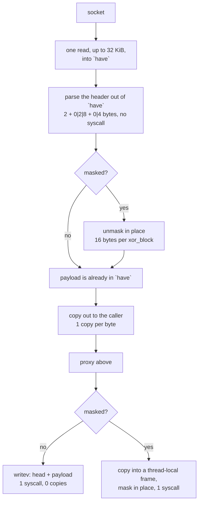

# The WebSocket carrier

`ferrox-app`'s WebSocket carrier is where the syscall shape was worst. A frame
header is 2 bytes, then 0, 2 or 8 bytes of length, then a 4-byte mask, then the
payload — and this tree used to spend one `read` syscall on each of those three
groups plus one on the payload. Three syscalls per message, for a header that is
at most 14 bytes.

Now there is one buffer. A `read` fills as much of it as the socket offers — up
to 32 KiB — a frame header is parsed out of it without touching the socket, and
the payload is unmasked where it lies. So a read covers a window, not a frame
header: 64 frames of 21 472 bytes come out of one `read`, where the old path
spent three per message before it delivered the first payload byte.

The write side was already right and is left alone: an unmasked frame goes out
with `writev`, one syscall and zero copies; a masked frame is copied once into a
thread-local buffer, masked in place with a 16-byte `xor_block`, and written
once. That is the floor for masking — the mask has to be applied somewhere, and
doing it in place beats a second buffer.

## Data path



## Measured

<!-- counts:begin -->
| key | value | checked by |
| --- | --- | --- |
| ops-retired-instructions | UNBLESSED | scripts/count-ops.sh |
| read-syscalls-per-64-frames | 1 | ferrox-app-ws::tests::a_read_covers_a_window_not_one_frame_header |
| read-ahead-window-bytes | 32768 | ferrox-app-ws::tests::a_read_covers_a_window_not_one_frame_header |
| write-syscalls-per-frame | 1 | ferrox-app-ws::tests::frames_round_trip_masked_and_plain |
| user-space-copies-per-byte-unmasked-write | 0 | ferrox-app-ws::tests::frames_round_trip_masked_and_plain |
| user-space-copies-per-byte-masked-write | 1 | ferrox-app-ws::tests::frames_round_trip_masked_and_plain |
| user-space-copies-per-byte-read | 1 | ferrox-app-ws::tests::a_read_covers_a_window_not_one_frame_header |

<!-- counts:end -->

## Ops

```bash
./scripts/count-ops.sh report \
  ws::tests::a_read_covers_a_window_not_one_frame_header 'ws::WsReader::pull'
```

`UNBLESSED`, as above.

## Time

**Not measured on this branch.** The carrier is timed end to end rather than in
isolation: `.github/workflows/parity.yml` runs `scripts/run-parity.sh` for
`upload`, `download` and `full-duplex` across the pinned engines, and
`.github/workflows/benchmark-matrix.yml` runs the `vless-ws` scenario. Both are
CI-only because every developer machine is behind a VPN. No artefact from this
branch has been read, so no duration is quoted.

## What we removed

- **An unbounded `realloc` chain in the read-ahead buffer.** `WsReader::pull`
  asks for `reserve_exact(READ_AHEAD)`, which requests exactly the leftover plus
  32 KiB — one byte more than the previous capacity whenever the leftover grew,
  so a stream that lands mid-frame reallocates and memcpys once per read.
  `reserve` amortises that. In the good case, where a read lands on a frame
  boundary, the branch was already false and this changes nothing.
- **NOT attempted: widening the mask loop's stride.** `apply_mask` XORs 16 bytes
  per iteration, so about a quarter of its work on a long masked frame is loop
  counter and bounds check rather than XOR. Striding 64 bytes was tried — same
  vector op count, same bytes at the same offsets, since 64 is a multiple of the
  4-byte mask — and it is a **regression**, and the arithmetic says so without a
  benchmark: the remainder is taken scalar, so `as_chunks_mut::<64>()` makes the
  scalar tail up to 63 bytes where `as_chunks_mut::<16>()` kept it under 16. At 63
  bytes it is 63 scalar XORs against 3 vector ops plus 15. Every length that is
  not a multiple of 64 is worse, and the lengths that are multiples of 64 are
  unchanged, so the change only ever helped frames that were already
  vector-aligned. Reverted. Fixing it properly means an inner loop over four
  16-byte lanes, which is more code than the win is worth without a
  measurement. `mask_chunks_match_the_byte_loop` is what pins the stride: it
  compares against the byte loop at 0, 1, 3, 4, 5, 15, 16, 17, 31, 32, 33, 63, 64,
  65, 127, 128, 129, 191, 192, 255, 1 024 and 8 192 — every boundary where a
  wrong stride shows up.
- **Two read syscalls per message, unconditionally, forever.** The old
  `frame_head` called `read_exact` for 2 bytes, then `read_exact` again for the
  extended length and the mask, then `read_exact` for the payload. Comparing the
  three implementations: Xray uses gorilla/websocket with a **4 KiB** read
  buffer, so it spends roughly one syscall per 4 KiB and splits every 8 KiB
  payload across two buffers and two writes; sing-box uses `sagernet/ws` over a
  32 KiB `buf.Buffer`; Zray reads into `read_buf`'s spare capacity with
  `ReadBuf::uninit`, then `split_to`s the frame out — a view, not a copy. Three
  syscalls for a 14-byte header is worse than all three, and the new
  `a_read_covers_a_window_not_one_frame_header` drives the reader over a fixed
  byte source, where a `read` returns everything it is asked for, and asserts
  that 64 frames of 21 472 bytes cost exactly **one** read.
- **The `unsafe { set_len }` that zero-filled first.** The old `data_into` grew
  the backlog with `reserve` + `set_len`, which is right, but the buffer was then
  cleared and refilled per message. `pull` keeps one buffer sized once per
  connection and grows it only when a single frame needs more room than the
  window holds — a 16 MiB frame costs one `reserve_exact` and then no
  compaction.
- **A second buffer.** `backlog`/`bat` and `have`/`at`/`msg_end` were two ways
  of holding the same thing; there is now one, which is both smaller and one
  fewer place for a copy to hide.

What is unchanged, deliberately: the `apply_mask` step is 16 bytes per
`xor_block` with a tail loop, mirroring Zray's measured `u128` step ("Measured
on Apple Silicon at opt-level = s, 1 KiB 121 → 71 ns and 16 KiB 1189 → 793",
with a note that a 32-byte step is slower because four stores into one cache
line each wait on the three before them). sing-box's `ws.Cipher` uses an 8-byte
`uint64` step; that is a regression against the measurement Zray published, so
it was not copied.

## Pins

| what | where |
| --- | --- |
| 4 KiB read buffer, 2-copies-per-byte read path | `upstream/xray-core/transport/internet/websocket`, gorilla v1.5.3 |
| 32 KiB buffer, `split_to` frame views, `u128` mask step | `upstream/zeronet/crates/zero-transport/src/ws/` |
| early data (`Sec-WebSocket-Protocol`) | `ferrox-core-transport::early_decode` |