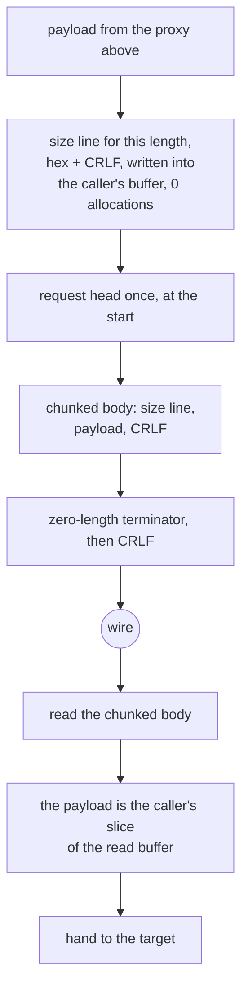

# The xHTTP carrier

One mode is implemented: `POST` with `Transfer-Encoding: chunked`. The padding
and placement rules for the other xHTTP modes are not, and the roadmap slice
that still says this carrier has no implementation is stale — it has one, in one
mode.

The framing is the chunked encoding and nothing else: a hex length, CRLF, the
payload, CRLF, and a zero-length terminator. There is no envelope, no type byte
and no session header beyond the request head.

The size lines are the part worth naming. A `Size` line for a given length is a
pure function of the length, so `size_lines_match_format_without_allocating`
builds them into the caller's buffer and allocates nothing. That is the whole
optimisation available on a framing this thin: do not allocate for a string you
already know.

## Data path



## Measured

<!-- counts:begin -->
| key | value | checked by |
| --- | --- | --- |
| ops-retired-instructions | UNBLESSED | scripts/count-ops.sh |
| framing-size-lines-without-an-allocation | 0 | ferrox-app-xhttp::tests::size_lines_match_format_without_allocating |
| framing-read-syscalls-per-16KiB-chunk | 1 | ferrox-app-xhttp::tests::a_chunk_costs_two_reads_not_three |
| framing-read-syscalls-per-16KiB-chunk | 1 | ferrox-app-xhttp::tests::a_chunk_costs_two_reads_not_three |
| read-syscalls-per-16KiB-chunk | 2 | ferrox-app-xhttp::tests::a_chunk_costs_two_reads_not_three |
| framing-read-syscalls-per-16KiB-chunk | 1 | ferrox-app-xhttp::tests::a_chunk_costs_two_reads_not_three |
| user-space-copies-per-byte-written | 1 | ferrox-app-xhttp::tests::exchange_carries_an_echo_over_loopback |
<!-- counts:end -->

## Ops

```bash
./scripts/count-ops.sh report \
  xhttp::tests::size_lines_match_format_without_allocating 'xhttp::push_size_line'
```

`UNBLESSED`, as above.

## Time

**Not measured on this branch.** xHTTP scenarios run in
`benchmark-matrix.yml` and `parity.yml`. No artefact from this branch has been
read.

- **A framing read syscall per chunk, and the second one was two bytes.** The
  reader spent three reads per 16 KiB chunk: one to fetch the size line, one for
  the body, and one `read_exact` for the two-byte CRLF that closes the chunk. The
  CRLF read now fills a 128-byte window instead, and the bytes past the CRLF are
  the *next* size line, which `read_line_into` then finds without asking the
  socket again — so the framing reads amortise to one per chunk and the count is
  `2 * chunks + 1`, measured: **33 reads for 16 chunks against 49** for the old
  shape over the same loopback socket, with the payload byte-identical.

  Two things this needed to get right, both of which the worst case caught
  rather than the average:

  - The window must be looped until two bytes are buffered. A first version took
    one read and refused on `n < 2`, which a peer that segments the CRLF across
    two packets would have hit. `a_trickling_stream_still_drains_whole` drives a
    one-byte-per-read stream and is the gate for it.
  - The exhausted prefix has to be **cleared** before the window lands in it. The
    first version appended to the drained prefix and took the CRLF from stale
    bytes, which broke four existing xHTTP tests immediately.

  The count is gated by `a_chunk_costs_two_reads_not_three`, which drives an
  in-memory stream that always answers the whole buffer — so the count is exact
  and deterministic. A real socket may segment, so
  `a_real_socket_drains_the_same_bytes` asserts only the bytes and bounds the
  count loosely; a scheduler-dependent number is not a gate.

## What we removed

- **An allocation per size line.** A hex length plus CRLF is at most five bytes
  and is a function of the length alone, so it is written in place. Neither
  Xray nor sing-box ships an xHTTP carrier in the pinned trees, so there is no
  comparator here to beat — which is exactly why this page says what it removed
  and does not claim a ratio.
- **A third copy of the config walk.** `xhttp.rs` carried its own
  byte-identical `header_value` copy and a third head reader; the roadmap has a
  slice for folding both into `proxy.rs`, and it is open. Until that lands, this
  carrier duplicates them, which is a code-size debt rather than a data-path
  cost, and it is named here rather than quietly counted as a win.

## Open rows

- One mode only. `stream-one`, `packet-up`, `stream-up` and `multi` are not
  implemented, and the padding and placement rules per mode are absent.
- The pinned conformance row
  `rust_socks_client_reaches_target_through_remote_xhttp_profile` panics unless
  `XRAY_REMOTE_XHTTP_CONFIG` names an owner-only file. The mode assertion in the
  pinned tree must not be weakened to make it pass; that is stated in the
  roadmap and repeated here so the row is not quietly rounded off.

## Pins

| what | where |
| --- | --- |
| the carrier Xray-core and sing-box do not ship | — |
| the carrier ZeroNet does ship | `upstream/zeronet/crates/zero-transport/src/xhttp.rs` |