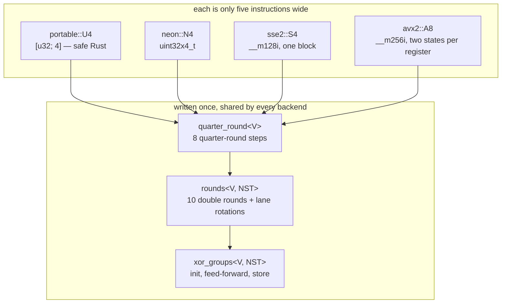
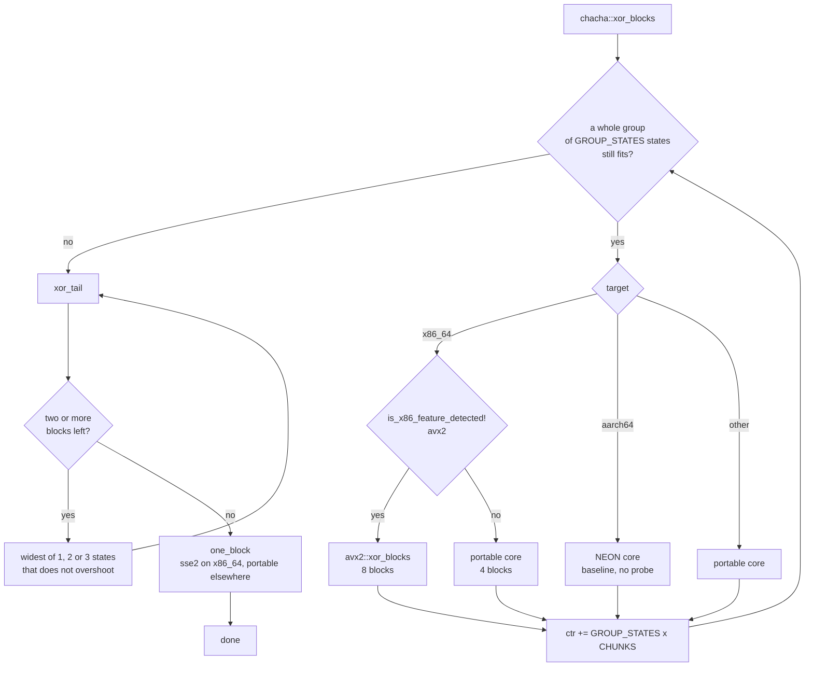

# `ferrox_core::chacha`

The keystream itself: one round function, written once, instantiated for portable arrays, NEON, SSE2 and AVX2.

## The one thing that makes this trustworthy

There is **one** `quarter_round` and **one** `rounds`, generic over a [`Lanes`](../../crates/ferrox-core/src/chacha/mod.rs) trait. Every backend implements that trait and nothing else.



Four hand-written `ChaCha20` cores would drift, and the differential test would report a mismatch without saying which one was wrong. Written this way, the only thing that *can* differ between architectures is what each backend means by "add these four words", "rotate left by 16" and "XOR chunk *c* into these sixteen bytes" — each a single documented instruction on its target. Bit-identity is therefore **structural** for the algorithm and **tested** for the primitives.

## The lane layout

A vector carries four consecutive state words per 128-bit *chunk*. Chunk *c* of register *g* holds words `4g..4g+3` of block `c*4 + g`.

```text
              register g=0      g=1        g=2         g=3
   chunk 0     words  0..3    words 4..7  words 8..11  words 12..15   -> block 0
   chunk 1     words  0..3    words 4..7  words 8..11  words 12..15   -> block 4
```

This is the Crypto++ layout, and the reason for it is the store: each register is already a run of 16 consecutive **output** bytes, so keystream goes straight into the caller's buffer with no transpose. The alternative — one word per lane, the more obvious transposed layout — needs a 16x8 transpose on the way out, which costs about as much as the extra rounds it saves. Four words per register is the other half: a single vector add does the work of four scalar adds.

## Why several states at once

One ChaCha20 chain is a dependent add-xor-rotate chain with nothing to overlap. A wide out-of-order core stalls on the dependency, not on the instruction count. So the core runs `NST` **independent** states interleaved, and the register rotation between the row round and the diagonal round is what keeps them independent rather than merely adjacent.

| backend | lanes | states in flight | blocks per iteration | registers |
| --- | --- | --- | --- | --- |
| portable | 4 (`[u32; 4]`) | 4 | 4 | 16 arrays |
| NEON (aarch64) | 4 (`uint32x4_t`) | 8 | 8 | 32 `q` registers |
| SSE2 (x86_64) | 4 (`__m128i`) | 1 | 1 | 4 `xmm` registers |
| AVX2 (x86_64) | 8 (`__m256i`) | 4 | 8 | 16 `ymm` registers |

`states in flight` is `NST`, the template parameter of `xor_groups` — four on `x86_64`, eight on `aarch64` — while *blocks per iteration* is `NST * CHUNKS`, so `AVX2`'s two chunks per state is where its eight come from. `backend()` names the same two numbers and is asserted against those constants at compile time, per architecture.

AVX2 gets eight blocks for the same 16 registers by putting **two states in one register** — the low 128 bits one state's four words, the high 128 bits another's. Every instruction used is per-128-bit-lane (`vpaddd`, `vpxor`, the shift pairs, `vpshufd`, `vpshufb`), so the same source drives both states and neither can disturb the other.

## Dispatch



The group is `GROUP_STATES = 4` states, which is `4 x CHUNKS` blocks: 8 on AVX2, 4 on NEON and the portable core. It is a constant rather than something the caller asks about, and the x86_64 probe is hoisted out of the loop so the whole ladder runs inside one `#[target_feature]` function instead of re-checking CPUID per group.

The tail used to fall out of the group loop one block at a time through the scalar core, so every length that was not a whole multiple of the group ran its last one to seven blocks on the slowest code in the tree while the vector core sat idle. It now runs the widest vector pass that covers the blocks that are left without overshooting, and a single block goes to `one_block`: on aarch64 the portable scalar core, because one block is one dependency chain with nothing to interleave and it measures faster than NEON (91.9 ns against 119.7 ns on the same machine); on x86_64 `sse2`, because LLVM compiles the portable core there to scalar `movl` and the scalar block cost a five-block buffer 0.86x while the four-block pass in the same call measured 1.9x.

Two blocks is the floor for the vector core, and a partial last block is not a reason to leave it: its twenty rounds run over the whole state whatever the caller stores, so it is generated together with the block before it and only the bytes the caller owns are stored.

## What Miri covers, and what it does not

| module | Miri | how it is checked instead |
| --- | --- | --- |
| `portable` | **yes**, in full | — |
| `neon` | no | differential test, every length and block offset |
| `sse2` | a local probe interprets these intrinsics; **no CI run has yet** | differential test, every length and block offset — green on both x86_64 runners |
| `avx2` | no | differential test, every length and block offset |
| `Lanes` contract | the `portable` instance | the differential test on the other two |

`portable` is safe Rust, so Miri interprets the ladder, the counter arithmetic, the group boundaries and every store offset — the arithmetic the SIMD modules copy, which is where a memory-safety mistake would live. What is left to the SIMD modules is five instructions each, whose only failure mode is a wrong answer, which the differential test catches at 3600 shapes.

## The shuffles

`rot_chunks` is a lane rotation within a chunk: `vpshufd` on AVX2 (per-128-bit-lane, so it rotates both states at once) and on SSE2, `vextq_u32` on NEON, `rotate_left` on the portable array.

`rotl16` and `rotl8` need byte masks on AVX2; SSE2 has no `pshufb`, so it uses a shift pair for both, and NEON's `rotl8` is a `tbl` lookup. Those masks are **not** derived here: they are taken from the `chacha20` crate's own AVX2 backend and verified numerically against a 16-distinct-byte source before being reused. Deriving a rotate mask by hand is exactly the kind of error that produces output wrong at one word position and therefore passes a spot check.

The `vpshufd` immediates *are* written here, as literals, with `rot_imm` and a `const _: () = { assert!(...) }` block proving each literal is what the formula `n | (n+1)<<2 | (n+2)<<4 | (n+3)<<6` gives. A hand-copied immediate is otherwise right for one of the three rotations and wrong for the other two.

## The counter

The counter is carried and advanced by the blocks each pass **actually produced**. Deriving the group offset from a byte index and the block offset from a loop counter is how this went wrong before: carrying only the block offset replayed the first group's keystream for every group after it — correct below 1024 bytes, silently wrong above it, which is essentially the whole range a record layer operates in. There is now a single `ctr`, advanced in one place per pass.

## The one-block band

At a length whose block count is one — 1 to 64 bytes — the two implementations run the *same* twenty rounds over the *same* single state: nothing to interleave, nothing to discard, no copy on either side, so the ratio is 1.00 by construction rather than by merit. Measured on one aarch64 machine at len 1: reference 92.5 ns, this core 91.9 ns, a hand-written scalar 16-word core 98.3 ns. That band is a tie, and a 1.00x bar with no allowance cannot certify a tie on a shared runner, so gate 3 starts at `TIMING_MIN = 65` and the 1-64 B lengths are identity-checked and not timed ([`claims.md`](../claims.md)). The consequence to keep in view: **no runner produces a timing number below 65 bytes on any architecture**, so a future change that made the one-block path slower would not be caught by gate 3 — gate 1 would still prove the bytes. That measurement is one contributor's machine and no named runner reproduces it.