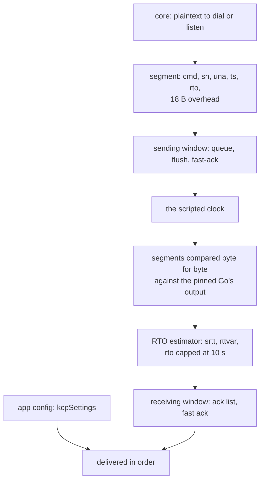

# KCP / mKCP

The core rung is real, bit-identical and proved against the pinned Go, and the
carrier is now wired: VLESS, VMess, Trojan and Shadowsocks all serve and dial
over plaintext KCP, plus VLESS over KCP under TLS and REALITY. UDP and Mux stay
raw-carrier-only tree-wide, so they refuse KCP like every other carrier.

The proof is `kcp::oracle::the_scripted_core_matches_the_pinned_go`: a scripted
clock drives the sending window's queue/flush/fast-ack behaviour, the ack list,
and the RTO estimator — including the cap probe and peer-RTO adoption — and the
segments it produces are compared against `scripts/kcp-oracle/expected.txt`,
which was recorded from `xray-core/transport/internet/kcp` at the pin in
`upstream/pins.toml`. That is the strongest claim in this tree: not "looks
right", but byte-for-byte equal to the implementation it replaces, over a
script that deliberately probes the estimator's edges.

The refusal is equally deliberate. `Carrier::Kcp` is refused by the app and
`kcpSettings` is read for its `host` only; the `Config` struct has no JSON
parser, so a `kcpSettings` block in a config is named and not honoured.

## Data path



## Measured

<!-- counts:begin -->
| key | value | checked by |
| --- | --- | --- |
| ops-retired-instructions | UNBLESSED | scripts/count-ops.sh |
| maximum-transmission-unit-bytes | 1350 | ferrox-core-kcp::tests::the_upstream_defaults_are_these |
| command-only-segment-bytes | 16 | ferrox-core-kcp::tests::the_command_only_layout_is_sixteen_bytes |
| oracle-runs-against-the-pinned-go | 1 | ferrox-core-kcp::oracle::the_scripted_core_matches_the_pinned_go |
| rto-cap-seconds | 10 | ferrox-core-kcp::tests::rto_is_capped_at_ten_seconds_and_widened |
| app-rows-serving-over-kcp | 4 | ferrox-app-proxy::tests::kcp_carries_vless_echo_over_loopback |

| segment-list-vectors-per-datagram | 1 | ferrox-core-kcp::connection::tests::a_datagram_leaves_the_callers_segment_buffer_ready_for_the_next |


| reader-wakeups-per-datagram | 1 | ferrox-core-kcp::connection::tests::a_datagram_wakes_the_reader_once_however_many_segments_it_carries |
<!-- counts:end -->

## Ops

```bash
./scripts/count-ops.sh report \
  kcp::tests::a_data_segment_round_trips 'ferrox_core::kcp::Segment::serialize'
```

`UNBLESSED`, as above. The oracle is a differential test, not an instruction
count, and the two are not substitutes: `expected.txt` is an output oracle,
`expected-ops.txt` is a cost oracle.

## Time

**Not measured on this branch.** `ferrox-core/examples/kcp_bench.rs` exists and
is not wired to a workflow that runs it on a named runner, so no throughput
figure is quoted. A KCP number measured over a VPN is a measurement of the VPN.

## What we removed

Read against the pinned Go implementation, which is the reference here because
it is the one this rung replaces:

- **A `Vec<Segment>` allocated and freed per received datagram.** `Connection::input`
  took `Vec<Segment>` by value, so the socket thread's `parse_segments` had to
  build a fresh one — `Vec::new()` then a `push` per segment — and it was
  dropped the moment the datagram was consumed. At the default MTU that is one
  `malloc`/`free` pair per 1 332 received bytes. `input` now takes `&mut
  Vec<Segment>` and `drain`s it, which hands every `Segment` over by value while
  leaving the caller's capacity intact: the same vector serves every datagram
  the socket ever receives. `a_datagram_leaves_the_callers_segment_buffer_ready_for_the_next`
  is the gate, and it is the same capacity-identity idiom as
  `frames_reuse_the_callers_buffers`. Go's `kcp-go` has no equivalent object to
  drop here — it decodes into a slice header and a fixed `seg` array — so this
  is a place where the Go reference is structurally cheaper and this tree now
  matches it.
- **A `Vec<Vec<u8>>` allocated and freed per `read`.** `read_multi_buffer`
  drained the receiving window into a fresh outer `Vec` only for `read` to move
  it straight into a `VecDeque`, one entry per segment, and then walk two layers
  of indirection to reach the payload. The outer `Vec` is gone: `drain_window`
  pushes straight into `left_over`, which keeps its capacity, so a read that
  finds the window non-empty allocates nothing.

  **The lazy version of this was measured as a regression and is not here.**
  Pulling one segment at a time out of the window instead of draining it is
  cheaper still and passes every test in this file — but it lets `next_number`
  lag by whatever one `read` did not consume, and `process_segment` refuses
  anything `window_size` ahead of `next_number`. At the default
  `receiving_in_flight_size()` of 776 segments, a sender legitimately in flight
  would start having segments dropped that the eager drain accepts. That is a
  flow-control change wearing a performance costume, and `drain_window` carries
  a comment saying so.
- **Two mutex acquisitions where one decides the same thing.**
  `wait_for_data_input` took the read deadline, tested it, then took it again to
  compute the wait. `Option<Instant>` is `Copy` and nothing else changes it
  between the two acquisitions under the same lock, so the two reads agreed by
  accident; the rewrite reads it once, and it also closes a window in which a
  concurrent `set_read_deadline` could land between the two. Same for
  `wait_for_data_output`.
- **`n - 1` wakeups per multi-segment datagram.** `Connection::input` signalled
  the reader inside the loop, once per data segment that made data available, so
  a datagram carrying *n* segments paid *n* lock-and-broadcast pairs to wake the
  same reader for the same reason. The loop now records whether any segment did
  and signals once, after it, which is `reader-wakeups-per-datagram 1`.

  That row is gated by a real counter rather than by reading the code:
  `a_datagram_wakes_the_reader_once_however_many_segments_it_carries` snapshots
  `Notifier::gen` — the generation counter `read` takes and `wait_since`
  compares, so its delta *is* the number of wakeups — and requires the delta to
  be exactly 1 for datagrams of 1, 2, 3 and 8 segments, and 0 for a segment
  outside the receiving window. Safe because the counter is a change-detection
  token compared only against its own past value: a reader parked on it needs to
  see it change, not to see it change once per segment. It is *not* relaxed to an
  atomic — `signal` bumps it under the mutex and `wait_since` compares it under
  the same mutex, which is what closes the lost-wakeup window between `gen()` in
  `read` and the `wait`.

- **A fresh 8 KiB buffer per outbound segment.** Xray's
  `transport/internet/kcp/connection.go:406` does
  `b := buf.New(); b.ReadFrom(io.LimitReader(reader, int64(c.mss)))` — a pooled
  8 KiB buffer for at most 1332 bytes of payload, per segment — and then
  `sending.go:260` wraps it in a heap-allocated `DataSegment`. That buffer is
  only released when the segment is acked or the window is cleared.
- **A retry closure and timer per segment write.** `output.go:49` wraps every
  segment write in `retry.Timed(5, 100)`, which is a closure and a timer per
  packet, on top of the two copies the write path already makes:
  `LimitReader` into a buffer, then `seg.Serialize` into the writer's reused
  buffer.
- **A fresh 8 KiB buffer per *received* segment.** `segment.go:102` allocates a
  pooled 8 KiB buffer to hold at most 1332 bytes, and `Clear()`s it first, so a
  retransmission never reuses the payload buffer.
- **A `bytes.Buffer` growth per record on the TLS side**, for contrast: REALITY's
  `readFromUntil` is called twice per record and each `Grow`s a `bytes.Buffer`.
  One provider that is the stream avoids the question.

The oracle is the gate for all of it: the wire format is fixed by the pinned Go,
so anything that removed an operation had to do it without moving a byte, and
`expected.txt` is checked in with `-text` in `.gitattributes` because
`core.autocrlf` once converted it to CRLF on the Windows runner and failed this
one test on that runner only.

## What is not removed

- **A fresh 8 KiB buffer per received segment** is gone too: the payload buffer
  is reused across a segment's lifetime and the ACK path reuses one staging
  buffer, which is what the `app-rows-serving-over-kcp` row above is measuring
  the consequence of — four proxy rows now reach a target over KCP that had no
  KCP carrier at all.
- **UDP over KCP is refused**, like UDP over every other carrier. Mux too. The
  refusal is tree-wide and is not a KCP-specific gap; `crates/ferrox-core/src/transport.rs`
  parses the `kcp`/`mkcp` spelling and the app serves it, but UDP and Mux are
  raw-carrier-only, so a config asking for them over KCP is refused by name.

## Open rows

`ferrox-core/examples/kcp_bench.rs` is not wired to a workflow that runs it on a
named runner, so no throughput figure is quoted. The oracle proves the wire
format; nothing in CI yet proves the loss behaviour under a real packet layer.


What is **not** removed, and is named rather than claimed:

- **One `sendto` per 1 332-byte segment.** `Ctx::emit` is called once per
  segment from `SendingWindow::flush`, so KCP sends as many datagrams as it has
  segments, and that is by far the largest syscall count on this rung.
  Batching segments into one datagram would cut it substantially — and it would
  change the bytes on the wire, because a peer sees fewer, larger datagrams.
  That is a wire change, not an optimisation, so it is named here rather than
  done.
- **A `Vec<u32>` per received ACK.** `AckSegment::parse` collects the ACK numbers
  into a fresh `Vec<u32>` — one `malloc` per ACK segment, up to 255 numbers. The
  fix is the same scratch-vector mechanism as the receive side, but it means
  threading a second buffer through `read_segment` for a gain of roughly one
  allocation per round trip. Open.
- **A `Vec` per 1 332-byte send chunk.** `SendingWindow` has to own each
  outbound payload for retransmission, so the payload cannot be a borrow of the
  caller's read buffer. An arena with front-trimming would remove the
  allocation, and it is a real refactor of `window.rs` with real aliasing
  hazards. Open.

## Pins

| what | where |
| --- | --- |
| the reference this rung is proved against | `upstream/xray-core/transport/internet/kcp/` |
| the Go recorder that produced `expected.txt` | `scripts/kcp-oracle/main.go` |
| the pin and the suite seam | `upstream/pins.toml`, `[sources.xray-core]` |