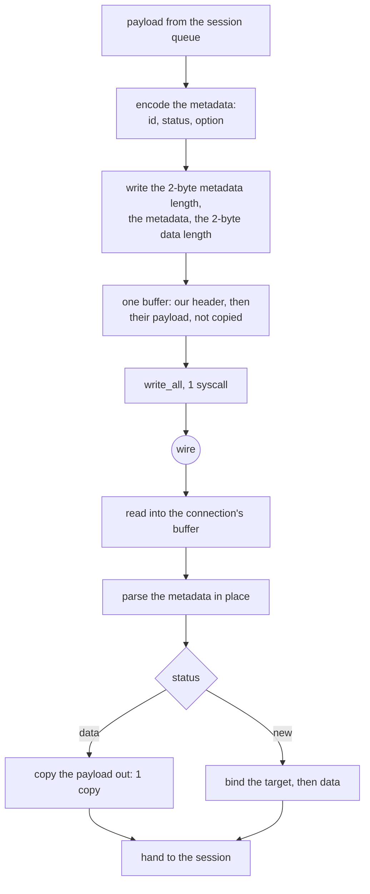

# Mux.Cool

Mux is the only method here whose bytes are not the caller's bytes: the frame
header is ours, the payload is not. That single fact decides the whole design.

A data frame is `metadataLen(2) | metadata | dataLen(2) | data`, where the
metadata is `sessionID(2) | status(1) | option(1)` and the `New` status carries a
source and a local address. The payload is handed to the relay exactly as it
arrived — `mux::CHUNK_MAX` is 8192 and nothing else in the pipeline touches it.

Write is therefore **zero** user-space copies per payload byte: the header is
appended in front of the caller's buffer and the whole thing is handed down as
one buffer. Read is one copy, out of the connection's own read buffer into the
caller's. There is no staging buffer, no temp and no per-frame allocation, and
`ferrox-bench` gate 6 requires all three of those to be exactly zero.

## Data path



## Measured

<!-- counts:begin -->
| key | value | checked by |
| --- | --- | --- |
| ops-retired-instructions | UNBLESSED | scripts/count-ops.sh |
| maximum-frame-payload-bytes | 8192 | ferrox-core-mux::tests::the_decoder_refuses_only_what_it_cannot_frame |
| user-space-copies-per-byte-written | 0 | ferrox-bench-gate-6 |
| user-space-copies-per-byte-read | 1 | ferrox-bench-gate-6 |
| mux-frame-allocations | 0 | ferrox-bench-gate-6 |
| live-session-cap | 8 | ferrox-core-mux::tests::the_concurrency_cap_counts_live_sessions_and_not_the_ids_used |
| xudp-frame-layout-matches-upstream | 1 | ferrox-app-proxy::tests::xudp_frames_match_the_upstream_layout |
<!-- counts:end -->

## Ops

```bash
./scripts/count-ops.sh report \
  mux::tests::a_new_frame_is_the_bytes_the_fields_add_up_to 'ferrox_core::mux::Frame::encode'
```

`UNBLESSED`, as above.

## Time

**Not measured on this branch.** `ferrox-bench` gate 6 compares Mux rows
field-for-field and requires zero allocations on both sides; that is a
correctness and allocation gate, not a clock. The clock is `.github/workflows/parity.yml`.
No artefact from this branch has been read.

## What we removed

- **The write-side payload copy.** Xray's `common/mux/writer.go:83` allocates a
  `MultiBuffer` per frame — `mb2 := make(buf.MultiBuffer, 0, len(data)+1)` — and
  appends the header buffer and the caller's payload buffers to it, so the
  payload is not copied but a slice is allocated per frame. sing-box, on the
  `smux` path, does `copy(buf[headerSize:], request.frame.data)` for every
  frame that is not vectorised, plus `result: make(chan writeResult, 1)` per
  frame and two goroutine handoffs. This tree appends into one buffer that
  exists for the connection, and gate 6 holds the allocation count at zero.
- **The read-side double copy.** Xray's frame unmarshal
  (`common/mux/frame.go:114-130`) reads the metadata into a pooled buffer, parses
  it, and then the chunk reader copies the payload out of the `BufferedReader`
  into the caller's buffer — two copies for one byte. Zray's `read_frame` reads
  the payload through `spare_capacity_mut` + `set_len`, which is one copy and no
  zero-fill; that is the shape here.
- **A 4 MiB receive buffer per session.** sing-box's smux defaults are
  `MaxReceiveBuffer = 4194304` and `MaxFrameSize = 32768`
  (`sagernet/smux/mux.go:62-71`), and `Allocator.Get` returns a `*[]byte`, so
  every frame costs a pool round trip plus one heap allocation for the head. The
  session cap here is 8, which is the smaller number that still gives one
  connection a handful of parallel streams.

XUDP now rides this mux. A `Network::Udp` target opens a UDP socket keyed by
the frame's `global_id`; datagrams arrive as `Keep` frames carrying their own
destination and replies return as `Keep` frames carrying their source, so one
XUDP session serves every destination of a SOCKS association instead of dialling
a carrier per destination. The client sends the mux request the way upstream
does — command 3, no address — so a real peer agrees on the wire.
`KeepAlive` is still a no-op, and the cap is still `DEFAULT_CAP` 8 live
sessions.

## Pins

| what | where |
| --- | --- |
| frame layout, `MultiBuffer` per frame, 8 KiB buffers | `upstream/xray-core/common/mux/` |
| smux frame sizes, per-frame channel, per-frame pool head | `upstream/sing-box` → `sagernet/smux/` |
| 64 KiB coalescing writer, `spare_capacity_mut` payload | `upstream/zeronet/crates/zero-protocol/src/mux.rs` |