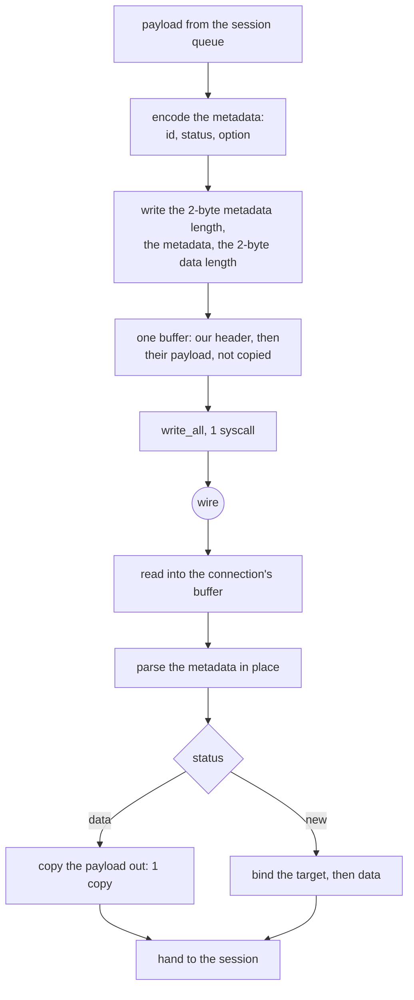

# Mux.Cool

Mux is the only method here whose bytes are not the caller's bytes: the frame
header is ours, the payload is not. That single fact decides the whole design.

A data frame is `metadataLen(2) | metadata | dataLen(2) | data`, where the
metadata is `sessionID(2) | status(1) | option(1)` and the `New` status carries a
source and a local address. The payload is handed to the relay exactly as it
arrived — `mux::CHUNK_MAX` is 8192 and nothing else in the pipeline touches it.

Write is therefore **zero** user-space copies per payload byte: the header is
appended in front of the caller's buffer and the whole thing is handed down as
one buffer. Read is one copy, out of the connection's own read buffer into the
caller's. There is no staging buffer, no temp and no per-frame allocation, and
`ferrox-bench` gate 6 requires all three of those to be exactly zero.

## Data path



## Measured

<!-- counts:begin -->
| key | value | checked by |
| --- | --- | --- |
| ops-retired-instructions | UNBLESSED | scripts/count-ops.sh |
| maximum-frame-payload-bytes | 8192 | ferrox-core-mux::tests::the_decoder_refuses_only_what_it_cannot_frame |
| relay-copies-per-byte-written | 0 | ferrox-app-proxy::tests::a_two_part_write_hands_the_payload_over_by_pointer |
| codec-copies-per-byte-written | 1 | ferrox-core-mux::tests::a_header_plus_a_patched_length_is_the_whole_frame |
| mux-frame-allocations | 0 | ferrox-bench-gate-6 |
| live-session-cap | 8 | ferrox-core-mux::tests::the_concurrency_cap_counts_live_sessions_and_not_the_ids_used |
| xudp-frame-layout-matches-upstream | 1 | ferrox-app-proxy::tests::xudp_frames_match_the_upstream_layout |

<!-- counts:end -->

## Ops

```bash
./scripts/count-ops.sh report \
  mux::tests::a_new_frame_is_the_bytes_the_fields_add_up_to 'ferrox_core::mux::Frame::encode'
```

`UNBLESSED`, as above.

## Time

**Not measured on this branch.** `ferrox-bench` gate 6 compares Mux rows
field-for-field and requires zero allocations on both sides; that is a
correctness and allocation gate, not a clock. The clock is `.github/workflows/parity.yml`.
No artefact from this branch has been read.

## What we removed

- **A full `memcpy` of every inbound byte, on all three read loops.** The
  accept loop, `mux_dial_downlink` and the XUDP reader each read into an 8 KiB
  stack array and then did `buf.extend_from_slice(&probe[..n])`, so every byte
  off the socket was copied once before the framing loop could see it — while
  `mux::decode` was already handing out a *borrowed* subslice of `buf`, which
  the consumer then writes straight to its socket. The framing buffer's own
  spare capacity is the read destination now, via `proxy::read_into_tail`, the
  same idiom `ws.rs::pull` and `vision.rs::fill` already used and for the same
  reason. The buffer is sized once with `with_capacity(READ_SLICE)` and `clear`ed
  between reads, so the relay loop never reallocates either. The user-space copy
  count on the read side goes from one to zero; the syscall count is unchanged,
  because a TCP read is a read either way.
  `a_read_into_the_tail_appends_exactly_what_the_stream_held` is the gate: it
  drains a stream through a five-bytes-at-a-time reader — 3 300-odd short reads
  over 16.5 KiB — and checks after *every* read that the buffer holds exactly the
  prefix the source held. A second test covers the two ways the `set_len` can be
  rolled back, the failing reader and the empty one, because a buffer left longer
  than the bytes read is how this idiom reads uninitialised memory.

  **Not claimed: the buffer does not reallocate.** `decode` returns `Short` with
  a partial frame still buffered, and the largest mux frame is
  `2 + META_MAX + 2 + 8192`, so a read can leave the buffer holding a near-maximal
  partial frame before `READ_SLICE` is appended. `with_capacity(READ_SLICE)` plus
  `reserve` reaches that on the second growth and stays there, so the new code
  reallocates at most twice per connection where the old `Vec::new()` grew
  geometrically — better, but not zero, and no row claims otherwise. Sizing the
  buffer to `2 + META_MAX + 2 + 8192 + READ_SLICE` up front would make it zero,
  and is not worth an over-sized first allocation on the evidence available.
- **The uplink's one payload copy per byte, and its per-frame header rebuild.**
  A mux payload is *framed*, not sealed: it goes on the wire behind a two-byte
  length with nothing else done to it. So the payload does not have to be moved
  into the frame buffer at all. `mux_dial_uplink` used to read into a stack
  buffer and then `encode_into` the whole frame — a full `memcpy` of every
  relayed byte — and it rebuilt the entire header per read even though the
  metadata is the same for every frame on that uplink. It now builds the header
  **once** and rewrites only its two-byte payload length, then hands the kernel
  the header and the read buffer as two `writev` parts, so the payload reaches
  the socket from where it was read. One syscall, unchanged; one `memcpy` of every
  relayed byte, gone.

  Three things had to hold, and each has its own gate rather than one test:

  - **The two encoders cannot drift.** `encode_into` is now
    `check_meta` + `write_meta` + the payload, and `encode_header_into` is
    `check_meta` + `write_meta` + a zeroed length — one implementation of the
    metadata, not two. `a_header_plus_a_patched_length_is_the_whole_frame` then
    requires header-plus-payload to equal the single-buffer encoder across every
    status, option, target and identity combination that type will encode, at
    ten payload lengths.
  - **The wiring delivers what the codec describes.**
    `the_mux_uplink_frames_every_relay_read_the_same_way` drives the relay over a
    real socket pair at seven total lengths, decodes every frame off the wire and
    requires the reassembled bytes to equal what was written to the client.
  - **The payload is handed over by pointer, not copied.**
    `a_two_part_write_hands_the_payload_over_by_pointer` asserts the second
    `writev` part's base address *is* the payload slice's. This is the only kind
    of test that can see the copy: a byte-level test cannot, because the bytes
    are identical either way — reverting to the copying form still passes the
    framing test, and that is the honest shape of this claim.

  **Two rows on this page were wrong and are corrected rather than kept.** Both
  `user-space-copies-per-byte-written 0` and `-read 1` named `ferrox-bench-gate-6`,
  which counts *allocations, bytes allocated and zero-fills* — not copies
  (`check_encode_allocs`, `muxframe.rs:234`). So the checker did not observe what
  the row claimed, and the written value was also wrong for the codec:
  `encode_into` copies the payload into the output buffer, so the codec's write
  side is **1** copy per byte, not 0. They are now `relay-copies-per-byte-written 0`
  — gated by the pointer identity above — and `codec-copies-per-byte-written 1`,
  which is the floor for an in-place-serialised codec and what the decode side's
  borrowed subslice already achieves.
- **The write-side payload copy.** Xray's `common/mux/writer.go:83` allocates a
  `MultiBuffer` per frame — `mb2 := make(buf.MultiBuffer, 0, len(data)+1)` — and
  appends the header buffer and the caller's payload buffers to it, so the
  payload is not copied but a slice is allocated per frame. sing-box, on the
  `smux` path, does `copy(buf[headerSize:], request.frame.data)` for every
  frame that is not vectorised, plus `result: make(chan writeResult, 1)` per
  frame and two goroutine handoffs. This tree appends into one buffer that
  exists for the connection, and gate 6 holds the allocation count at zero.
- **The read-side double copy.** Xray's frame unmarshal
  (`common/mux/frame.go:114-130`) reads the metadata into a pooled buffer, parses
  it, and then the chunk reader copies the payload out of the `BufferedReader`
  into the caller's buffer — two copies for one byte. Zray's `read_frame` reads
  the payload through `spare_capacity_mut` + `set_len`, which is one copy and no
  zero-fill; that is the shape here.
- **A 4 MiB receive buffer per session.** sing-box's smux defaults are
  `MaxReceiveBuffer = 4194304` and `MaxFrameSize = 32768`
  (`sagernet/smux/mux.go:62-71`), and `Allocator.Get` returns a `*[]byte`, so
  every frame costs a pool round trip plus one heap allocation for the head. The
  session cap here is 8, which is the smaller number that still gives one
  connection a handful of parallel streams.

XUDP now rides this mux. A `Network::Udp` target opens a UDP socket keyed by
the frame's `global_id`; datagrams arrive as `Keep` frames carrying their own
destination and replies return as `Keep` frames carrying their source, so one
XUDP session serves every destination of a SOCKS association instead of dialling
a carrier per destination. The client sends the mux request the way upstream
does — command 3, no address — so a real peer agrees on the wire.
`KeepAlive` is still a no-op, and the cap is still `DEFAULT_CAP` 8 live
sessions.

## Pins

| what | where |
| --- | --- |
| frame layout, `MultiBuffer` per frame, 8 KiB buffers | `upstream/xray-core/common/mux/` |
| smux frame sizes, per-frame channel, per-frame pool head | `upstream/sing-box` → `sagernet/smux/` |
| 64 KiB coalescing writer, `spare_capacity_mut` payload | `upstream/zeronet/crates/zero-protocol/src/mux.rs` |