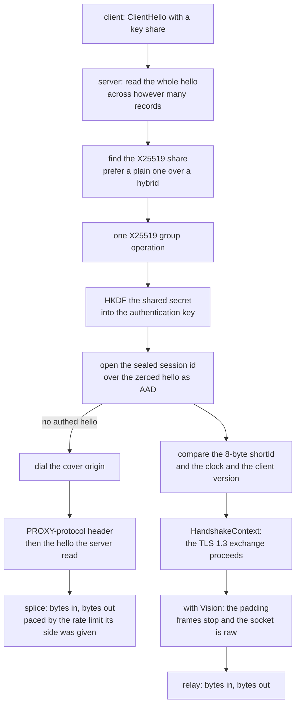

# REALITY and TLS

One TLS stack, one interface. `TlsProvider` is implemented by rustls and the
provider *is* `Read + Write`, so nothing above this rung can depend on the stack
underneath — no feature to select, no build without TLS, and no second provider
to keep in step. `active_backends()` names it, and it names one.

REALITY is the server side only in this tree. The `security` gate in the proxy
accepts an outbound when `security` is empty or `none` and **skips** a REALITY
outbound rather than attempting it, so a REALITY row in the matrix is a server
row. That is the first thing to know about this method; the rest is the
handshake's cost.

What the handshake does: read the ClientHello, find the X25519 key share, do one
group operation, derive the shared secret, HKDF it into an authentication key,
and check that the certificate the peer presented is the certificate this
session's key can account for — plus an eight-byte `shortId` compared against
what the client sent. The certificate is minted per authentication key, so two
sessions never present the same bytes.

## Data path



## Measured

<!-- counts:begin -->
| key | value | checked by |
| --- | --- | --- |
| ops-retired-instructions | UNBLESSED | scripts/count-ops.sh |
| tls-providers | 1 | ferrox-core::active_backends |
| client-outbound-rows-dialled | 0 | ferrox-app-proxy::tests::vless_outbound_with_reality_security_is_skipped |
| x25519-shares-recognised | 3 | ferrox-core-reality::tests::the_x25519_share_is_found_in_every_group_that_carries_one |
| short-id-bytes | 8 | ferrox-core-reality::tests::a_short_id_is_zero_padded_to_eight_bytes |
| cover-origin-dials-per-authenticated-hello | 0 | ferrox-core-reality::tests::an_authenticated_hello_costs_the_cover_origin_nothing |
| cover-origin-bytes-per-spliced-hello | 1 | ferrox-core-reality::tests::an_unauthenticated_hello_is_spliced_into_the_cover_origin_byte_for_byte |
| proxy-protocol-header-bytes | 28 | ferrox-core-reality::tests::the_binary_proxy_header_is_a_fixed_rectangular_twenty_eight_bytes |
<!-- counts:end -->

## Ops

```bash
./scripts/count-ops.sh report \
  reality::tests::an_authenticated_hello_is_accepted 'ferrox_core::tls::reality::authenticate'
```

`UNBLESSED`, as above, and `scripts/method-ops.txt` names no REALITY symbol, so
`ops.yml` will not report one until it does.

## Time

**Not measured on this branch.** `der_to_pem 2653` is the single instruction
count this repository has ever blessed, and it is measured by `ops.yml` on
`ubuntu-latest` because valgrind does not exist on the other runners. No
handshake duration is quoted from a machine without a named runner.

## What we removed

- **A second TLS stack to keep in step.** Xray carries REALITY as a fork of
  `crypto/tls` at a pinned pseudo-version, and reaches into `tls.Conn` with
  `reflect` plus `unsafe.Pointer` at `proxy.go:688-728` to steal the live
  `input *bytes.Reader` and `rawInput *bytes.Buffer` so Vision can flush what was
  over-read. sing-box clones a `utls.Config` per handshake and builds the
  ClientHello **twice** — once, then again after filtering out ML-KEM
  (`common/tls/reality_client.go:144-160`) — and then reads an unexported
  `peerCertificates` field through reflection and `unsafe.Add` to verify
  (`:284-306`). One provider that *is* the stream means Vision never needs to
  reach into anything, which is why
  [the Vision page](xtls-vision.md) can end the framing by handing the socket
   over instead of by copying bytes out of someone else's buffer.
- **Reflection and `unsafe` in the handshake.** The gates are
  `an_authenticated_hello_is_accepted`, `every_unauthenticated_hello_is_refused`
  and `the_certificate_differs_per_auth_key`.
- **A hybrid key share when a plain one is present.** One group operation per
  authenticated hello, not two; `a_plain_share_is_preferred_over_a_hybrid_one`
  is the gate.
- **One cover-origin dial per accepted socket.** Both references dial the real
  site *before* reading a byte, so a port scanner costs one outbound connection
  each. The dial here is lazy: an authenticated hello costs the cover origin
  nothing, and a refused one costs exactly the hello the server read, which is
  `an_authenticated_hello_costs_the_cover_origin_nothing`.
- **A split hello reassembled twice.** The reader grows one buffer and stops at
  the declared handshake length, then hands rustls the same bytes through a
  replay prefix, so the record framing is read once rather than re-parsed by a
  second implementation. A timeout keeps waiting for a hello that arrived in
  two segments instead of refusing a handshake that was working.

What is **not** removed, and is the open row this method is really waiting on:
there is no uTLS fingerprint shaping in this tree at all, so the
`unsafe-*` fingerprint extension parses, requires opt-in, and would spoof nothing
even with consent. The REALITY client role is unwired, so a REALITY outbound is
still skipped rather than dialled. And the certificate problem the roadmap calls
out is still open: REALITY's only recognised certificate has an Ed25519 key, no
uTLS fingerprint offers signature algorithm `0x0807`, and all eleven committed
raw ClientHellos list eight to eleven signature algorithms, none of them `0x0807`.

## Pins

| what | where |
| --- | --- |
| the fork of `crypto/tls`, the reflection into it | `upstream/xray-core` → `github.com/xtls/reality`, `proxy/proxy.go` |
| the double ClientHello, `utls`, reflection | `upstream/sing-box/common/tls/reality_client.go` |
| the certificate and shortId oracle | `github.com/xtls/reality` `tls.go:200-300`, `handshake_server_tls13.go:100-180` |