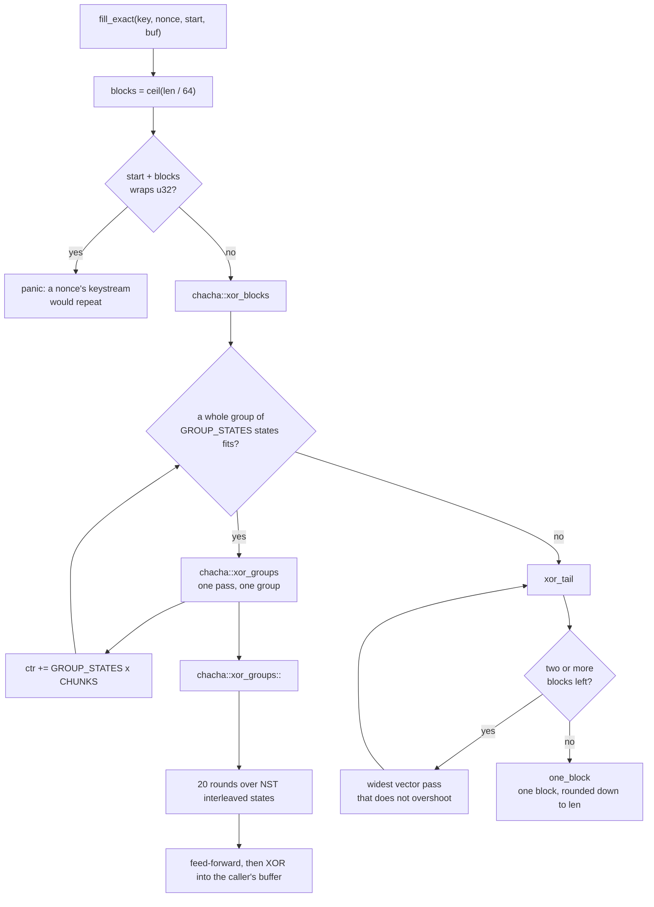
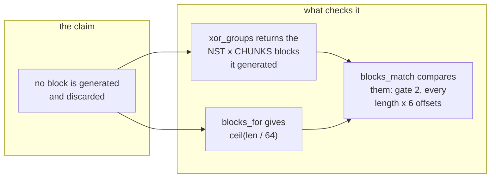

# `ferrox_core::record::fill_exact`

XORs ChaCha20 keystream over a buffer, in place, generating exactly as many blocks as the buffer needs.

## Signature

```rust
pub fn fill_exact(
    key: &[u8; 32],
    nonce: &[u8; 12],
    start_block: u32,
    buf: &mut [u8],
) -> u64 // blocks generated
```

## What it replaces

Xray-core, sing-box and AmneziaWG all reach ChaCha20 through an AEAD interface that cannot be positioned partway through a keystream, so a caller wanting *n* bytes derives keystream for a fixed larger unit — a four-block refill — and copies out the part it wanted. A 40-byte record pays for 256 bytes of rounds and discards 216.

The upstream `chacha20` crate has the same shape from the other side: its one-shot `apply_keystream` generates a full 64-byte block per call, and its AVX2 backend computes **four** blocks per call and uses one when asked for one. That waste is measured, not assumed — see [the note on the reference](#the-reference-is-not-as-fast-as-it-looks).

## How



There is no ladder of hand-picked rungs any more, and the tail is not the scalar core. A whole group goes through the vector core; what is left goes through the widest vector pass that covers it without generating a block nobody asked for; one block alone goes to `one_block` — the scalar core off x86_64, `chacha::sse2` on it, because LLVM compiles the portable core to scalar code there. A partial last block is generated with the block before it and stored short, so a 100-byte buffer is two interleaved blocks, not one interleaved block and a half.

## What "exactly as many blocks as needed" is checked against

`fill_exact` returns what the ladder reported, and the count comes from the passes that ran the rounds: `xor_groups` returns the `NST * CHUNKS` blocks it generated, the ladder sums those, and the counter advances by the same values, so the report and the advance are one number read twice. `blocks_for(len)` is what the caller's length needs, `blocks_match(len, generated)` is the comparison, and gate 2 runs it at every length and every block offset.

The count used to be `blocks_for(buf.len())` computed inside `fill_exact` and compared against `blocks_for(len)` — `ceil(n / 64) == ceil(n / 64)`, which cannot fail, and was reported green on four runners. Two tests cover the arrangement now: one calls the ladder at 3 offsets x 6 lengths, and one feeds the comparison a count one block high and one block low and requires it to reject both.



## Safety

- No `unsafe` in this function or in `chacha::portable`. Every store is a sub-slice of the caller's buffer derived by `as_chunks_mut`, so a write past the end is an index panic rather than a silent overrun.
- The counter is checked against wrap **before** any work. A nonce's keystream repeating is a silent confidentiality failure, so it panics instead, and a test asserts the buffer is untouched when it does.
- Miri runs these paths on nightly. See [`chacha-xor-blocks.md`](chacha-xor-blocks.md) for what Miri does and does not reach.

## Verification

| property | how it is checked | where |
| --- | --- | --- |
| bit-identical | vs the `chacha20` crate, 2 key pairs x 6 block offsets x 44 lengths | `core::tests::every_rung_matches_the_reference`; 3600 shapes in the gate |
| no discarded work | the ladder's own count equals `blocks_for(len)`, at 6 block offsets | `record::tests::the_ladder_reports_the_blocks_the_caller_asked_for`; `ferrox-bench` gate 2 |
| no wrap | panics before writing | `record::tests::refuses_a_wrapping_counter` |
| no allocation | counting global allocator, gated at 0 | `ferrox-bench` gate 2 |
| not slower | timing bar, re-measured before failing | `ferrox-bench` gate 3 |

Every key and nonce used by every test differs in **every byte**: an all-equal key cannot distinguish a correct word order from a permuted one, because every lane holds the same value and a core that read the wrong four key words produces an identical state. That gap once let a byte-offset bug pass a suite explicitly checking for it.

## The reference is not as fast as it looks

The reference's speed depends on the architecture, and the difference is large enough to be the whole story on aarch64: `chacha` 0.9.1 selects its backend in `backends.rs`, and the NEON branch requires a `chacha20_force_neon` cfg that nothing in the crate sets.

| target | what the reference compiles to | blocks per iteration |
| --- | --- | --- |
| x86_64 with AVX2 | `avx2.rs` | 4 |
| x86_64 without AVX2 | `sse2.rs` | 1 |
| **aarch64** | **`soft.rs`, scalar** | **1** |
| NEON, if it were enabled | `neon.rs` | 4 |

So on an aarch64 runner the reference is a scalar core and a vector core wins by a lot, and a report that said only "vs chacha20 0.9.1" would credit that gap to this workspace. Every report therefore prints both backends — see [`ferrox_core::core::backend`](../arch/overview.md#the-two-backends-are-not-the-same-thing).