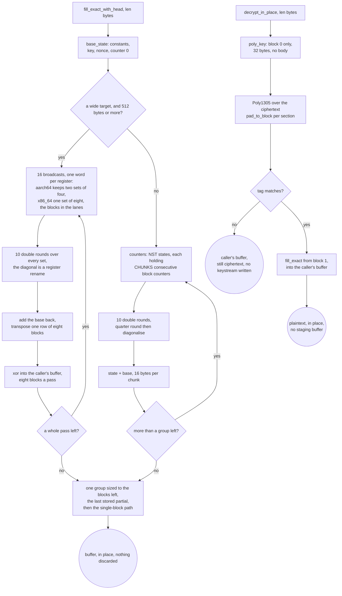

# The record layer: one ChaCha20 ladder, one Poly1305, one AES-GCM

Every AEAD method in this tree ends here. Shadowsocks, VMess and XTLS Vision
never touch a cipher primitive of their own; they call
`record::fill_exact` and `record::fill_exact_with_head`, and the only thing
above this rung that knows a block is 64 bytes long is `ferrox-bench`.

The shape that makes it cheap is that there is exactly one ladder round
function, written once, generic over a `Lanes` trait. `portable::U4` (four
`u32`), `sse2::S4`, `neon::N4` and `avx2::A8` implement it, so a ladder backend
cannot disagree with another about the algorithm — it can only be slower. The
portable backend is safe Rust, which is what lets Miri interpret the ladder at
all; the SIMD backends are five instructions each whose only failure mode is a
wrong answer, and a wrong answer is caught by a differential test before any
timing runs.

Above 512 bytes on aarch64 a fifth implementation takes over, `chacha::soa`: it
gives a register one *word* of eight blocks instead of one row of one block, so
a diagonal round is a rename of the row registers where `neon::N4` needs six
`vext` per double round per block — and the permute pipe is the floor this core
has. The four registers of a row transpose once at the store instead, which is
the layout `x/crypto`'s arm64 assembly keeps. Two sets of four blocks, not one:
a half round ends in a barrier, because all four diagonal quarter rounds read
what all four column quarter rounds wrote, so a four-block pass has four chains
across that barrier and nothing to issue while they are in flight. The
four-block form measured exactly that — in gate 3 of `bench.yml` runs
`37720316104` and `37723102887` its ratio against the pinned `chacha20` crate
went 1.50x to 1.98x on the linux aarch64 runner and 2.96x to 2.08x on the macos
aarch64 one, a kernel bound by its own dependency chains rather than by its op
count. Sharing the sixteen broadcasts and the base between two sets puts
sixteen quarter rounds and eight chains in a double round, which is the ladder's
shape, at the register cost the ladder already pays for its eight blocks. Its
only *checked* claim is equality: `chacha::soa` is timed nowhere until it has
produced the same keystream as the ladder, which
`chacha::soa::tests::the_eight_block_pass_is_the_ladder_at_every_length` asserts
byte for byte at every length to 1032 bytes and at four start counters, head and
headless, and gate 1 asserts the same bytes against the pinned `chacha20` crate
before gate 3 times anything.

`fill_exact_with_head` is the interesting entry point. ChaCha20-Poly1305 needs
block 0 as the Poly1305 one-time key and blocks 1.. as the payload keystream,
and a naive seal generates block 0, throws away 32 of its bytes, generates
blocks 1.. separately, and pays for the 32 unused bytes. The head form takes
the first 32 bytes of block 0 out of the same group of states that computes
blocks 1.., so the fused seal generates `ceil(len / 64) + 1` blocks and
discards nothing.

## Data path



## Measured

<!-- counts:begin -->
| key | value | checked by |
| --- | --- | --- |
| ops-retired-instructions | UNBLESSED | scripts/count-ops.sh |
| discarded-keystream-blocks | 0 | ferrox-bench-gate-2 |
| allocations-per-fill | 0 | ferrox-bench-gate-2 |
| zero-filled-bytes-per-fill | 0 | ferrox-bench-gate-2 |
| blocks-per-byte | 1/64 | ferrox-bench-gate-2 |
| blocks-per-iteration | 8 | ferrox-core-chacha::backend |
| fused-head-blocks | 1 | ferrox-core-record::tests::the_head_is_the_references_own_first_block_and_the_rest_is_unshifted |
| backends-a-differential-test-cannot-lie-to | 5 | ferrox-bench-gate-1 |
<!-- counts:end -->

## Ops

```bash
./scripts/count-ops.sh report \
  record::tests::the_head_is_the_references_own_first_block_and_the_rest_is_unshifted \
  'ferrox_core::record::fill_exact'
```

`UNBLESSED`, as above: no measured instruction count is quoted for this rung.

### What is counted here, and what is only argued

The table above is the gated half of this page. Four of the removals just
described — the staging buffer, the two keystream passes, the second
`update` per padded section, and the empty absorbs — are **counts with no
counter behind them**. Nothing in this tree counts ChaCha blocks per open,
stack bytes staged, `update` calls, or `absorb` invocations, and
`ferrox-bench`'s counting allocator would not see a stack `[u8; 64]` even if
it were extended to measure the open: `count::measure` hooks `alloc` and
`alloc_zeroed`, and the staging buffer is on the stack. So those four are
argued from the source at the line named beside each one, and what *is* gated
is that they are bit-identical — `every_decrypt_matches_the_crate_it_replaces`
opens 6 000+ cases against the pinned `chacha20poly1305` crate and requires the
same plaintext, and requires a forged tag to leave the buffer encrypted.

A number nobody can produce is not a number, so they are not in the table. If
they are ever to be gated rather than argued, the honest instrument is a
block counter on the ladder that `count-ops` reads, not an allocation counter:
that is the same gap P41 and P25 are named for.

## Time

Measured in `bench.yml` run `37728743550`, which carries the pass (`66c704e`
over `89f9714`), against the same rows in run `37720316104`, which carried the
ladder alone (`4bb63c5`). Gate 3 times this rung against the pinned `chacha20`
0.9 crate at 235 lengths from 65 to 65 537, interleaved best of five per side,
and re-measures any length under 0.95x before the job can fail on it; gate 1
runs the differential identity check first, so a backend that is fast because
it is wrong cannot pass.

| bytes | linux aarch64, ladder | linux aarch64, pass | macos aarch64, ladder | macos aarch64, pass |
| ---: | ---: | ---: | ---: | ---: |
| 1 KiB | 1.49x | 1.66x | 3.19x | 3.12x |
| 4 KiB | 1.50x | 1.69x | 2.96x | 3.13x |
| 16 KiB | 1.50x | 1.70x | 2.95x | 3.19x |
| 64 KiB | 1.50x | 1.70x | 2.98x | 3.25x |

Both runs measured their own reference in the same process, so the ratios
compare, but they are different runner instances. Lengths below 512 bytes
compile to the same ladder in both runs, and those 203 rows are this
comparison's noise floor: 0.94x to 1.01x on linux aarch64, 0.61x to 1.30x on
macos aarch64. Against that floor, the 32 measured lengths at or above 512
bytes — the ones the pass handles — run 1.04x to 1.14x, median 1.11x, on linux
aarch64, every one of them above it, and 0.92x to 1.42x, median 1.05x, on macos
aarch64, where the three rows under 1.0x (769, 1024 and 2047 bytes) move less
than the noise beside them does.

Gate 7b's halves are printed and not gated, and at these sizes they are the
weaker instrument: on macos aarch64 its 16 KiB keystream row read 9356 ns for
the pass against 9041 ns for the ladder, while gate 3 read the pass 1.08x faster
at the same length. The self-timed row has no reference to cancel a drifting
runner, so the claim here rests on gate 3.

`c8e19b4` then sized the ladder's last group to every block a buffer has left
rather than leaving one over for the single-block path, and `701298f` made the
calibration time the chain that one block pays for. The pair is measured in
`bench.yml` run `37737912879` against run `37730127644`, which carried the pass
at `d31ddae`, and the lengths it moves are the ones whose remainder is exactly a
group: on `aarch64` that is any length of the form `k × 512 + 449..511`, where
eight states in one group replace seven states and a whole dependent round
chain. Four of the 235 timed lengths sit in that window — 449, 511, 1023 and
1535 — and all four are most of what separates the two runs on linux aarch64,
0.08x of ratio being this pair's noise floor there. The macos rows move further
because its small lengths are the noisier ones, so its four are quoted beside
them rather than claimed:

| bytes | linux aarch64, before | linux aarch64, after | macos aarch64, before | macos aarch64, after |
| ---: | ---: | ---: | ---: | ---: |
| 449 | 1.29x (640 ns) | 1.54x (539 ns) | 1.71x (445 ns) | 2.91x (280 ns) |
| 511 | 1.30x (646 ns) | 1.53x (545 ns) | 1.84x (415 ns) | 2.91x (282 ns) |
| 1023 | 1.44x (1 146 ns) | 1.60x (1 042 ns) | 2.33x (655 ns) | 2.97x (549 ns) |
| 1535 | 1.52x (1 632 ns) | 1.62x (1 528 ns) | 2.55x (893 ns) | 3.01x (810 ns) |

Run `37740838172` repeats those two rows on the same two runners — 449 bytes
reads 1.53x (543 ns) on linux aarch64 and 2.93x (274 ns) on macos aarch64 — so
the change is the tail and not the run.

The `x86_64` rows of those two runs are not usable for that comparison, and the
reason is the one the `x86_64` pass below exists for. GitHub moved those runners
between the runs: the rows before and after were read on an `avx2` + `vaes`
machine, and run `37737912879` landed on one carrying `avx512f`, where the same
`x86_64` binary read 0.76x to 0.96x of the reference at 512 bytes and above
against 1.20x on the machine before it, while the reference's own clock moved
18%. The ladder's pass-length loop is untouched by both commits and the same
binary ran on both machines, so that was a property of the runner: the ladder
spends forty shuffle ops a double round for the eight blocks it holds, where the
pass spends sixteen, and a machine that issues one shuffle a cycle charges for
the difference.

Run `37740838172` carries the pass, against run `37737912879`, which is the same
ladder on the same runner class — the reference's own clock at 16 KiB reads
9 316 ns against 9 175 ns on linux `x86_64` and 7 781 ns against 6 974 ns on
windows `x86_64`, so the windows runner is the slower of the two by about a
tenth and its absolute column is read with that in mind:

| bytes | linux x86_64, ladder | linux x86_64, pass | windows x86_64, ladder | windows x86_64, pass |
| ---: | ---: | ---: | ---: | ---: |
| 1 KiB | 0.98x (601 ns) | 1.38x (428 ns) | 0.80x (569 ns) | 1.29x (392 ns) |
| 4 KiB | 3.58x (1 773 ns) | 3.58x (1 743 ns) | 0.79x (2 243 ns, remeasured) | 1.32x (1 483 ns) |
| 16 KiB | 0.96x (9 521 ns) | 1.36x (6 846 ns) | 0.76x (9 159 ns) | 1.33x (5 863 ns) |
| 64 KiB | 0.96x (38 329 ns) | 1.36x (27 188 ns) | 0.76x (36 648 ns) | 1.32x (23 561 ns) |

The 4 KiB linux row is the one that does not move, and the reason is in the
reference rather than in either side of the change: at 4 KiB the reference
itself takes 6 351 ns against 6 604 ns for 16 KiB, so that ratio is set by the
reference's own buffer and both sides read 3.58x. Every other row is the pass,
with the absolute times down 28% on linux `x86_64` and 36% on windows `x86_64`.
Below 512 bytes on `x86_64` the ladder is what runs in every one of those runs,
so those rows read the machine and not the pass: 64 to 128 bytes move between
2.0x and 2.3x across the ladder pair on linux `x86_64` while running the same
binary, and the only small lengths either commit touches there are the tail's
own groups — 320 bytes reads 1.47x (185 ns) in the pass's run against 1.48x
(179 ns) in the run before it, and 448 bytes 1.51x (312 ns) against 1.52x
(304 ns).

## What we removed

- **Six lane permutations a double round a block on `aarch64`, and ten
  single-cycle shuffles a double round a state on `x86_64`.** Both lane layouts
  diagonalise by rotating the lane order of the row registers: `neon::N4`
  spends six `vext` a double round for its one block, so a block's twenty rounds
  pay sixty permutations, and `avx2::A8` spends six `vpshufd` and four `vpshufb`
  a double round for its two blocks, forty shuffles a double round for the eight
  blocks it holds. The pass diagonalises by *naming*: one state word per
  register and the blocks in the lanes means the four registers of a diagonal
  quarter round are the four registers of the column one, so the rotation is
  free and the only shuffles left are the two byte-level rotations of each
  quarter round — two a block a double round, against five on `x86_64` and six
  on `aarch64`. What the pass pays instead is one transpose of four registers
  per row of blocks at the store. Nothing else moves: the quarter round, the ten
  double rounds and the keystream bytes are the same, and the pass's equality
  with the ladder is asserted at every length before gate 3 times either side —
  `soa::tests::the_eight_block_pass_is_the_ladder_at_every_length` on `aarch64`
  and `avx2::tests::the_eight_block_pass_is_the_ladder_at_every_length` on
  `x86_64`, both at every length to two passes and six start counters, with the
  one-time key compared beside the ciphertext.
- **What the pass did not remove, on purpose.** Below 512 bytes both targets
  are still their lane ladder: a pass pays its setup for eight blocks whether
  eight are wanted or one, and a group sized to the blocks that are left asks
  for exactly the blocks the caller asked for. The single-block path that closes
  a call — one dependent round chain, which is the whole cost of a short record
  — is still there for a block or less, and it is the one place the calibration
  decides: it timed sixty-four *independent* blocks per core, which measures the
  throughput of a wide register file and not the latency of one block with
  nothing beside it to issue, and read the lanes as the faster tail on machines
  where one block does not fill the four-lane core. It now counts each call from
  the word the one before it wrote, so the loop is the dependent chain the tail
  actually pays for, and the same verdict test still checks that the two cores
  agree byte for byte before the verdict is trusted. The MAC beside the keystream is untouched by
  this slice, and the limb extraction it got in the slice before is not a clean
  win: five `TBL4` lookups a group read 4152 ns against the scalar windows' 4421
  ns at 16 KiB on macos aarch64, and 6436 ns against 6222 ns on linux aarch64.
  It is faster on one runner, slower on the other, and named here rather than
  left as a win.
- **Keystream that was generated and thrown away.** Gate 2 compares the block
  count the ladder reports against `ceil(len / 64)` at every length in a
  0..=65 537 sweep and at six start counters, and fails on any excess. The
  `chacha20` crate the reference uses fills a keystream buffer *four blocks at
  a time* on every backend it ships, which is what makes a short call expensive;
  the ladder here sizes its last group to the blocks that are left and only
  rounds up to a state's width — two blocks on `x86_64`, one on `aarch64` — so
  the blocks a length asks for are the blocks a length pays for, and the count
  it reports is `ceil(len / 64)` at every length. `record::blocks_with_head_match`
  is the same accounting for the fused head: an empty body plus a 32-byte head
  is one block, not two. Two things that are *not* zero, named rather than
  claimed: a two-block state computes its second block whether or not the
  buffer carries it on `x86_64`, and a pass of eight blocks carries its lanes
  whether or not a headed buffer stores all of them. Neither is a *discarded*
  block in the table's sense — the table's row is the count the ladder reports,
  which gate 2 sweeps against `ceil(len / 64)` — they are lanes of an
  instruction that was already being issued.
- **A per-call allocation and a memset.** Gate 2 runs the fill under a
  `#[global_allocator]` that separates `alloc` from `alloc_zeroed`, and requires
  exactly zero of each at every length. A `Vec<u8>` staging buffer per call, or
  a `vec![0; len]` that the caller then overwrites, both fail that gate — which
  is the same finding Zray recorded in its own hot-path allocator gate, where
  `vec![0u8; n]` "zeroes up to 64 KiB that the read then overwrites".
- **The 64-byte staging buffer every open used to carry.** A ChaCha20-Poly1305
  open has to authenticate the *ciphertext*, so it cannot decrypt before the tag
  is checked and it cannot check the tag after the buffer holds plaintext. The
  way out is that Poly1305 needs no keystream at all: `aead.rs` now derives the
  one-time key, authenticates the ciphertext in place, compares the tag, and
  only then calls `fill_exact(key, nonce, 1, buf)`. The old shape generated the
  first 64 bytes of body keystream into a `[u8; 64]` on the stack, XORed them
  back into the caller's buffer with a 64-iteration scalar loop, and then called
  `fill_exact(key, nonce, 2, rest)` for the tail. Three things went with it: the
  staging buffer and its zero-fill, the scalar loop, and the split. The block
  count is identical at every length (`1 + ceil(len/64)` before and after) and
  the panic threshold is identical, because `fill_exact_with_head` on a 64-byte
  head plus `fill_exact` from block 2 on the tail already cost two passes. This
  is the order `aesgcm::open_impl` in this same tree has always used — GHASH
  over the ciphertext, verify, then CTR — so the AEADs no longer disagree about
  when plaintext appears. The 6 000-case sweep
  `aead::tests::every_decrypt_matches_the_crate_it_replaces` is what proves the
  reorder is byte-identical: it opens with the `chacha20poly1305` crate and
  compares, and it also checks that a forged tag leaves the buffer encrypted.
- **A second `update` and a wasted `absorb(&[])` per padded section.**
  `Poly1305::pad_to_block` zeroes `buffer` up to a block and absorbs it in one
  call, replacing `update(&[0u8; 16][..slack])`, which cost a call, a `min`, two
  bounds checks and a *dynamically sized* `memcpy` for 1..15 bytes. Padding
- **The empty `absorb` at both ends of every record.** `Poly1305::update` called
  `absorb(&data[..whole])` and copied `rest` even when `whole` was zero and
  `rest` was empty, which is exactly the shape of every padding call: a dispatch,
  three length compares, eight loads of `r`/`s`/`h`, three stores and a call,
  for no bytes. `update` now guards both, and both 4-lane ladders call
  `absorb_one_block_chain` directly instead of recursing through `absorb` when
  the head is zero blocks — which is every 64-byte-aligned record, so every
  8 KiB VMess frame on the AVX2 and NEON-4 rungs.


What is **not** removed, and is named rather than claimed:

- **There is no 512-byte NEON rung, and two tests read as if there were.**
  `NEON_THRESHOLD_BYTES` and `absorb_neon` are both `#[cfg(all(test,
  target_arch = "aarch64"))]`, so the 512-byte rung exists only under the test
  harness — but `every_threshold_reaches_the_same_tag_from_both_sides` sweeps it
  as a shipping threshold and `the_neon_halves_are_the_three_limbs_at_every_length_around_the_threshold`
  gates on it. A reader of those two tests believes a shorter aarch64 rung ships.
  It does not. The shipping ladders are `{128 stride-2, 1024 two-lane, 4096
  NEON-4}` on aarch64 and `{128 stride-2, 1024 AVX2}` on x86_64, so any page
  that quotes a threshold has to say which architecture it means — the two do
  not agree, and the x86 AVX2 rung moved to 1 KiB in `815eeb2` because its
  fixed setup cost is repaid by then.

  This also bounds what the ladder-head guards on the four-lane rungs can
  assume: the head is `e = blocks % 4` blocks, so at most 48 bytes, and the
  smallest dispatch threshold on either architecture is 128. That is why both
  guards may call `absorb_one_block_chain` directly instead of going back
  through `absorb` — a 48-byte slice can never reach another rung, so there is
  no dispatch to skip.
- **`ops-retired-instructions` is still `UNBLESSED` on every page.** One symbol
  in this repository carries a blessed exact count, `der_to_pem`. The removed
  operations named above are counted in the table — copies, allocations, passes,
  blocks, absorbs — but the retired-instruction figure for each is not measured,
  so no page states one.

## Pins

| what | where |
| --- | --- |
| the one-shot AEAD that forces a refill per call | `upstream/sing-box` → `golang.org/x/crypto/chacha20poly1305`, `chacha20poly1305.go:35` |
| the explicit block range and the 8→4→2→1 ladder | `upstream/zeronet/crates/zero-protocol/src/chacha20/mod.rs` |
| the stream cipher this rung replaces | `upstream/xray-core/common/crypto/internal/chacha.go` |