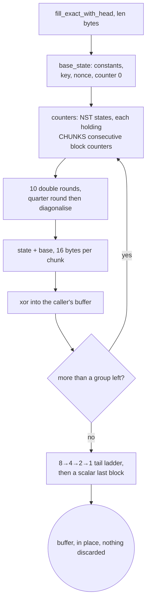

# The record layer: one ChaCha20 ladder, one Poly1305, one AES-GCM

Every AEAD method in this tree ends here. Shadowsocks, VMess and XTLS Vision
never touch a cipher primitive of their own; they call
`record::fill_exact` and `record::fill_exact_with_head`, and the only thing
above this rung that knows a block is 64 bytes long is `ferrox-bench`.

The shape that makes it cheap is that there is exactly one round function,
written once, generic over a `Lanes` trait. `portable::U4` (four `u32`), `sse2::S4`,
`neon::N4` and `avx2::A8` implement it, so a backend cannot disagree with
another about the algorithm — it can only be slower. The portable backend is
safe Rust, which is what lets Miri interpret the ladder at all; the SIMD
backends are five instructions each whose only failure mode is a wrong answer,
and a wrong answer is caught by a differential test before any timing runs.

`fill_exact_with_head` is the interesting entry point. ChaCha20-Poly1305 needs
block 0 as the Poly1305 one-time key and blocks 1.. as the payload keystream,
and a naive seal generates block 0, throws away 32 of its bytes, generates
blocks 1.. separately, and pays for the 32 unused bytes. The head form takes
the first 32 bytes of block 0 out of the same group of states that computes
blocks 1.., so the fused seal generates `ceil(len / 64) + 1` blocks and
discards nothing.

## Data path



## Measured

<!-- counts:begin -->
| key | value | checked by |
| --- | --- | --- |
| ops-retired-instructions | UNBLESSED | scripts/count-ops.sh |
| discarded-keystream-blocks | 0 | ferrox-bench-gate-2 |
| allocations-per-fill | 0 | ferrox-bench-gate-2 |
| zero-filled-bytes-per-fill | 0 | ferrox-bench-gate-2 |
| blocks-per-byte | 1/64 | ferrox-bench-gate-2 |
| blocks-per-iteration | 8 | ferrox-core-chacha::backend |
| fused-head-blocks | 1 | ferrox-core-record::tests::the_head_is_the_references_own_first_block_and_the_rest_is_unshifted |
| backends-a-differential-test-cannot-lie-to | 4 | ferrox-bench-gate-1 |
<!-- counts:end -->

## Ops

```bash
./scripts/count-ops.sh report \
  record::tests::the_head_is_the_references_own_first_block_and_the_rest_is_unshifted \
  'ferrox_core::record::fill_exact'
```

`UNBLESSED`, as above: no measured instruction count is quoted for this rung.

## Time

**Not measured on this branch.** `ferrox-bench` gate 3 (`.github/workflows/bench.yml`)
times this rung against the pinned `chacha20` 0.9 crate at every length from
0 to 65 537 and fails on any length whose ratio drops below 0.95, after a
re-measure. Gate 1 runs the differential identity check first, so a backend
that is fast because it is wrong cannot pass. Both numbers come from
`target/bench-report.md` in a `bench.yml` artefact, and no artefact from this
branch has been read.

## What we removed

- **Keystream that was generated and thrown away.** Gate 2 compares the block
  count the ladder reports against `ceil(len / 64)` at every length in a
  0..=65 537 sweep and at six start counters, and fails on any excess. The
  `chacha20` crate the reference uses fills a keystream buffer *four blocks at
  a time* on every backend it ships, which is what makes a short call expensive;
  the ladder here takes an 8 → 4 → 2 → 1 tail and only enters a rung when the
  remaining blocks meet its width, so nothing is computed for a length the
  caller did not ask for. `record::blocks_with_head_match` is the same
  accounting for the fused head: an empty body plus a 32-byte head is one block,
  not two.
- **A per-call allocation and a memset.** Gate 2 runs the fill under a
  `#[global_allocator]` that separates `alloc` from `alloc_zeroed`, and requires
  exactly zero of each at every length. A `Vec<u8>` staging buffer per call, or
  a `vec![0; len]` that the caller then overwrites, both fail that gate — which
  is the same finding Zray recorded in its own hot-path allocator gate, where
  `vec![0u8; n]` "zeroes up to 64 KiB that the read then overwrites".
- **The Poly1305 padding as a second absorb.** `aead::mac` pads each of the AAD
  and ciphertext sections to a 16-byte boundary by calling `update` again with
  up to 15 zero bytes, so a section that is already a multiple of 16 costs a
  call with an empty slice and a section that is not costs a second absorb over
  the padding. Upstream does the same thing — Xray's `poly1305.Write` in
  `common/crypto/poly1305.go` and Zray's `chacha20poly1305.rs:47-60` both pad
  by absorbing zeros — so this is a shared cost, not a place where this tree is
  behind. It is named here rather than claimed as a win.

## Pins

| what | where |
| --- | --- |
| the one-shot AEAD that forces a refill per call | `upstream/sing-box` → `golang.org/x/crypto/chacha20poly1305`, `chacha20poly1305.go:35` |
| the explicit block range and the 8→4→2→1 ladder | `upstream/zeronet/crates/zero-protocol/src/chacha20/mod.rs` |
| the stream cipher this rung replaces | `upstream/xray-core/common/crypto/internal/chacha.go` |