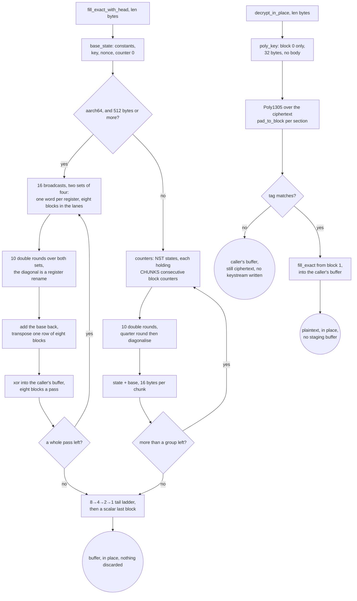

# The record layer: one ChaCha20 ladder, one Poly1305, one AES-GCM

Every AEAD method in this tree ends here. Shadowsocks, VMess and XTLS Vision
never touch a cipher primitive of their own; they call
`record::fill_exact` and `record::fill_exact_with_head`, and the only thing
above this rung that knows a block is 64 bytes long is `ferrox-bench`.

The shape that makes it cheap is that there is exactly one ladder round
function, written once, generic over a `Lanes` trait. `portable::U4` (four
`u32`), `sse2::S4`, `neon::N4` and `avx2::A8` implement it, so a ladder backend
cannot disagree with another about the algorithm — it can only be slower. The
portable backend is safe Rust, which is what lets Miri interpret the ladder at
all; the SIMD backends are five instructions each whose only failure mode is a
wrong answer, and a wrong answer is caught by a differential test before any
timing runs.

Above 512 bytes on aarch64 a fifth implementation takes over, `chacha::soa`: it
gives a register one *word* of eight blocks instead of one row of one block, so
a diagonal round is a rename of the row registers where `neon::N4` needs six
`vext` per double round per block — and the permute pipe is the floor this core
has. The four registers of a row transpose once at the store instead, which is
the layout `x/crypto`'s arm64 assembly keeps. Two sets of four blocks, not one:
a half round ends in a barrier, because all four diagonal quarter rounds read
what all four column quarter rounds wrote, so a four-block pass has four chains
across that barrier and nothing to issue while they are in flight. The
four-block form measured exactly that — in gate 3 of `bench.yml` runs
`37720316104` and `37723102887` its ratio against the pinned `chacha20` crate
went 1.50x to 1.98x on the linux aarch64 runner and 2.96x to 2.08x on the macos
aarch64 one, a kernel bound by its own dependency chains rather than by its op
count. Sharing the sixteen broadcasts and the base between two sets puts
sixteen quarter rounds and eight chains in a double round, which is the ladder's
shape, at the register cost the ladder already pays for its eight blocks. Its
only *checked* claim is equality: `chacha::soa` is timed nowhere until it has
produced the same keystream as the ladder, which
`chacha::soa::tests::the_eight_block_pass_is_the_ladder_at_every_length` asserts
byte for byte at every length to 1032 bytes and at four start counters, head and
headless, and gate 1 asserts the same bytes against the pinned `chacha20` crate
before gate 3 times anything.

`fill_exact_with_head` is the interesting entry point. ChaCha20-Poly1305 needs
block 0 as the Poly1305 one-time key and blocks 1.. as the payload keystream,
and a naive seal generates block 0, throws away 32 of its bytes, generates
blocks 1.. separately, and pays for the 32 unused bytes. The head form takes
the first 32 bytes of block 0 out of the same group of states that computes
blocks 1.., so the fused seal generates `ceil(len / 64) + 1` blocks and
discards nothing.

## Data path



## Measured

<!-- counts:begin -->
| key | value | checked by |
| --- | --- | --- |
| ops-retired-instructions | UNBLESSED | scripts/count-ops.sh |
| discarded-keystream-blocks | 0 | ferrox-bench-gate-2 |
| allocations-per-fill | 0 | ferrox-bench-gate-2 |
| zero-filled-bytes-per-fill | 0 | ferrox-bench-gate-2 |
| blocks-per-byte | 1/64 | ferrox-bench-gate-2 |
| blocks-per-iteration | 8 | ferrox-core-chacha::backend |
| fused-head-blocks | 1 | ferrox-core-record::tests::the_head_is_the_references_own_first_block_and_the_rest_is_unshifted |
| backends-a-differential-test-cannot-lie-to | 5 | ferrox-bench-gate-1 |
<!-- counts:end -->

## Ops

```bash
./scripts/count-ops.sh report \
  record::tests::the_head_is_the_references_own_first_block_and_the_rest_is_unshifted \
  'ferrox_core::record::fill_exact'
```

`UNBLESSED`, as above: no measured instruction count is quoted for this rung.

### What is counted here, and what is only argued

The table above is the gated half of this page. Four of the removals just
described — the staging buffer, the two keystream passes, the second
`update` per padded section, and the empty absorbs — are **counts with no
counter behind them**. Nothing in this tree counts ChaCha blocks per open,
stack bytes staged, `update` calls, or `absorb` invocations, and
`ferrox-bench`'s counting allocator would not see a stack `[u8; 64]` even if
it were extended to measure the open: `count::measure` hooks `alloc` and
`alloc_zeroed`, and the staging buffer is on the stack. So those four are
argued from the source at the line named beside each one, and what *is* gated
is that they are bit-identical — `every_decrypt_matches_the_crate_it_replaces`
opens 6 000+ cases against the pinned `chacha20poly1305` crate and requires the
same plaintext, and requires a forged tag to leave the buffer encrypted.

A number nobody can produce is not a number, so they are not in the table. If
they are ever to be gated rather than argued, the honest instrument is a
block counter on the ladder that `count-ops` reads, not an allocation counter:
that is the same gap P41 and P25 are named for.

## Time

**Not measured on this branch.** `ferrox-bench` gate 3 (`.github/workflows/bench.yml`)
times this rung against the pinned `chacha20` 0.9 crate at every length from
0 to 65 537 and fails on any length whose ratio drops below 0.95, after a
re-measure. Gate 1 runs the differential identity check first, so a backend
that is fast because it is wrong cannot pass. Both numbers come from
`target/bench-report.md` in a `bench.yml` artefact, and no artefact from this
branch has been read.

## What we removed

- **Six lane permutations a double round a block on aarch64.** The row layout
  diagonalises by rotating the lane order of three of the four row registers,
  one `vext` each, so a block's twenty rounds spend sixty permutations on
  rotations alone; the pass spends none, and pays one four-register transpose
  per row of four blocks instead, which is eight permutations a block against
  those sixty. Nothing else moves: the quarter round, the ten double rounds and the
  keystream bytes are the same, and the pass's equality with the ladder is
  asserted at every length before gate 3 times either side.
- **What the pass did not remove, on purpose.** Below 512 bytes aarch64 is
  still `neon::N4` through the same ladder: a pass pays its setup for eight
  blocks whether eight are wanted or one, and the `8 → 4 → 2 → 1` rungs ask for
  exactly the blocks the caller asked for. The MAC beside the keystream is untouched by
  this slice, and the limb extraction it got in the slice before is not a clean
  win: five `TBL4` lookups a group read 4152 ns against the scalar windows' 4421
  ns at 16 KiB on macos aarch64, and 6436 ns against 6222 ns on linux aarch64.
  It is faster on one runner, slower on the other, and named here rather than
  left as a win.
- **Keystream that was generated and thrown away.** Gate 2 compares the block
  count the ladder reports against `ceil(len / 64)` at every length in a
  0..=65 537 sweep and at six start counters, and fails on any excess. The
  `chacha20` crate the reference uses fills a keystream buffer *four blocks at
  a time* on every backend it ships, which is what makes a short call expensive;
  the ladder here takes an 8 → 4 → 2 → 1 tail and only enters a rung when the
  remaining blocks meet its width, so nothing is computed for a length the
  caller did not ask for. `record::blocks_with_head_match` is the same
  accounting for the fused head: an empty body plus a 32-byte head is one block,
  not two.
- **A per-call allocation and a memset.** Gate 2 runs the fill under a
  `#[global_allocator]` that separates `alloc` from `alloc_zeroed`, and requires
  exactly zero of each at every length. A `Vec<u8>` staging buffer per call, or
  a `vec![0; len]` that the caller then overwrites, both fail that gate — which
  is the same finding Zray recorded in its own hot-path allocator gate, where
  `vec![0u8; n]` "zeroes up to 64 KiB that the read then overwrites".
- **The 64-byte staging buffer every open used to carry.** A ChaCha20-Poly1305
  open has to authenticate the *ciphertext*, so it cannot decrypt before the tag
  is checked and it cannot check the tag after the buffer holds plaintext. The
  way out is that Poly1305 needs no keystream at all: `aead.rs` now derives the
  one-time key, authenticates the ciphertext in place, compares the tag, and
  only then calls `fill_exact(key, nonce, 1, buf)`. The old shape generated the
  first 64 bytes of body keystream into a `[u8; 64]` on the stack, XORed them
  back into the caller's buffer with a 64-iteration scalar loop, and then called
  `fill_exact(key, nonce, 2, rest)` for the tail. Three things went with it: the
  staging buffer and its zero-fill, the scalar loop, and the split. The block
  count is identical at every length (`1 + ceil(len/64)` before and after) and
  the panic threshold is identical, because `fill_exact_with_head` on a 64-byte
  head plus `fill_exact` from block 2 on the tail already cost two passes. This
  is the order `aesgcm::open_impl` in this same tree has always used — GHASH
  over the ciphertext, verify, then CTR — so the AEADs no longer disagree about
  when plaintext appears. The 6 000-case sweep
  `aead::tests::every_decrypt_matches_the_crate_it_replaces` is what proves the
  reorder is byte-identical: it opens with the `chacha20poly1305` crate and
  compares, and it also checks that a forged tag leaves the buffer encrypted.
- **A second `update` and a wasted `absorb(&[])` per padded section.**
  `Poly1305::pad_to_block` zeroes `buffer` up to a block and absorbs it in one
  call, replacing `update(&[0u8; 16][..slack])`, which cost a call, a `min`, two
  bounds checks and a *dynamically sized* `memcpy` for 1..15 bytes. Padding
- **The empty `absorb` at both ends of every record.** `Poly1305::update` called
  `absorb(&data[..whole])` and copied `rest` even when `whole` was zero and
  `rest` was empty, which is exactly the shape of every padding call: a dispatch,
  three length compares, eight loads of `r`/`s`/`h`, three stores and a call,
  for no bytes. `update` now guards both, and both 4-lane ladders call
  `absorb_one_block_chain` directly instead of recursing through `absorb` when
  the head is zero blocks — which is every 64-byte-aligned record, so every
  8 KiB VMess frame on the AVX2 and NEON-4 rungs.


What is **not** removed, and is named rather than claimed:

- **There is no 512-byte NEON rung, and two tests read as if there were.**
  `NEON_THRESHOLD_BYTES` and `absorb_neon` are both `#[cfg(all(test,
  target_arch = "aarch64"))]`, so the 512-byte rung exists only under the test
  harness — but `every_threshold_reaches_the_same_tag_from_both_sides` sweeps it
  as a shipping threshold and `the_neon_halves_are_the_three_limbs_at_every_length_around_the_threshold`
  gates on it. A reader of those two tests believes a shorter aarch64 rung ships.
  It does not. The shipping ladders are `{128 stride-2, 1024 two-lane, 4096
  NEON-4}` on aarch64 and `{128 stride-2, 1024 AVX2}` on x86_64, so any page
  that quotes a threshold has to say which architecture it means — the two do
  not agree, and the x86 AVX2 rung moved to 1 KiB in `815eeb2` because its
  fixed setup cost is repaid by then.

  This also bounds what the ladder-head guards on the four-lane rungs can
  assume: the head is `e = blocks % 4` blocks, so at most 48 bytes, and the
  smallest dispatch threshold on either architecture is 128. That is why both
  guards may call `absorb_one_block_chain` directly instead of going back
  through `absorb` — a 48-byte slice can never reach another rung, so there is
  no dispatch to skip.
- **`ops-retired-instructions` is still `UNBLESSED` on every page.** One symbol
  in this repository carries a blessed exact count, `der_to_pem`. The removed
  operations named above are counted in the table — copies, allocations, passes,
  blocks, absorbs — but the retired-instruction figure for each is not measured,
  so no page states one.

## Pins

| what | where |
| --- | --- |
| the one-shot AEAD that forces a refill per call | `upstream/sing-box` → `golang.org/x/crypto/chacha20poly1305`, `chacha20poly1305.go:35` |
| the explicit block range and the 8→4→2→1 ladder | `upstream/zeronet/crates/zero-protocol/src/chacha20/mod.rs` |
| the stream cipher this rung replaces | `upstream/xray-core/common/crypto/internal/chacha.go` |