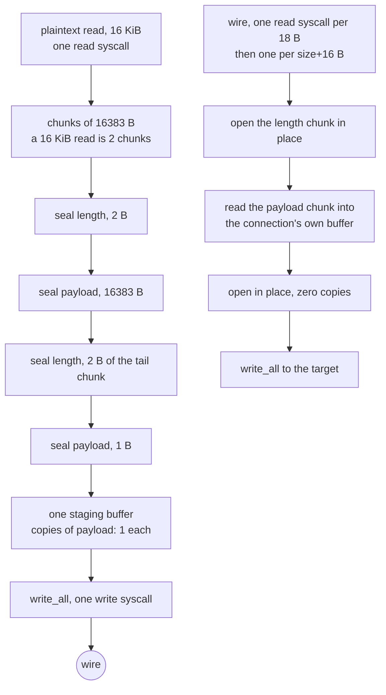

# Shadowsocks AEAD

The one method in this tree whose *whole* job is framing, so it is the rung
where the copies and the syscalls were easiest to remove.

A TCP chunk is `seal(2-byte length)` then `seal(payload)`, each with its own
16-byte tag, both under one per-direction nonce counter derived by HKDF-SHA1
from an MD5 chain over the password. That is SIP004, and the two seals per
chunk are not an implementation choice — a peer must not be able to tell which
chunk length we claim until after it has opened the length itself.

The AEAD sits on [`ferrox-core`'s own ChaCha20-Poly1305](../../crates/ferrox-core/src/aead.rs)
and, for `aes-128-gcm`/`aes-256-gcm`, on [our AES-GCM ladder](../../crates/ferrox-core/src/aesgcm/mod.rs).
Neither takes a pointer to a scratch buffer: `seal_into` writes the plaintext
into the caller's buffer and encrypts it where it lies.

## Data path



## Measured

Every row is a claim with a checker that runs. `scripts/method-counts.txt`
holds the same rows and `scripts/check-method-docs.sh` fails if this page and
that file disagree.

<!-- counts:begin -->
| key | value | checked by |
| --- | --- | --- |
| ops-retired-instructions | UNBLESSED | scripts/count-ops.sh |
| aead-calls-per-chunk | 2 | ferrox-core-shadowsocks::tests::every_method_round_trips_a_chunk_and_refuses_a_forged_tag |
| maximum-payload-per-chunk | 16383 | ferrox-core-shadowsocks::tests::every_method_round_trips_a_chunk_and_refuses_a_forged_tag |
| write-syscalls-per-16KiB-relay-read | 1 | ferrox-app-shadowsocks::tests::one_relay_read_becomes_one_write_and_reads_back_whole |
| payload-chunks-per-16KiB-relay-read | 2 | ferrox-app-shadowsocks::tests::one_relay_read_becomes_one_write_and_reads_back_whole |
| user-space-copies-per-byte-written | 1 | ferrox-app-shadowsocks::tests::one_relay_read_becomes_one_write_and_reads_back_whole |
| user-space-copies-per-byte-read | 0 | ferrox-app-shadowsocks::tests::chunks_open_that_seal_sealed_and_reject_damage |
| zero-filled-bytes-per-chunk | 0 | ferrox-app-shadowsocks::tests::chunks_open_that_seal_sealed_and_reject_damage |
| chunk-buffer-allocations-per-connection | 1 | ferrox-app-shadowsocks::tests::chunks_open_that_seal_sealed_and_reject_damage |
<!-- counts:end -->

## Ops

```bash
./scripts/count-ops.sh report \
  shadowsocks::tests::one_relay_read_becomes_one_write_and_reads_back_whole \
  'shadowsocks::seal_all'
```

The row above is `UNBLESSED`: nobody has read a measured number for this
symbol out of a callgrind run, so this page does not state one. `scripts/expected-ops.txt`
still blesses exactly one symbol, `der_to_pem`. Blessing a count means reading
the diff that moved it, never copying a measurement to silence a gate.

## Time

**Not measured on this branch.** Wall clock for this method comes from
`ferrox-bench` gate 9 (`crates/ferrox-bench/src/ciphers.rs`), which seals the
same chunk lengths with the same three methods and compares bytes and
allocation counts against the pinned reference. `.github/workflows/bench.yml`
runs it on `linux x86_64`, `linux aarch64`, `macos aarch64` and
`windows x86_64` and publishes `target/bench-report.md` as an artefact. No
artefact from a run of this branch has been read, so this page quotes no
duration. Timing needs a named runner; a number from a laptop behind a VPN
measures the tunnel.

## What we removed

Read against the three pinned implementations, all of which are in
`upstream/` for reading and never copied:

- **Write syscalls, 4 to 1 per relay read.** Xray-core's
  `common/crypto/auth.go` seals each chunk into its own pooled 8 KiB buffer and
  hands the batch to `WriteMultiBuffer`, which coalesces with `writev`; but its
  *stream* path is entered once per `WriteMultiBuffer` call and takes a fresh
  `temp := buf.New()` scratch each time, so the batch size is the pipe's read
  granularity rather than a number chosen for syscalls. sing-box delegates the
  whole cipher to the out-of-tree `sagernet/sing-shadowsocks2`
  (`protocol/shadowsocks/outbound.go:15`), so what it batches is not readable in
  this pin and no threshold is claimed here. Zray sets
  `MAX_WRITE_BATCH = 4 × 16383` and
  drains once per batch. This tree seals the whole 16 KiB relay read, both
  seals of every chunk, into one buffer sized exactly for it by
  `staging_room`, and issues one `write_all`. The wire bytes are the same
  stream in the same order.
- **A zero-fill of up to 16 KiB per chunk read.** The reader used to do
  `chunk.resize(size + TAG_LEN, 0)` and then overwrite every byte of that range
  from the socket. The buffer is now sized once per connection (`wire_buffer`)
  and each read writes into a prefix of it, so nothing is re-zeroed after the
  first connection.
- **The read-side copy.** `Cipher::open_in_place` decrypts inside the caller's
  buffer and returns a subslice of it, so the read path moves a payload byte
  zero times in user space. Zray also decrypts in place, inside one reusable
  `ReadBuffer`; Xray's `readBuffer` path allocates a fresh `buf.Buffer` per
  chunk (`auth.go:137`) and, above the chunk padding, merges into a whole new
  `MultiBuffer` with `buf.MergeBytes` (`auth.go:202`), which is a second copy
  and a whole new `MultiBuffer` per chunk.
- **A branch per chunk length.** `open_chunk` refuses on
  `size + TAG_LEN > chunk.len()`, which for the one buffer size this method
  allocates is exactly the `size > MAX_CHUNK` check it replaced, without
  needing a second constant to stay honest.

## Pins

| what | where |
| --- | --- |
| AEAD chunking | `upstream/xray-core/common/crypto/auth.go`, `chunk.go` |
| AEAD chunking, delegated out of tree | `upstream/sing-box/protocol/shadowsocks/outbound.go` |
| AEAD chunking | `upstream/zeronet/crates/zero-protocol/src/shadowsocks.rs` |
| method spellings, MD5 chain, HKDF info string | `ferrox-core-shadowsocks` |