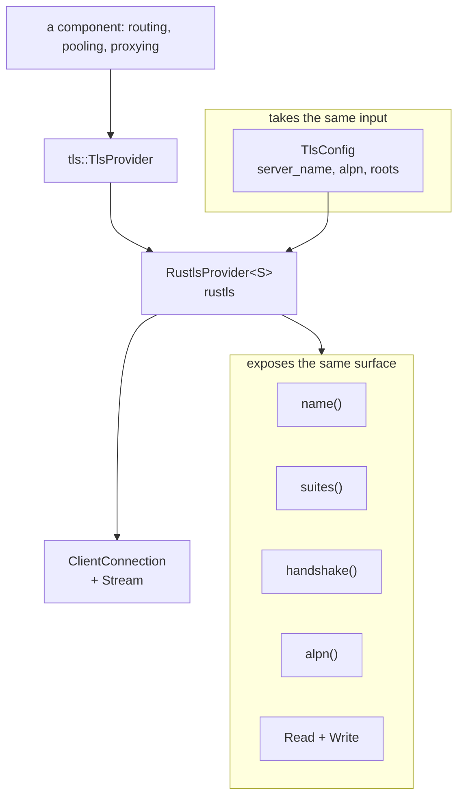

# `ferrox_core::tls`

One interface, one backend: `rustls`.

## Why one interface and one backend

A proxy needs a TLS stack, and the one used here is `rustls`: pure Rust and auditable, with no C toolchain in the build. What that requires is an **interface that does not leak the stack**, so nothing above it can accidentally depend on it. Anything whose answer is really about rustls internals belongs in the adapter, read back at runtime.

## The interface

The provider **is** `Read + Write`. A caller moves encrypted bytes without knowing the stack underneath, which keeps the record path measurable on its own rather than tangled with the handshake.

## Selecting the backend

There is nothing to select: rustls is linked unconditionally. A build with no TLS stack is not a configuration this crate offers, because a caller who finds no provider reaches for plaintext and no test asserting "never plaintext" would catch it — such a test needs a plaintext path to assert against.

## What `suites()` reports

`suites()` returns the provider's actual suite list, read at runtime from `rustls::crypto::ring::ALL_CIPHER_SUITES` in its own preference order. The list is never written down here as a claim about the stack: a list maintained by hand is a claim about the stack rather than a report of it, and goes stale silently.

## One mapping that cannot be made exhaustive

`rustls::Error` is `#[non_exhaustive]`, so the mapping to `TlsError` needs a trailing `_` arm. That means a **new** rustls variant would land in `Other` rather than failing the build — including a new certificate error, which is both the variant most likely to be added and the one a caller most wants classified.

Every variant rustls 0.23 defines is listed explicitly anyway, so the classification is deliberate and reviewable rather than whatever the last arm caught. But the mapping is re-read when rustls is bumped and **nothing checks that it is complete**: a new upstream variant would land in `Other` silently. What is checked is that the explicit arms exist at all, by reading `rustls_backend.rs` ([`../claims.md`](../claims.md)).

## Verification status

| backend | compiles here | tested here |
| --- | --- | --- |
| `rustls` | yes — `ci.yml` builds it on every runner in the matrix | yes — a loopback handshake, a wrong-name refusal and an ALPN refusal in `cargo test` |

Three tests check the handshake, so the adapter claims a connection it has completed. What is not claimed is interop against any other stack: the peer in all three is rustls itself, which is also why `suites` is read from the stack rather than written here.
