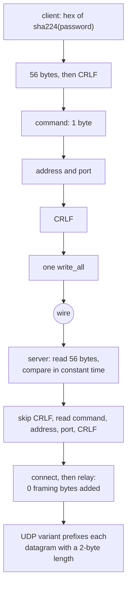

# Trojan over TCP

Trojan is a header and then nothing, which makes it the cheapest method in the
matrix to relay and the easiest to get subtly wrong.

The header is `sha224_hex(password) | CRLF | command(1) | address | port | CRLF`.
The 56 ASCII bytes are compared without an early exit on the server; after that
the stream is the stream and the relay adds no framing bytes at all.

Two things are deliberately not implemented and are named rather than rounded
off: there is no `trojan://` share-link parser (the link column in the README is
empty for this row), and `security: tls` dials over every diallable carrier
but not under mux or for UDP, so those rows are refused rather than sent
plain. Both are capability statements, not performance ones.

## Data path



## Measured

<!-- counts:begin -->
| key | value | checked by |
| --- | --- | --- |
| ops-retired-instructions | UNBLESSED | scripts/count-ops.sh |
| password-bytes-on-the-wire | 56 | ferrox-app-proxy::tests::trojan_key_is_sha224_hex |
| framing-bytes-added-after-the-header | 0 | ferrox-app-proxy::tests::trojan_relay_round_trips_and_refuses_strangers |
| udp-framing-bytes-per-datagram | 2 | ferrox-app-proxy::tests::trojan_udp_frames_carry |
| header-reads-numeric-address | 2 | ferrox-app-proxy::tests::the_trojan_header_costs_two_reads_not_seven |
| header-reads-domain-address | 3 | ferrox-app-proxy::tests::the_trojan_header_costs_two_reads_not_seven |
| header-bytes-copied-out-of-the-buffer | 0 | ferrox-app-proxy::tests::the_trojan_header_costs_two_reads_not_seven |
| key-bytes-compared-early-exit | 0 | ferrox-app-proxy::tests::the_key_compare_reads_every_byte |
<!-- counts:end -->

## Ops

```bash
./scripts/count-ops.sh report \
  proxy::tests::the_trojan_header_costs_two_reads_not_seven 'proxy::decode_trojan_request'
```

`UNBLESSED`, as above.

## Time

**Not measured on this branch.** `.github/workflows/parity.yml` and
`benchmark-matrix.yml` run a `trojan-raw` scenario. No artefact from this branch
has been read, so no duration is quoted.

## What we removed

- **Seven header reads down to two, and eight down to three for a domain.** The
  header is `56 + 2 + 1 + addr + port + 2` bytes. The old `decode_trojan_request`
  read it a field at a time: `read_exact` for the 56 key bytes, then CRLF, then
  the command, then `read_socks_addr`, which is another `read_exact` for `atyp`
  and one each for the address, the port and the closing CRLF. `decode_trojan_request`
  now fills one stack buffer through a cursor and parses it in place, so a
  numeric address costs two reads and a domain three — the domain cannot do
  better in two because its length byte has to arrive before the name's extent
  is known. `the_trojan_header_costs_two_reads_not_seven` drives all three
  address forms over a fixed byte source and counts the reads exactly.
- **A key compare that returned on the first wrong byte.** `got != *key`
  short-circuits, so the time it took said how much of the key was right.
  `key_agrees` folds the whole 56 bytes into one accumulator instead, and
  refuses a short read outright. `the_key_compare_reads_every_byte` is the gate.
- **An MD5 or SHA-1 chain per connection.** The password arrives as its SHA-224
  hex, so there is nothing to derive: 56 bytes on the wire, 56 bytes compared.
  Contrast Shadowsocks, where the MD5 chain and HKDF are real work and are named
  in [that page](shadowsocks.md).

What is **not** removed: the 2-byte length prefix on UDP. It is wire format, not
an optimisation, and `trojan_udp_frames_carry` / `trojan_udp_frames_reject_damage`
are the gates on it. A domain header still allocates one `String` for the
`host:port` pair that `to_socket_addrs` takes, and that is a resolver interface,
not a copy this page can remove.

## Pins

| what | where |
| --- | --- |
| field-at-a-time header parse, `io.ReadFull` per field | `upstream/xray-core/proxy/trojan/protocol.go` |
| header read into one `buf.Buffer`, parsed in place | `upstream/xray-core/proxy/trojan/server.go` |
| header layout, headroom write | `upstream/sing-box` → `sagernet/trojan/protocol.go` |
| slice parser, zero allocations | `upstream/zeronet/crates/zero-protocol/src/trojan.rs` |

Xray's two ends disagree with each other, which is the honest summary: the
server (`server.go`) reads the first request into one `buf.Buffer` and compares
`first.Byte(56)` in place, while the client (`protocol.go`, `ParseHeader`) does
five `io.ReadFull` calls plus `ReadAddressPort` against the bare socket.