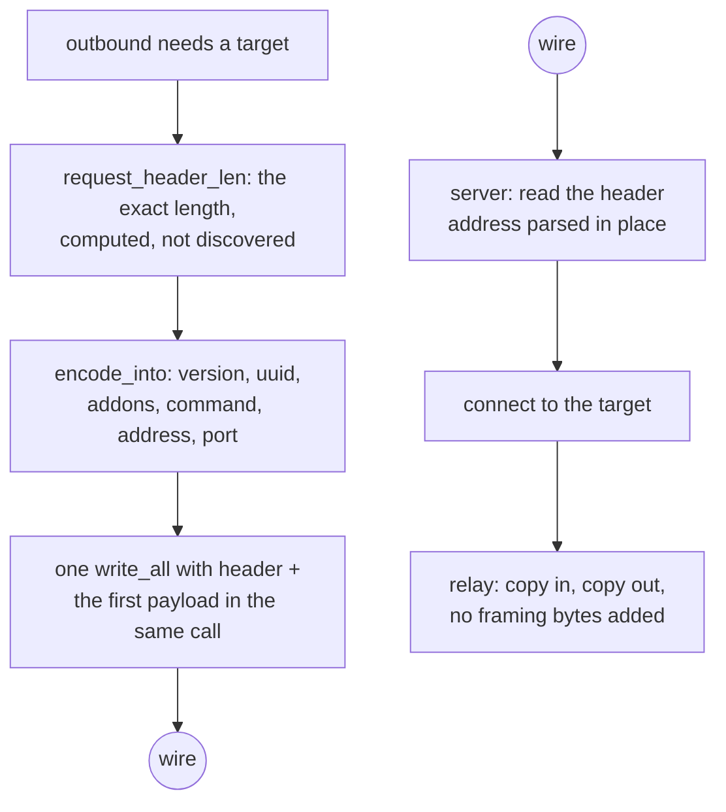

# VLESS over TCP

VLESS has no framing. One request header, then the stream is the stream, and
the whole method's cost is in reading that header without copying it and
encoding it without allocating.

The header is `version(1) | uuid(16) | addonsLen(1) | addons | command(1) |
address | port`. `addons` is a protobuf whose only field this tree honours is
`Flow`, the XTLS Vision selector; a header that carries a flow gets 2 add-on
bytes and nothing else. For `xtls-rprx-vision` the command byte and the address
are still written — Vision is a framing *around* VLESS, not a replacement for
its target field.

`request_header_len` is a pure function of the destination, so the caller knows
the exact length before reading anything. `encode_into` writes into a buffer the
caller owns. That combination is why `ferrox-bench` gate 2 can assert zero
allocations, zero allocated bytes and zero zero-fills for the encode at an
IPv4, an IPv6 and a domain destination.

## Data path



## Measured

<!-- counts:begin -->
| key | value | checked by |
| --- | --- | --- |
| ops-retired-instructions | UNBLESSED | scripts/count-ops.sh |
| request-header-allocations | 0 | ferrox-bench-gate-2 |
| request-header-bytes-zero-filled | 0 | ferrox-bench-gate-2 |
| address-families-encoded | 4 | ferrox-core-vless::tests::header_address_families_encode_stably |
| vision-addons-bytes | 2 | ferrox-core-vless::tests::non_vision_header_carries_empty_addons |
| reality-outbound-rows-dialled | 0 | ferrox-app-proxy::tests::vless_outbound_with_reality_security_is_skipped |
<!-- counts:end -->

## Ops

```bash
./scripts/count-ops.sh report \
  vless::tests::header_address_families_encode_stably 'ferrox_core::vless::VlessLink::encode_into'
```

`UNBLESSED`, as above.

## Time

**Not measured on this branch.** `.github/workflows/parity.yml` runs the
`vless-raw` scenario across the pinned engines for upload, download and
full-duplex; `.github/workflows/benchmark-matrix.yml` runs the same. Both are
CI-only. No artefact from this branch has been read.

## What we removed

- **A field-at-a-time header read.** This is the largest difference between the
  three implementations and it is not close. Xray's
  `proxy/vless/encoding/encoding.go:120` calls
  `addrParser.ReadAddressPort`, which issues a separate `io.ReadFull` for the
  port, another for the address type byte, then another per family, then one for
  a domain's length and one for its body — up to seven reads served out of one
  `BufferedReader`, so one syscall but seven slice splits and seven `Read`
  calls. sing-box's `sagernet/sing-vmess/vless/protocol.go:29-79` does the same
  thing against the **bare `net.Conn`**, so it is 6–8 real syscalls for a 19–34
  byte header, plus a `make([]byte, strLen)` and a `string(strBytes)` second
  allocation for a domain. Zray parses a slice in place with zero allocations.
  This tree parses in place too, and `parses_the_brief_link` and
  `header_address_families_encode_stably` are the gates.
- **A header written through a temporary.** sing-box's `WriteBuffer` path is
  already good — it extends the header into the pooled buffer's headroom and
  writes header and payload in one call — and this tree matches that shape
  rather than the `buf.NewSize` + copy shape beside it.
- **An 8 KiB buffer per connection that is thrown away.** Xray's
  `proxy/vless/inbound/inbound.go:286` does
  `buf.FromBytes(make([]byte, buf.Size))`, and because `FromBytes` marks the
  buffer `ownership: unmanaged` its `Release` is a no-op, so that 8 KiB never
  reaches `bytespool`. The relay buffer here starts at 16 KiB and is promoted to
  256 KiB only once a read fills it completely, and on Linux the plain `copy`
  path is `splice(2)` with no user-space copy at all.

## Rows that are not dialled

`security=reality` outbounds are **skipped, not attempted**
(`vless_outbound_with_reality_security_is_skipped`): the client role is not
wired, so a REALITY row in the matrix is a server row. That is a capability
statement, not a performance one, and it is why the last row above is `0`.

## Pins

| what | where |
| --- | --- |
| header layout, addons, address parsing | `upstream/xray-core/proxy/vless/encoding/` |
| header layout, field-at-a-time socket reads | `upstream/sing-box` → `sagernet/sing-vmess/vless/protocol.go` |
| slice parser, zero allocations | `upstream/zeronet/crates/zero-protocol/src/vless.rs` |