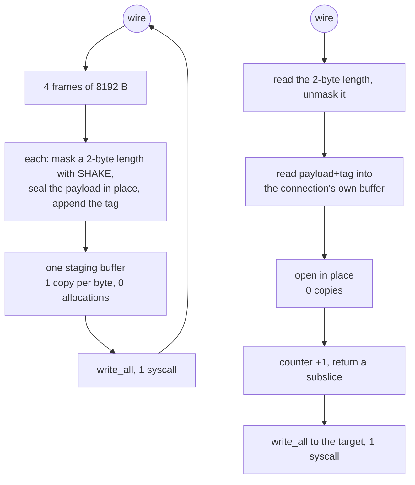

# VMess AEAD

VMess is the one method here that pays for a keyed handshake and then gets out
of the way. The header is read once per connection and every later frame is an
8 KiB payload, a SHAKE-masked 2-byte length, and a 16-byte tag.

The framing this tree speaks is `OptionChunkStream | OptionChunkMasking |
OptionGlobalPadding` with **no** authenticated-length option, which is the shape
that costs one AEAD call per frame instead of two. That is not a simplification:
a peer negotiates framing options in the clear, so a different set is visible on
the wire. Xray's client default is the same three bits, so this matches.

Read and write are asymmetric on purpose. Writing batches: four 8 KiB frames are
staged into one buffer and written with one syscall. Reading is in place: the
frame is read into a buffer the connection already owns, the payload is opened
inside it, and a subslice of that same buffer is what the caller gets.

## Data path



## Measured

<!-- counts:begin -->
| key | value | checked by |
| --- | --- | --- |
| ops-retired-instructions | UNBLESSED | scripts/count-ops.sh |
| maximum-payload-per-frame | 8192 | ferrox-app-vmess::tests::frames_seal_to_stable_bytes |
| frames-per-write-syscall | 4 | ferrox-app-vmess::tests::a_batch_on_the_wire_is_the_frames_written_one_at_a_time |
| write-syscalls-per-32KiB-relay-read | 1 | ferrox-app-vmess::tests::a_batch_on_the_wire_is_the_frames_written_one_at_a_time |
| user-space-copies-per-byte-written | 1 | ferrox-app-vmess::tests::frames_reuse_the_callers_buffers |
| frame-buffer-allocations-per-relay-write | 0 | ferrox-app-vmess::tests::frames_reuse_the_callers_buffers |
| counters-per-frame | 1 | ferrox-app-vmess::tests::counters_advance_one_per_frame_at_any_offset |
<!-- counts:end -->

## Ops

```bash
./scripts/count-ops.sh report \
  vmess::tests::frames_reuse_the_callers_buffers 'vmess::stage_frames'
```

`UNBLESSED`, as above.

## Time

**Not measured on this branch.** `ferrox-bench` gate 4 (`framing.rs`) compares
VMess-style framing rows byte for byte against the pinned reference, and gate 7b
compares the AEAD seals; neither is a clock. The clock is gate 3's ratio at
every measured length plus `.github/workflows/parity.yml`'s `vmess-raw`
scenario. No artefact from this branch has been read.

The tag and the payload are both authenticated over the ciphertext, so this
method's open path is the [`record-layer`](record-layer.md) open path: the tag is
checked before any keystream exists and block one onward is xored into the
frame buffer once. That is what `vmess user-space-copies-per-byte-written 1` and
`vmess frame-buffer-allocations-per-relay-write 0` above are counting, and the
Poly1305 rungs it shares — one absorb per padded section, no empty absorb at
either end of a record, no head recursion into the dispatch on a 64-byte-aligned
frame — apply to every 8 KiB VMess frame on the AVX2 and NEON-4 paths.

- **Two rows this page claims were not being checked at all.** The gate for
  `frames-per-write-syscall 4` and `write-syscalls-per-32KiB-relay-read 1` swept
  payload lengths that topped out at `3 * MAX_PLAIN` — which is **three** frames.
  The fourth iteration of `stage_frames`' loop was never entered by any test, so
  the number 4 was unobserved; and the sink was a `Vec`, which cannot tell one
  `write` from four, so the syscall row had no counter behind it either. The
  sweep now runs to `4 * MAX_PLAIN - 1`, `4 * MAX_PLAIN` and `READ_PLAIN`, and
  writes into a `CountingWriter`, so both rows are observed rather than assumed.
  Nothing about the frames changed; only what the test can see.
- **A silent truncation that the same gap was hiding.** `stage_frames` staged at
  most `FRAMES_PER_WRITE` frames and, if the read was wider, exited its loop with
  bytes left and returned `true` — a truncated frame sequence on the wire, with
  no assertion anywhere. `pump_relay` clamps to `READ_PLAIN`, which equals the
  batch bound, so nothing reaches it today; but the two expressions that have to
  agree were checked by nobody, and raising `FRAMES_PER_WRITE` without raising
  `READ_PLAIN` would have dropped the tail of every relay read over 32 KiB.
  `stage_frames` now refuses instead, and
  `a_read_wider_than_one_batch_is_refused_not_truncated` gates that: it drives
  `READ_PLAIN + 1` and `READ_PLAIN + MAX_PLAIN`, requires `false`, and requires
  that **nothing** reached the sink.

## What we removed

- **A frame buffer per relay write.** `frames_reuse_the_callers_buffers` is the
  gate: one buffer, sized once per connection by `with_capacity`, refilled by
  `clear`. For comparison, Xray's `common/crypto/auth.go:287` does
  `mb2Write := make(buf.MultiBuffer, 0, len(mb)+10)` and takes a pooled
  `temp := buf.New()` scratch on every `WriteMultiBuffer` call, so the batch is
  the pipe's read granularity rather than a number chosen for syscalls.
- **Four write syscalls per relay read.** sing-box's VMess writes one
  `ChunkWriter` frame per write with `WriteChunkSize = 15000`
  (`sing-vmess/protocol.go:24-32`) and only coalesces when the upper layer is
  vectorised. Xray's stream path coalesces with `writev` but starts from a fresh
  scratch each call. This tree stages four frames and writes once;
  `a_batch_on_the_wire_is_the_frames_written_one_at_a_time` is the gate that
  the batch is byte-identical to writing the frames one at a time.
- **A second copy on read.** Xray's large-chunk read path
  (`common/crypto/auth.go:188-203`) allocates a pooled buffer, reads into it,
  opens in place, and then calls `buf.MergeBytes`, which is a second copy plus a
  whole new `MultiBuffer` of 8 KiB buffers per chunk. The `≤ 8 KiB` path
  (`:137-151`) is in place and is the cheaper of the two; this tree always
  takes the in-place shape because its frame size is fixed at 8 KiB.
- **Nested HMAC construction.** The VMess KDF is an explicit HMAC-chain state
  machine (`vmess::Kdf`) that reuses a precomputed inner/outer pair, where
  Xray's `proxy/vmess/aead/kdf.go` builds a fresh `hmac.New` per path element
  and the handshake pays four of them. Zray made the same call for the same
  reason.

What was **not** removed, and is named rather than rounded off: the auth-id
lookup. `replay_seen` is a linear probe over a `HashSet` of 16-byte ids with no
per-connection cache keyed by auth id, which is the same shape as Xray's
`AuthIDDecoderHolder.Match`. The read side of the header costs three `read_exact`
calls (16 + 18 + 8 bytes) rather than one, because the auth id has to be read
before the length can be decrypted. Both are handshake-only, once per
connection, and neither is where a connection spends its time.

## Pins

| what | where |
| --- | --- |
| chunk stream + chunk masking options, frame sizes | `upstream/xray-core/proxy/vmess/encoding/`, `common/crypto/auth.go` |
| chunk stream + chunk masking options, `WriteChunkSize` | `upstream/sing-box` → `sagernet/sing-vmess/protocol.go` |
| the same framing, in place, batched | `upstream/zeronet/crates/zero-protocol/src/vmess.rs` |