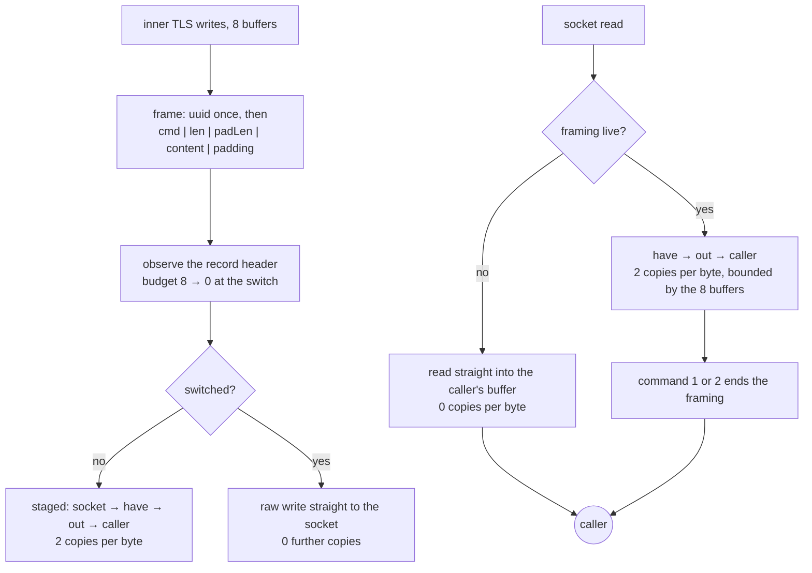

# XTLS Vision

Vision is the one framing in this tree that *stops existing*. Once the inner
TLS handshake is over, the padding frames stop and the stream becomes the raw
socket, so the framing's cost should be zero from that point on — not amortised,
not small. Zero.

The framing is: the first frame is prefixed with the 16-byte user UUID; every
frame is then `command(1) | length(2) | padLength(2) | content | padding`.
Commands are `0` continue, `1` end, `2` direct. Padding is zero-filled and its
length comes from the same seed table Xray uses (`{900, 500, 900, 256}`), so
the byte counts a DPI sees are the byte counts the reference produces.

For eight buffers in each direction the writer and the reader run a TLS filter:
`0x16 0x03` means a handshake record, `0x17 0x03 0x03` means application data,
and a `0x00 0x2b 0x00 0x02 0x03 0x04` window inside a 1.3 ServerHello means the
inner TLS negotiated a cipher worth switching for. Until that window closes,
every buffer is framed; after it, nothing is.

## Data path



## Measured

<!-- counts:begin -->
| key | value | checked by |
| --- | --- | --- |
| ops-retired-instructions | UNBLESSED | scripts/count-ops.sh |
| padding-command-bytes | 5 | ferrox-app-vision::tests::writing_frames_the_payload_and_heads_the_first_with_the_uuid |
| first-frame-uuid-bytes | 16 | ferrox-app-vision::tests::writing_frames_the_payload_and_heads_the_first_with_the_uuid |
| tls-buffers-inspected-before-the-switch | 8 | ferrox-app-vision::tests::both_directions_spend_the_same_filter_budget |
| user-space-copies-per-byte-while-framed | 2 | ferrox-app-vision::tests::the_framing_switch_ends_the_staging |
| user-space-copies-per-byte-after-the-switch | 0 | ferrox-app-vision::tests::the_framing_switch_ends_the_staging |
| seal-open-staging-allocations | 0 | ferrox-bench-gate-2 |
<!-- counts:end -->

## Ops

```bash
./scripts/count-ops.sh report \
  vision::tests::the_framing_switch_ends_the_staging \
  'vision::Link::read_direct'
```

`UNBLESSED`, as above.

## Time

**Not measured on this branch.** `ferrox-bench` runs a Vision allocation gate
(`gate_vision_allocs`) over content lengths 0, 1, 64, 1400 and 8171 and refuses
any allocation, any allocated byte and any zero-fill; the wall clock for this
framing is not separately timed and no duration is quoted here. Allocation
counts are deterministic and are gated; durations are not.

One row on this page names a gate that does not cover it, and it is renamed
rather than deleted so the claim stays true: `seal-open-staging-allocations 0`
is `ferrox-bench-gate-2`, and gate 2 drives the **stateless**
`vless::VisionSeal`/`vless::VisionOpen` pair in `ferrox-core`. That pair is a
second, independent implementation of this framing. It shares nothing with
`vision::Link` in `ferrox-app` — no `have`, no `out`, no `hat`/`oat`, no
`tls.budget` filter, no `read_direct` — and the data path above is `Link`
throughout.

**`vision::Link` is under no allocation gate at all, and it allocates.** `Link::fill`
does `self.have.reserve_exact(RELAY_BUFFER)` for 256 KiB and `out` starts at
`Vec::new()` and grows to hold the decoded content, so a gate that drove `Link`
would report at least one allocation on the first fill. No number is claimed for
it here. The two rows beside the renamed one are properly gated: both
`user-space-copies-per-byte-while-framed` and `-after-the-switch` name
`the_framing_switch_ends_the_staging`, which really does drive `Link`.

## What we removed

Vision was the worst-shaped carrier in this tree before the change, and the
reason is worth writing down: it had **three** user-space copies per byte
throughout the whole session, not only during the handshake.

- **After the switch, two of the three copies are gone.** `read` used to read
  into a `chunk` buffer, extend `out` from it, and then copy out of `out` into
  the caller's buffer, on every call, forever. `read_direct` now hands the
  caller's buffer to the session when the framing is over, so the post-handshake
  steady state — which is every byte of every real connection — costs zero
  user-space copies. `the_framing_switch_ends_the_staging` counts staged bytes
  and asserts that not one byte after the switch went through a staging buffer.
- **A stream that never carried Vision now stops paying for the check.** If the
  first 16 bytes are not the user UUID the stream is not addressed to this
  session and never will be; `unpad` records that by clearing `padding`, so the
  pass-through path drops from three copies to zero instead of re-comparing 16
  bytes per read for the life of the connection.
- **One pooled buffer per incoming buffer, unconditionally.** Xray's
  `XtlsUnpadding` (`proxy/proxy.go:561`) takes a fresh 8 KiB `buf.Buffer` for
  *every* buffer that arrives once Vision is engaged, before any header check
  beyond the UUID compare, and `IsCompleteRecord` (`:410`) allocates a slice the
  size of the whole `MultiBuffer` and copies the whole thing into it on every
  padded write — so while padding, Xray copies every byte three times too. This
  tree's `staging` buffer is cleared and reused, and `ferrox-bench`'s
  `gate_vision_allocs` requires zero allocations at every length.

What was deliberately **not** removed: the seed table and the padding itself.
Padding bytes are wire bytes; making them random instead of zero would change
the output, and the point of this repository is that it does not.

## Pins

| what | where |
| --- | --- |
| framing, seeds, filter budget | `upstream/xray-core/proxy/proxy.go` |
| the same wire bytes | `upstream/zeronet/crates/zero-protocol/src/vision.rs` |
| the flow name and the `security` gate | `ferrox-core-transport::Support` |