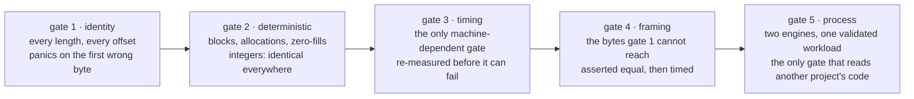

# Methodology

How to read a number here, and what it does not entitle you to.

## The order of the gates

1. **Identity runs first.** A wrong core never gets to be a fast one.
2. **Then the deterministic properties.** Blocks generated, allocations, zero-fills: integer counts, identical on every machine, gated outright.
3. **Then timing.** A duration is a distribution, not a fact.
4. **Then framing**, which gate 1's bytes cannot reach.
5. **Then the process comparison.** Last because it is the slowest gate and the only one needing binaries built from upstream pins; it has its own workflow (`parity.yml`) so a regression in either is reported as itself.

The report is written to disk **before** the gate is asserted on, so a failing run still publishes the table it failed on.

## One regressing length fails the job

Gate 3 fails if the implementation is more than 5% slower at **any single timed length**: the bar is 0.95x. Robustness comes from the measurement, not from a lenient bar — best of 5 interleaved rounds per side, so one scheduling hiccup does not become a permanent table entry. A length under the bar is **re-measured at four times the budget** before it is allowed to fail; the re-measure confirms the number, it does not lower the bar.

### The framing gates had the bar without the confirmation

The rule above is a property of the bar, not of gate 3, and for most of this tree's life the code did not agree. Gates 4, 6, 7, 7c, 8 and 10 shared the same `BAR`, `ROUNDS` and best-of discipline, and had no confirmation at all — so a framing was decided by one sample. Run `37325906810`, `windows x86_64`, `early encode, 2048B`:

| run | commit | reference ns/op | ferrox ns/op | speedup |
| --- | --- | ---: | ---: | ---: |
| `37320161241` | `03ddb6a` | 4268.1 | 4064.0 | **1.05x** |
| `37325906810` | `e06bac7` | 4338.5 | 5139.9 | **0.84x** |

`PR #87` merged between them and touched `ferrox-app`'s UDP path, not `transport.rs` or `earlydata.rs` — so the 26% swing is the runner: the other three runners read 1.07x, 1.08x and 1.11x for the same row. The reference barely moved (4268ns to 4339ns) while this side moved 4064ns to 5140ns, which is what a co-tenant taking the CPU looks like from inside a best-of-5.

**So `framing::timed_row` is the one place a gated framing row is built**, applying the same three independent passes at four times the budget that gate 3 uses. Two details matter: the median is over passes and the pair published is the pair gated on (`confirmed_pass` returns the median pass's two absolute times, because a row's published numbers *are* its two absolute times), and `confirmation_note` names the rows whose published numbers are a confirmed re-read rather than the first sample.

This cannot hide a regression: a framing genuinely under the bar is under it in every pass, because every pass runs the same code on the same machine. `a_length_that_is_really_slower_still_fails` holds that down.

Gate 7b and gate 9 rows are **not** confirmed, and neither are gate 6's encode rows: those rows are reported rather than gated — gate 7b's two sides run the same closure so its ratio is noise by construction, gate 9 straddles a hardware boundary that differs per runner, and gate 6's encode rows are in `muxframe::REPORTED_ONLY`.

## What "faster" is allowed to mean

| statement | acceptable | not acceptable |
| --- | --- | --- |
| about this repo's CI | "1.05x at 2 KiB on linux x86_64, run 2026-10-02" | "fastest" |
| about gate 5 | "1.36x the pinned Xray-core's throughput on the `SOCKS` relay path, 95% interval [1.31, 1.41], five paired repeats on macos aarch64" | "faster than Xray" — the path, workload and repeat count are part of the sentence |
| about a gate-5 gap | "`TUN` is `not_covered`: `ferrox-app` serves no TUN device" | omitting the row |
| about a length | "no worse than 0.95x of the reference at any measured length from 65 bytes up; 1–64 are a tie by construction" | "faster in general" |
| about a device | "on the four architectures CI runs" | "on any device" |
| about correctness | "byte-identical to the pinned reference" | "compatible" |

A benchmark is a measurement of a configuration at a point in time, and it decays: a new CPU, a new upstream release, a changed input distribution. `bench.yml` runs daily for that reason.

## Read both ends of every ratio

The report's header names the reference the run declared **and** the backend that reference actually compiled to. This matters more than it sounds: `chacha` 0.9.1 falls back to a scalar core on aarch64 because its NEON backend is gated behind a cfg nothing sets, so on that architecture most of any speedup is the reference not using its SIMD path. A ratio quoted without both names is not a measurement of this workspace.

## Comparing apples to oranges in the timing gate

The reference is re-keyed and re-seeked on **every call** — `ChaCha20::new` plus `seek` — which a stateful record layer would not do. That fixed cost flatters short lengths in particular. The 16384-byte row is closest to a real `VMess` or Shadowsocks record and should be read as the headline; short-length rows are the `fill_exact` advantage, not a proxy throughput number.

Allocation counts, by contrast, are exact: taken with the harness's buffer allocated *before* the counting window opens, so the harness's own `vec!` never lands inside a count. `scripts/check-leak-surface.sh` is the static half of the same claim, and `check-linux.sh` / `check-windows.sh` cover the other blind spot: `#[cfg(target_os = "linux")]` code is compiled out everywhere else, so a macOS or Windows clippy cannot see a name that does not exist, a type that is wrong, or a constant nothing uses. All three reached this tree and every one was caught by the `linux x86_64` job rather than at the desk.

## Upstream comparison

Upstream implementations are pinned by commit in [`../upstream/pins.toml`](../upstream/pins.toml), not tracked. A comparison against "latest" is not a comparison.

`scripts/check-upstream-pins.sh` fails if a pin stops resolving, if a source has **no** `rev` at all, or if the file parses to nothing. An unpinned source is a hard error rather than a skip. Each `rev` is verified by a depth-1 fetch of that exact object, not by `ls-remote`, because `ls-remote` only lists what refs point at.

`scripts/update-pins.sh` refreshes the pins, prints the diff, and opens a PR rather than pushing.

Upstream test suites are **run against** Ferrox's binaries in CI, never copied here: sing-box is GPL-3.0, Xray-core is MPL-2.0 and PattNG / Aether are GPL-3.0 / AGPL-3.0. Running their suites unmodified is both licence-clean and a stronger claim than a hand-rewritten vector. When a rung is implemented, every suite covering it checks it — the suite flips in `upstream/pins.toml`, never here. See [`conformance.md`](conformance.md).

Every benchmark report ends with the per-method matrix (`crates/ferrox-bench/src/methods.rs`), generated the way ZeroNet generates its support table from its capability data: status cells are read from the parser at report time for every row the link format can express, and an unimplemented cell stays empty with its reason.

## Adding a SIMD backend

The condition is bit-identity, not speed. A backend is merged only after:

1. it implements `Lanes` and nothing else — no round function of its own;
2. it matches `chacha::portable` byte for byte at every length and every block offset, including both sides of every group boundary;
3. the keys used differ in every byte (see [`function/record-fill-exact.md`](function/record-fill-exact.md) for why);
4. it is measured on one native runner per ISA, not one machine;
5. every `unsafe` block carries a `SAFETY:` comment — enforced by `clippy::undocumented_unsafe_blocks`, denied workspace-wide.

A backend that cannot be interpreted by Miri must be argued for instead: what it assumes, and which check discharges each assumption.

## Gate 5: the process-level comparison

Gates 1-4 measure `ferrox-core` in one process, in nanoseconds per call, against a same-language reference. That says nothing about the path an engine actually takes: accept a `SOCKS` connection, relay it, copy bytes, stay resident. That is where a Rust core and a Go core differ, and it is the one a user experiences.

Gate 5 measures it as a process. Engines come from `upstream/pins.toml`, each built from its pin by `scripts/run-parity.sh`.

### Which engines, and how each is told which config

`scripts/run-parity.sh` builds every engine from its pin and drives all of them through one request. They disagree about how a config file is named, so the harness carries that as a per-engine enum (`parity::ConfigArg`) rather than guessing:

| engine | pin | invocation | licence |
| --- | --- | --- | --- |
| `ferrox` | this tree | `run -config <path>` | MIT |
| `xray-core` | `b26a91de` | `run -config <path>` | MPL-2.0 |
| `xray-rust` | `7a4fb2dd` | `run -config <path>` | MPL-2.0 |
| `sing-box` | `c9922979` | `run -c <path>` | GPL-3.0 |
| `zeronet` (`zray`) | `97a99734` | `run <path>` | MIT |

None is copied into this tree. An engine that cannot be built on the host is **skipped with the reason printed**, never silently dropped.

### Which rows decide gate 5

Every engine is measured and every row is published. Only the `ferrox` rows — the one engine this repository ships — decide the verdict; the rest carry a `reported, not gated` marker.

Gating the comparators too made the job's pass condition a property of a binary this repository does not build: `throughput (zeronet vs xray-core)` read 0.51x–0.59x on `linux aarch64` in every run and no edit here can move it. `stats::Row::gates` carries the distinction, and two tests hold it: the same interval gated still fails, and a run in which every row reports fails rather than passing vacuously.

### Linux `splice`, and why that row was 0.77x for a week

Gate 5's `throughput (ferrox vs xray-core)` row sat at 0.76x on `linux aarch64` for a week while every other runner passed, and it was not this repository's code:

| runner | ferrox | xray-core | ratio | zeronet vs xray-core |
| --- | --- | --- | --- | --- |
| `macos aarch64` | 2463.9 MiB/s | 2307.5 MiB/s | **1.068x** | 0.92x |
| `linux aarch64` | 3951.3 MiB/s | 5201.6 MiB/s | **0.760x** | 0.56x |

Gate 3 on `linux aarch64` was clean at 235 lengths, worst 1.00x, and `windows x86_64` passed. Both Rust engines lost to the Go one on Linux and neither lost on macOS, which is the copy path and not either implementation: Go's `net.TCPConn` implements `io.ReaderFrom`, so `io.Copy` between two TCP connections goes through `internal/poll.splice` on Linux and is a `read`/`write` loop elsewhere, while Rust's `std::io::copy` is a `read`/`write` loop on every platform.

So the relay now splices there: `pipe(2)` once per direction, `splice(2)` in and out, draining the pipe on a short write. `copy_all` is that path on Linux and the copying loop elsewhere, compared against each other on a 1 MiB payload by `the_splice_path_and_the_copying_path_move_the_same_bytes`. Where it landed:

| runner | before | after |
| --- | --- | --- |
| `linux aarch64` | 0.760x | **0.970x**, interval [0.952, 0.983] |
| `macos aarch64` | 1.068x | 1.067x, interval [0.983, 1.150] |
| `linux x86_64` | 0.662x | 1.317x, interval [0.942, 1.700] |

macOS is unchanged to the third digit, which is what a Linux-only change should look like.

### The pipe's capacity, measured rather than modelled

`splice` moves at most what fits in the pipe it moves through, so the capacity is the number of bytes one call can move. A `pipe(2)` that asks for nothing is 64 KiB: two syscalls per 64 KiB, 32 768 per GiB. Go's `internal/poll.newPipe` sets `F_SETPIPE_SZ` to 1 MiB (`maxSpliceSize = 1 << 20`), so the same two syscalls cover 16x the bytes.

**An earlier conclusion here rested on an arithmetic error, so the error is recorded rather than quietly overwritten.** The argument was: *at 5 GiB/s a 64 KiB pipe issues about 160 000 syscalls a second, and a `splice` is roughly 40 ns of entry and exit — 0.6% of a core.* 40 ns is the cost of a *trivial* syscall. A 64 KiB `splice` takes sixteen pipe buffers, moves every page of the socket's receive queue into them, and copies them back out into the destination socket's skbs. Nothing measured here supports 40 ns, and the CPU row — which read `0` for every engine at the time — now says 2.2 us per call. Both confounders are now fixed too: the old harness made **three** passes over every payload byte, diluting an engine's own difference into a constant offset, and the ceiling it normalised against measured a different workload. Runner spread on `linux x86_64` fell from **2.7x to 1.02x**.

So the capacity is no longer a constant someone reasoned about: `F_SETPIPE_SZ` asks and `F_GETPIPE_SZ` reads the granted size back, and `FERROX_SPLICE_PIPE_BYTES` overrides the ask so several sizes can be compared in one run via `parity.yml`'s `splice_pipe_bytes` input. A capacity other than the default is logged once per direction.

**The sweep, and the answer.** Medians of five repeats of an 8 GiB validated download on `linux x86_64`:

| pipe | throughput vs xray-core | cpu ms/GiB (ferrox / xray) | ferrox's five repeats |
| --- | --- | ---: | --- |
| 64 KiB (what shipped) | **0.78x**, [0.64, 0.91] | 266 / 211 | spread **1.82x** |
| 256 KiB | 0.99x, [0.91, 1.10] | 231 / 234 | spread 1.20x |
| 1 MiB (Go's value) | 1.00x, [0.89, 1.11] | 225 / 232 | spread 1.25x |

**256 KiB is what ships**: 1 MiB measures the same and costs four times the pipe memory — `2 MiB` per connection against `512 KiB`, on a row whose whole claim is an order of magnitude of resident memory — needs a `pipe-max-size` a hardened host may not have, and allocates 256 kernel pages per pipe instead of 64.

The bimodality is worth keeping: at 64 KiB one repeat in five landed at half speed while `sing-box` — same runner, 1 MiB pipe — held a 1.15x spread. A runner does not alternate between two speeds on a schedule; a relay does, because a 64 KiB unit is small enough for a three-stage pipeline to drain between units.

**Re-measured after `SPLICE_F_MOVE` and the worker pool, and part of the above is withdrawn.** The sweep decided the constant and stands as the measurement that decided it; what a later commit changed is how much is still the constant's to claim. `parity.yml` runs 37260088926 (64 KiB) and 37260096483 (256 KiB):

| pipe | throughput vs xray-core | cpu ms/GiB (ferrox / xray) | spread |
| --- | ---: | ---: | --- |
| 64 KiB | **0.80x**, [0.76, 0.84] | 306 / 243 | **1.14x** |
| **256 KiB (ships)** | 0.97x, [0.93, 1.00] | 276 / 304 | 1.09x |

- **The bimodality is gone at 64 KiB** — no half-speed repeat, against one in five above. The tell was sound; the thing it pointed at got fixed twice.
- **The absolute cost of a 64 KiB pipe roughly halved.** What is left of the throughput argument is a ratio, not a cliff.
- **The CPU row now moves more than the effect.** The reference read 243 ms/GiB in one leg and 304 in the other — a fifth — against a difference this constant is worth of 306 to 276. A row whose noise exceeds the difference cannot decide it.

256 KiB therefore still ships for the two reasons that survive: the CPU, and a gate that resolves at 64 KiB and fails where 256 KiB passes. Withdrawn: the fifth of the throughput, and the pipe's authorship of the bimodality.

**These were the first green `linux x86_64` gate-5 rows this project has produced.** The 0.78x above is the same tree, same runner and same reference as the 0.696x further down. What *is* shipped from the same investigation removes work with no memory cost: `httpupgrade` read its `HTTP` head a byte at a time on a path where the head arrives in one segment — a couple of hundred syscalls per handshake, now two, in `proxy::read_http_head`, which `ws` and `httpheader` share.

### `SPLICE_F_MOVE`: measured, retried, and removed

`splice(2)` documents `SPLICE_F_MOVE` as telling the kernel that the pipe's pages *may* be moved to the destination rather than copied. On the read direction it means nothing to a relay — the pipe is reused next round. On the write direction it is the only place it could mean anything. Go passes only `spliceNonblock`; sing-box passes `MOVE` on the write only.

This section previously claimed the flag was probably costing 1.5x in CPU at concurrency, on the strength of two runs taken twenty minutes apart. **That was wrong and it is retracted.** A controlled A/B says otherwise: same commit, same runner, same 16 flows, same 7 repeats, only the flag differing.

| `SPLICE_MOVE` | cpu per GiB vs `xray-core` | throughput vs `xray-core` |
| --- | --- | --- |
| `off` | 0.741x, [0.719, 0.766] | **1.152x**, [1.061, 1.254] |
| `on` | 0.715x, [0.688, 0.746] | **1.123x**, [1.051, 1.218] |

Both intervals overlap in both columns; the flag is inert. So the 16-connection CPU gap is real, resolved, and **not** the flag's fault: with the flag off, ferrox still spends about 1.35x the CPU per GiB that xray-core does at sixteen connections, and is still 1.15x faster and 9x smaller.

| | at `connections=16` |
| --- | --- |
| throughput | **1.15x better**, resolved |
| peak RSS | **9-10x better**, resolved |
| cpu per GiB | **1.35x worse**, resolved, cause still open |

The flag is **removed**: a per-chunk hint in the hottest loop, with an environment read and a field to carry it, that buys nothing measurable does not earn its place. The `splice_move` input went with it — a knob for a flag that is not there is a knob someone reads as a supported configuration. The retraction is the point worth keeping: a 1.5x difference between two runs of the same relay twenty minutes apart is not evidence about a flag, it is evidence that the `connections=16` CPU column on a four-vCPU shared runner is wider than the effect anyone was attributing to it. The suspicion had a mechanism — `MOVE` detaches the pipe's pages, so a 256 KiB pipe donates its buffer every push and faults it back on the next pull — but a plausible mechanism is not a measurement.

### The structural difference that reading the Go source *did* find

Reading all three comparators for the flags is what found `MOVE`. Reading them for the *surrounding* code found something larger, on the same path.

pinned `Xray-core` does not write a splice loop at all. Its relay is one call, `w, err := tc.ReadFrom(readerConn)` at `proxy/proxy.go:775`, which hands the copy to the Go runtime. In `internal/poll/splice_linux.go` the loop passes `spliceNonblock` to both `splice` calls and, on `EAGAIN`, parks the **goroutine on the runtime netpoller** rather than blocking an OS thread. One `epoll_wait` therefore returns *every* ready descriptor, and one OS thread drains a batch of connections' worth of it.

This relay passes `0` for flags and blocks in both directions: `pull` sleeps until the source socket has bytes, `push` until the destination accepts them. At sixteen connections that is thirty-two threads each sleeping and waking individually, against xray-core's eight or nine servicing a batch — the `threads` column reads ferrox 4 at one connection and 34 at sixteen, xray-core 8 and 9.

That is a difference in *shape*, established from source rather than from a timing, and it is what `poll_relay` is. The waits become one `poll(2)` per worker covering every flow it holds. `epoll` would scale better but its failure modes are registration lifetime and `EPOLLHUP` ordering, and a relay that must stay byte-exact with the blocking path it replaces is the wrong place to meet those.

### Two new knobs measured, and both claims are dead

Recorded rather than dropped, because a dead hypothesis that has been measured is worth more than one that has not.

**"Two OS threads per connection will lose to Go's netpoller-parked goroutines."** The measurement says the relay was already at parity at the concurrency that can see it. `connections=16`, `download`, `linux x86_64`, medians of five repeats:

| | throughput | cpu per GiB | peak RSS |
| --- | ---: | ---: | ---: |
| ferrox vs `xray-core` | 0.987x, [0.943, 1.024] | **1.114x better, [1.066, 1.158]** | 10.3x better |
| sing-box vs `xray-core` | 0.995x, [0.963, 1.023] | 0.977x | 0.86x |

Thirty-two relay threads on a four-vCPU runner, and nothing falls over. The pool is kept because it takes thread creation and a 2 MiB stack mapping off the connection path — but **it is not a throughput win and must not be described as one.** The design that would win is a poller multiplexing many sockets onto a fixed thread set: a rewrite of the relay, not a change to it.

**"A 256 KiB pipe is too small for the upload direction."** Refuted: `splice` returns what is *available*, not what was asked for, so the writer's chunk size never becomes the round size, and the 1.63x was the `linux x86_64` runner rather than the relay.

So the sweep's honest shape is: **64 KiB is too small, 256 KiB is enough, 1 MiB buys nothing** — in both directions, for the same reason in both.

### A test whose reference goes through the dispatcher, is not a reference

Two bugs in the same new `poly1305` two-lane path, both of which produced **well-formed tags that were wrong** rather than faults, and both of which sat behind a passing test. They are recorded because the shape of them is the general lesson, not because the arithmetic is interesting.

The first: `mul_unfolded`'s third argument is the `* 20` terms of the **right** (multiplier) operand. The two-lane path passed the **left** operand's terms instead. Substituting gives `x1*(x2*20) + x2*(x1*20) = 40*x1*x2` where the product needs `20*(x1*y2 + x2*y1)` — wrong for every input, and wrong as a valid field element, so `finish` reduces it to a plausible tag. `field_pow3` had the same inversion, and `field_pow3`'s own doc comment already said *recomputed from each **right-hand** operand*. **The comment was right and the code was wrong**, which is the most expensive kind of disagreement to leave in a tree: it reads as documentation of a deliberate choice.

The second: `field_pow3` seeded its accumulator with `[1, 1, 1]`. That is the multiplicative identity in the file's *five-limb 26-bit* basis, where `p = 5 * 2^130` folds a whole limb at a time. In the accumulator's *three-limb* basis the identity is `[1, 0, 0]`. A helper carried over from the vector paths' basis into the scalar one, and every exponentiation — the lane-one shift in the combine — came out as a valid element that was simply the wrong one.

**Why the test missed both.** The direct-loop test compares every loop in the file against "the one-block chain", and it obtained that chain through `absorb` — which **dispatches**. From 1 KiB upward `absorb` hands back `absorb_two_lane`, so the test was comparing the two-lane band against itself for exactly the lengths the two-lane band owns, and passing. The loop is now a named function, `absorb_one_block_chain`, reached directly, and the test's reference is a real reference.

The general rule, and it is the same one as the section below: **a reference that is reached by the same dispatch that chooses the subject is not a reference.** The 26-bit `tag_via_26_bit_horner` end-to-end sweep did catch it — on every input at every length in the band, in both `debug` and `release` — which is why gate 1 exists and why it is not a timing gate. The ratio gates could not see it: a wrong accumulator is roughly as fast as a right one.

The bench binary is where it was noticed. `ferrox-bench` aborted with `SIGABRT` before reaching gate 5 on **every** run, which is what made the throughput work below possible at all.

### A window shorter than the ramp measures the ramp

`benchmark-matrix.yml`'s smoke tier moved 128 MiB per repeat and rendered `throughput.png` from it. The chart read ferrox at **10.6x** the pinned Xray-core's throughput. It is 1.2-1.3x, and the difference is entirely the window.

The rule was already written down, further up this file and in `scripts/lib-matrix.sh`: the transfer window *is* the instrument, and a short one is not faster, it is noisier. Every bulk row in `standard_scenarios` moved 8 GiB for that reason. The smoke tier moved 1/64th of that and published the difference as throughput.

Xray-core's VLESS relay reaches its steady rate after a **fixed start-up cost** that a 128 MiB window cannot amortise. Medians of three repeats, `macos aarch64`, the same two binaries over the same self-relay:

| bytes per repeat | xray-core | ferrox | ratio |
| --- | ---: | ---: | ---: |
| 128 MiB | 197-208 MiB/s | 835-1262 | **4.2-6.4x** |
| 512 MiB | 693-712 | 2331-2604 | 3.3-3.8x |
| 2 GiB | 1021-1273 | 1670-2215 | 1.3-1.7x |
| 8 GiB | 1272-1371 | 1289-1877 | **1.0-1.4x** |

The last row is what this file already claimed for this runner and the first is what the README's chart said. The symptom is worth naming precisely: **it read as a win.** A ten-fold throughput advantage is exactly the shape of a result nobody re-checks, which is why it survived from the tier's introduction until someone opened the chart. The smoke tier now moves 8 GiB like every other bulk row and differs only in scenario count, engine count and repeats.

What the ceiling column could and could not have done here is the more useful part. The ceiling is the same validated loop with no engine in the path, measured beside each repeat, and on this cell it read 5985-6985 MiB/s while both engines read under 2700. It was correctly saying *the generator was not the limit* — which is true, and is not the question. **A ceiling rules out the harness; it cannot tell you that a window is long enough to have amortised anything.** Those are separate claims and only one of them is what a ceiling measures.

### A ratio is not a measurement without the absolutes

`linux x86_64` measured this tree at 1.05x in one run and 0.66x in the next, twenty minutes apart, with ferrox at 3408 → 1968 MiB/s, zeronet at 2464 → 1574 and xray-core at 3247 → 2943. Every engine moved, and the two CPU-bound Rust engines moved four times as far as the splice-based Go one, because a degraded runner costs a userspace copy more than it costs a page hand-off. A five-pair bootstrap interval measures variation *within* a run and cannot see that, so the run reads as a resolved regression when the run is the variable. That is why `target/bench-report.md` is uploaded next to the raw runs on both `bench.yml` and `parity.yml`: the medians table beside the ratio is the only thing that shows whether the whole table moved or one row did.

The harness already measures the runner and publishes it: the ceiling is the same workload with **no engine in the path**. Across ten `linux x86_64` runs of one tree it read 2220 to 5724 MiB/s — a 2.7x spread in the machine alone — and the gate's row moved with it:

| run | ceiling | ferrox | xray-core | ratio |
| --- | --- | --- | --- | --- |
| 37206416930 | 5724 | 4385 | 3895 | 1.126x |
| 37205938055 | 2988 | 3487 | 3799 | 0.918x |
| 37219548642 | 2410 | 2773 | 3140 | 0.883x |
| 37216797778 | 2220 | 2740 | 3140 | 0.873x |
| 37205678883 | 3046 | 2417 | 3003 | 0.805x |
| 37211320763 | 3293 | 2337 | 3017 | 0.775x |
| 37220728736 | 2246 | 2296 | 3082 | 0.745x |
| 37220018833 | 3428 | 2150 | 3090 | 0.696x |

`linux aarch64`, `macos aarch64` and `windows x86_64` have tight intervals on the same code — `linux aarch64` reads `[0.952, 0.983]` over five pairs — so this was the one runner whose variance exceeded the gate's tolerance, not a property of the engines.

**Both halves of that are now fixed, and the fix was the window.** Every run above moved 1 GiB, which at these rates is 0.22-0.76 s of transfer. A shared CI runner loses the CPU to a co-tenant for tens of milliseconds at a time; over 0.25 s that is a third of the measurement and over 8 GiB it is about 2%. Nothing about the engine changed between those two — only how long it was watched for. The window is now 8 GiB per flow (`ITERATIONS` defaults to 131072), which also puts ~560 ms of CPU under a 10 ms resolution floor instead of ~70 ms and turns `cpu per GiB` from a permanent `unproven` into a measurement. With the window lengthened the same runner measures **1.02x** of ceiling spread; where a runner still cannot resolve the tolerance, the throughput row is published and marked `NOT CERTIFIED` rather than given a verdict.

### What the fixed harness says, per runner

Medians of five repeats of an 8 GiB validated download, CPU in ms per GiB (lower is better):

| engine | `linux aarch64` | cpu | `linux x86_64` | cpu | `macos aarch64` | cpu | peak RSS (all) |
| --- | ---: | ---: | ---: | ---: | ---: | ---: | ---: |
| `xray-core` (reference) | 6134 | 158 | 4213 | 234 | 4285 | 225 | 28-33 MiB |
| `sing-box` | 5981 | 154 | 4254 | 238 | 5778 | 151 | 30-38 MiB |
| `ferrox` | 5925 | 146 | 3986 | 231 | **5817** | **140** | **2.3-3.2 MiB** |
| `zeronet` | 2698 | 370 | 1886 | 550 | 4866 | 190 | 5-9 MiB |

Three further runs at seven repeats are green on all four runners; the best-resolved reads `linux aarch64` 1.06x [1.01, 1.11] and `macos aarch64` **1.39x** [1.22, 1.63] on throughput with the CPU row 1.08x and **1.67x**, and the RSS row at 11.3x and 12.5x.

The GitHub-hosted runners are shared and their load varies between runs: the same commit read a ceiling spread of 1.02x on one `linux x86_64` run and 1.33x on the next. Where that happens the throughput row says so and attributes the ambiguity to the machine rather than claiming a tie, which is why the rows above are medians of several runs rather than one. So on `linux aarch64` this relay is level with the pinned Go core on throughput, cheapest of the four in CPU, and an order of magnitude smaller in resident memory — **11x** against `xray-core` and **12x** against `sing-box`. `linux x86_64` is at parity on both rows once the pipe is sized.

One thing the fixed harness changed about what "the reference" means: **`sing-box` is faster than `xray-core`** on both Linux runners, on throughput and on CPU. `xray-core` is the reference because it is the pinned core this project set out to match, not because it is the fastest thing in the comparison.

### `windows x86_64` measured nothing, and reported success

The Windows leg ran `./scripts/run-parity.sh` — a `bash` script — through **PowerShell**, the default `shell:` for a `run:` step on `windows-latest` when none is named. PowerShell cannot execute it. The step exited 0 having done nothing, no report was written, the artifact upload found no files, and `if-no-files-found: warn` made that a warning. The job was **green**.

This is the defect worth naming: a runner listed in the coverage table, contributing no rows, reported as a pass. Three changes, in order of how much they would have caught it: `shell: bash` on the step, `if-no-files-found: error` so an empty run is red instead of a warning, and the summary step emitting `::error::` when the report is missing.

And then the reason it had nothing to measure: `sample()` shelled out to `ps`, and the `ps` a Git-Bash step finds on `windows-latest` answers `unknown option -- o`. There is a Win32 route (`OpenProcess`, `GetProcessTimes`, `GetProcessMemoryInfo`, `CloseHandle`) and it was written here. **It was not shipped, because it crashed the runner** — `STATUS_ACCESS_VIOLATION`. Hand-declared FFI written without a target to run it on is exactly what this repository's own rule is about, so it came out; what shipped instead was a `SampleError::NoSource` naming the missing mechanism, which made gate 5 red on that runner with a reason instead of green and silent.

### `SampleError::NoSource` is gone, and one comment outlived it

The paragraph above ends with `SampleError::NoSource` naming the missing mechanism,
which is what it did at the time. That variant **no longer exists**: the Win32
sampler below shipped, and the `upstream` job that cited the absence as its reason
for excluding Windows from the benchmark matrix has now had the Windows leg added
back, with the same three protections this section already prescribes.

The general shape is the one worth keeping, because it happened twice in one
tree. **A comment stating why something is absent is a claim about the present, and
it is checked by nothing.** `benchmark-matrix.yml` excluded Windows for eight
commits after the reason stopped being true, and the coverage table's assertion
that every host has a CPU mechanism rested on that comment rather than on a
measured cell. The fix is not to write better comments; it is to prefer a gate
that fails when the reason goes away. The matrix now has one: a leg that produces
no cell report exits non-zero, and the artifact upload is `if-no-files-found:
error`, so the absence cannot be reported as a pass.

### The Win32 sampler, shipped

So the sampler is written, in `ps::win32`, and three things differ from the version that crashed:

- **The declarations come from `windows-sys`, not from here.** A hand-written `PROCESS_MEMORY_COUNTERS` is a layout claim, and a wrong one is a wild pointer rather than a compile error. `windows-sys`' declarations are generated from the SDK headers. The dependency is already in the tree, transitively through `ring`.
- **The arithmetic is not in the `unsafe` blocks.** `FILETIME` to milliseconds, the exit-time subtraction and the thread count are three ordinary functions (`ticks_from_parts`, `ticks_to_millis`, `cpu_millis_from_ticks`, `count_owned`), tested on every runner.
- **There is a gate that compiles it.** `check-windows.sh` builds the workspace for `x86_64-pc-windows-msvc` from a macOS host, using the same `zig` shim as `check-linux.sh`. It cannot *run* the result and is not pretending to: what it buys is that a wrong name, a wrong type, a missing `SAFETY` comment and a lint are all found at the desk. The first version of the sampler had a call to a helper that did not resolve in that scope, and that gate found it in the first run.

| | `linux x86_64` | `macos aarch64` | `windows x86_64` |
| --- | ---: | ---: | ---: |
| mechanism | `/proc/<pid>/stat` | `ps -o time=` | `GetProcessTimes` |
| finest CPU delta | 10 ms | 10 ms | **1 ms** |
| RSS | `ps` `rss=` | `ps` `rss=` | `peakWorkingSetSize` |
| threads | `ps -o nlwp=` | absent | `ToolHelp` snapshot |

A `1 ms` floor is the best in the matrix: `GetProcessTimes` counts in 100-nanosecond units, so Windows is the only runner that can resolve a transfer lasting a fifth of a second. The Linux row's `10 ms` comes from `USER_HZ` being 100 and macOS's from BSD `ps` printing hundredths. `SampleError::NoSource` and `CpuSource::None` are **gone**: every host in the matrix has a mechanism, and a variant nothing can construct is dead code that reads like a policy. A Win32 call that fails is a `SampleError::Win32` naming the call and `GetLastError`'s code, and it fails the run.

### The request is the pinned harness's

`xray-rust` ships a process-level harness whose contract is a `JSON` request naming an engine binary and a workload, and a `result.json` of validated throughput, RSS and CPU (`upstream/xray-rust/crates/xray-bench/src/protocol_bench.rs:122`). That contract is engine-agnostic: the measured engine is external and only has to accept `<binary> run -config <path>` with its inbounds injected. `ferrox-app` does, so **one request file measures either binary**.

`crates/ferrox-bench/src/parity.rs` speaks that contract for this side: the same request fields with the same bounds, the same result fields, the same 500 ms pre-sleep and settle, the same 100 ms `ps` sampling, and the same xorshift payload seed (`0x9e37_79b9_7f4a_7c15`) so both harnesses validate the same bytes. Their harness is `MPL-2.0` and is **not** copied here — `upstream/pins.toml` already runs their suites unmodified from the pin. What is reproduced is the shape, so one request and one report mean the same thing on both sides. `scripts/run-parity.sh` does not build their workspace by default: it is a long build, and `COMPARE_UPSTREAM=1` says so rather than pretending.

### What is refused, and why refusing is the point

| request field | what happens here |
| --- | --- |
| `path: "tun"` | refused: `ferrox-app` serves no TUN device |
| `idle_connections > 0` | refused: no held-open workload, so no resident-memory-per-idle-flow figure |
| `prepare_client` | refused: it exists so a Go launcher's CPU does not bias its lifetime figure, and `ferrox-app` is exec'd directly |
| any unknown field | refused |

The unknown-field rule is `deny_unknown_fields`, as theirs has it. A request file is handed to *both* harnesses; a field one reads and the other ignores means the two ran different workloads under one name.

Everything is bound to a non-loopback address (`local_non_loopback_ipv4`), not only to avoid loopback shortcuts: Xray's `freedom` outbound refuses private destinations outright when the connection arrived over a protocol inbound (`proxy/freedom/freedom.go:215`), so a loopback target is blackholed rather than dialled.

### The four rules, which are ZeroNet's

1. **The payload is validated.** The sink writes a deterministic xorshift keystream and checks every byte; concurrent flows use disjoint rotations, so a core that interleaves two sessions onto one carrier is caught rather than hidden behind a correct total.
2. **The transfer window excludes setup.** Setup is timed in its own columns.
3. **The harness ceiling is published.** The same validated loop runs with no engine in the path, and a row at or above 85% of it is marked generator-bound (`HARNESS_BOUND`).
4. **Order is rotated, then reversed**, and comparisons are paired on the repeat index, so the interval is over pairs rather than two independently aggregated sample sets.

### The gate

From `crates/ferrox-bench/src/stats.rs`, ZeroNet's acceptance criteria expressed over these runs:

| rule | ZeroNet | here |
| --- | --- | --- |
| regression tolerance | 5%, and only when the **whole** 95% interval is on the wrong side | `TOLERANCE` |
| resolvable difference | 0.05 — "not a claim about the cores; a claim about this host with this sample count" | `RESOLVABLE` |
| pairs before a ratio exists | 2, else `unproven` | `MIN_PAIRS` |
| repeats worth reading | 3 | `MIN_RUNS` |
| harness ceiling | published, 85% bound | `HARNESS_BOUND` |
| CPU resolution floor | 10 ms | `cpu_resolution_floor_millis` |
| "nothing resolved" | not a pass | `Gate::nothing_resolved` |
| empty comparison | fails | `Gate::no_comparison` |
| aggregates | re-derived from raw cells, disagreement fails | `compare_process::revalidate`, on every run |

Two rows are gated on the ratio and one is reported. Peak RSS is reported at a 5% tolerance rather than ZeroNet's stricter zero allowance, because a direction-only memory rule fails on any difference at all, including the allocator differing between a macOS and a Linux image. Stated because a stricter-sounding rule quietly relaxed is worse than one openly narrower. The direction is carried in the ratio rather than applied twice: a `Lower` metric divides reference by candidate, so an engine using a fourteenth of the memory scores `14x` and not `0.07x`.

### One run is one run

The gate is per-run: each run publishes its own intervals, and a run whose throughput row reads *within noise* still passes as long as another row resolved. That is ZeroNet's rule, and it has a consequence worth naming: **a favourable run and an unlucky run both pass**, and five runs of one unchanged build moved ferrox's throughput ratio between 1.24x and 1.55x.

What survived that spread is the *ordering*, not the digits: ferrox > zray > xray-core on all three metrics in every run. A median-over-runs aggregation is not implemented, so a ratio quoted from any single run should be read with the spread in mind, and [`claims.md`](claims.md) quotes the range rather than a run.

### Aggregates must re-derive

Every run writes its `result.json`, reads it back, and re-derives `throughput_mib_s`, `cpu_millis_per_gib`, `peak_rss_kib` and `cpu_millis` from the raw fields beside them before the run counts. The request is read back off disk for the same reason: the file is the artefact. This caught a real bug the first time it ran — the startup `ps` readings were excluded from the sample vector while the CPU total was still a delta from the first of them, so the published total was not derivable from the published samples.

### Coverage

A gap has to be marked as a gap and not dropped (`upstream/zeronet/docs/benchmarks/harness/zbench/xrayrust_suite.py:19`). So:

| measurement | here | status |
| --- | --- | --- |
| `SOCKS` inbound to a direct outbound, as a process | gate 5 | **covered** |
| validated payload against a deterministic byte pattern | gate 5 | **covered** |
| peak RSS and CPU per payload, sampled from outside the process | gate 5, `ps` | **covered** |
| paired bootstrap ratio intervals | gate 5, `stats.rs` | **covered** |
| engine order rotated and reversed across repeats | gate 5, `stats::rotate` | **covered** |
| harness ceiling published per run | gate 5 | **covered** |
| aggregates re-derived from raw cells | gate 5, `revalidate` | **covered** |
| bit-identity and allocation counts | gates 1, 2 and 4, in process | **covered** |
| per-length record-layer throughput | gate 3 | **covered** |
| `TUN` workloads (`tun-freedom`, `tun-fake-dns`, `tun-tcp-freedom`) | refused by the request validator | **not_covered**: `ferrox-app` serves no TUN device |
| `UDP` workloads (`udp-freedom`, `udp-vless`, `udp-xudp`) | refused | **not_covered**: no UDP listener on the `SOCKS` inbound |
| `REALITY` + Vision + XUDP | not attempted | **not_covered**: the `REALITY` handshake is rung 2, unimplemented ([`arch/superset.md`](arch/superset.md)) |
| `gRPC`, `XHTTP` (H1/H2/H3) carrier throughput | not attempted | **not_covered**: those rungs are unimplemented |
| geodata routing, `routed-tcp-freedom` | not attempted | **not_covered**: no router in this workspace at all |
| multiple concurrent flows as a memory curve | `--connections` moves bytes, not curves | **partial**: `idle_connections` is refused, so there is no held-open row |
| the pinned `xray-rust` harness over the same file | runnable, opt-in | **partial**: the schema is reproduced and the file is written, but their binary is not built by `parity.yml` |

The rows that will move first are bounded by a rung in [`arch/superset.md`](arch/superset.md) rather than by the harness.

### Two engines this host could not build

Recorded because "not measured" and "not measurable here" are different.

| engine | blocked by | the error |
| --- | --- | --- |
| `sing-box` at `c9922979` | `go.mod` requires Go >= 1.25.5, this host has 1.24.6; `golang.org/toolchain@v0.0.1-go1.25.5` returns `403`, `go.dev/dl` serves HTML, Homebrew refuses | `go.mod requires go >= 1.25.5 (running go 1.24.6; GOTOOLCHAIN=local)` |
| `xray-rust` at `7a4fb2dd` | `aws-lc-sys`'s configure check will not link against this host's Command Line Tools SDK | `ld: tapi error: malformed file .../MacOSX27.0.sdk/usr/lib/libSystem.B.tbd:4:20: error: unknown architecture` |

Both are this machine's toolchain, not the pins: `xray-core` builds here from the same Go install that `sing-box` refuses, and ZeroNet's 19-crate Rust workspace builds here from the same Cargo that `aws-lc-sys` fails under. On the Linux runners both are expected to build; until one does, the rows above are the whole of the comparison and they say so.