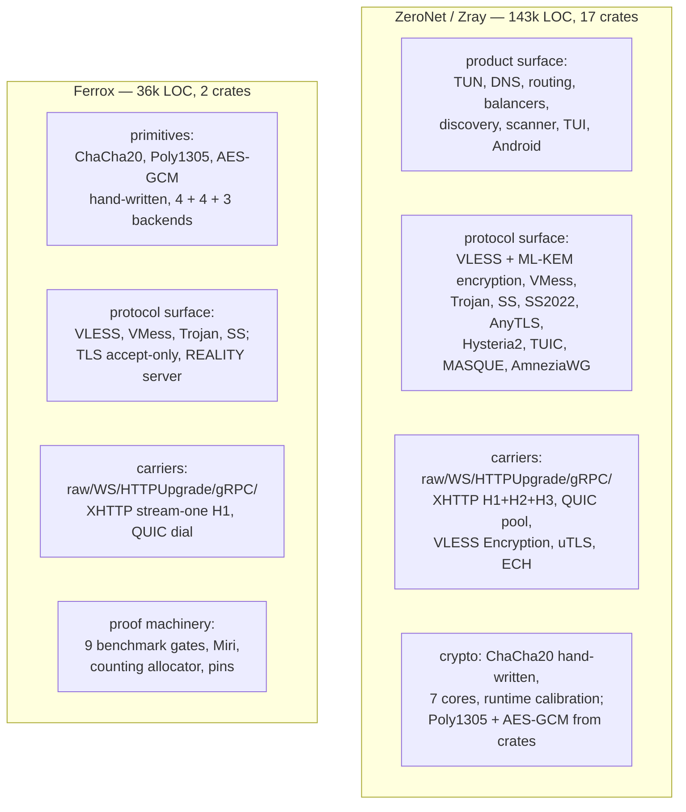

# ZeroNet / Zray compared with Ferrox

Read at the pins, not from memory: ZeroNet at `97a99734` (`upstream/pins.toml`), Ferrox at `4f0dd05`. ZeroNet is **not** a fork of Xray-core or sing-box — no `go.mod`, no Go source, every crate carrying a `PROVENANCE.md`. What it *did* take from Xray-core is three files it names itself: `vless_encryption.rs:11`, `xhttp_request.rs:9`, and the `splithttp` config shape. So this is a comparison of two independent implementations of the same protocols, not a fork relationship.

ZeroNet is a finished product roughly **4× our size** (143k LOC across 17 crates against our 36k across two), shipping a client, a server, a TUI, an Android app and a public scanner. It is further along on everything that is not a cryptographic primitive. We are further along on every cryptographic primitive, and on nothing else. That is the whole comparison in one sentence, and the rest of this page is the evidence.

## 1 — Methods of connection ZeroNet has that we do not

Every row is read from source at the pin, not from a README table. Ours is read from the `match` arms in `proxy.rs`, because — see §6 — our own `Support` registry disagrees with our own code.

### 1.1 Carriers we do not have at all

| method | ZeroNet | Ferrox | notes |
| --- | --- | --- | --- |
| XHTTP `packet-up` over H1/H2/H3 | `zero-transport/src/xhttp.rs:139,198,1457` | **absent** | ours is stream-one only (`xhttp.rs`, 468 lines) |
| XHTTP `stream-up` (split POST/GET legs) over H1/H2/H3 | `xhttp.rs:615,1439,2075` | **absent** | pairs legs by session path, 30 s park window |
| XHTTP `downloadSettings` (separate download endpoint) | `zero-config/src/model.rs:108` | **absent** | wired at `outbound.rs:~900` |
| XHTTP request shaping: padding placement, cookie vs query, `tokenish` search | `xhttp_request.rs` | **absent** | we send a fixed chunked body |
| QUIC connection pool, one auth'd connection per server, `rebind_all()` on migration | `zero-transport/src/quic_pool.rs` | **absent** | we open a fresh QUIC per dial |
| Hysteria 2 | `zero-transport/src/hysteria2.rs` (808 l) | **refusal arm only** (`proxy.rs:354`) | HTTP/3 auth at `https://hysteria/auth`, status 233, QUIC varint target `0x401` |
| TUIC v5 | `zero-transport/src/tuic.rs` (1010 l) | **absent** | AUTH/CONNECT/PACKET/HEARTBEAT, out-of-order datagram reassembly |
| MASQUE CONNECT-IP (RFC 9484) | `zero-transport/src/masque.rs` (1153 l) | **refusal arm only** (`proxy.rs:356`) | `cf-connect-ip`, SPKI pinning, H3 datagrams + H2 DATAGRAM capsules, ECDSA P-256 enrolment |

### 1.2 Protocols we do not have at all

| method | ZeroNet | Ferrox |
| --- | --- | --- |
| VLESS Encryption (`mlkem768x25519plus`, ML-KEM-768 + X25519, 0-RTT ticket) | `zero-protocol/src/vless_encryption.rs`, 1353 l | **absent** |
| Shadowsocks 2022 / SIP022 (`2022-blake3-aes-*-gcm`) | `zero-protocol/src/shadowsocks2022.rs` | **absent** — we have HKDF-SHA1 subkeys only |
| AnyTLS v2 | `zero-protocol/src/anytls.rs` | **absent** |
| AmneziaWG / WireGuard | `zero-protocol/src/amnezia.rs` + `wg_stack.rs` (881 + 1571 l, smoltcp stack above) | **absent** |
| XUDP packet mode | `zero-protocol/src/mux.rs:42-106` | **absent** — we have the mux frames, not the packet mode |
| Shadowsocks plugins (obfs, v2ray-plugin) | **absent** | **absent** — the one protocol row where we match |

### 1.3 Whole subsystems we do not have at all

These are not rows in the superset matrix. They are engines with no cell to sit in.

| subsystem | ZeroNet | Ferrox | what it costs to be absent |
| --- | --- | --- | --- |
| DNS | `zero-dns/`, 4101 l: 9 transports (UDP/TCP/DoT/DoH/H2/DoH3/DoQ/system/FakeDNS), 4096-entry cache with RFC 2308 negative clamping, in-flight coalescing, hedging at 150 ms–1.2 s, `LeakPolicy::Strict`, `lookup_ech_config_list` | **nothing.** `to_socket_addrs()` at `proxy.rs:2674` and nowhere else | a proxy with no DNS cannot pick a clean IP, cannot do FakeDNS, cannot discover ECH, and leaks every query on a filtered network |
| Routing | `zero-router/` + `routing.rs`: ordered first-match rules, 8 selectors, `full:`/`domain:`/`keyword:`/`regexp:`/`geosite:`/`ext:`, hash sets per label + Aho-Corasick + a `Vec<Regex>` (deliberately not `RegexSet`), `IpRanges` as coalesced sorted ranges with binary search, the **inert-rule guard** | **nothing.** `find_outbound()` at `proxy.rs:4575` returns the *first* match and stops | every session takes the same exit; there is no per-domain routing at all |
| Balancers + observatory | `zero-observatory/`: `random`/`roundrobin`/`leastping`/`leastload`, `HealthTable::choose` with `PING_HYSTERESIS_RATIO = 0.2`, EWMA `0.8/0.2`, `record_alive` separated from `record_success`, SplitMix64 ticket before the first sample | **nothing** | no failover; one dead server is one dead client |
| The connection planner | `zero-observatory/src/lib.rs:180-292`: ten ordered `PathStrategy` rungs, climb-on-success / descend-only-after-N, compact `u8` for a lock-free hot path, a `NetworkProfile` that stores capability evidence and never destinations | **nothing** | this is the single most interesting engine in ZeroNet; §4 |
| TUN / tun2socks | `zero-tun/` (4k) + `vendor/netstack-smoltcp` (1603 l, six documented patches): `/dev/net/tun`, macOS `utun` control socket, Wintun by name, Android `VpnService` descriptor adopted never opened, iOS `NEPacketTunnelProvider` | **zero occurrences of `TUN` in `crates/`** | we cannot be a VPN at all. This is Goal 3 and it has not started. |
| Evasion | `zero-evasion/` (2.9k): ClientHello fragmentation in two modes (re-frame into *valid* records, or raw split), UDP noise incl. a plausible QUIC-Initial decoy, keepalive shaping that distinguishes time-triggered from byte-triggered reset, SNI desync via raw IPv4 injection, `RandBetween` reproduced bug-for-bug | **nothing** — the 45 `fingerprint` hits are `UnsafeOptIn::allow_unsafe_fingerprint`, the opposite idea | we are detectable by anyone reading our ClientHello |
| Fingerprints | `zero-security/src/utls_profiles.rs`, 4725 l: ~50 named profiles (`hellochrome_133`, `hellofirefox_148`, `helloios_14`, …) + family aliases + `randomized`, translated into `rustls::client::ClientHelloPlan` | **nothing.** We accept rustls's own ClientHello, so we look like rustls | we fingerprint as a Rust library, which is a fingerprint |
| ECH | `zero-security/src/tls.rs:245-320`, real HPKE via `aws-lc-rs`, SVCB `ech=` discovery through the managed resolver, shaping force-disabled when active (measured: shaping broke every Cloudflare ECH handshake), fails closed when the list is missing | **nothing** | inner SNI is exposed |
| Chaining | `sockopt.dialerProxy` (`model.rs:528`), hop-by-hop `resolve_chain` with loop refusal and `MAX_CHAIN`, `Outbound::chainable()` refusing Mux and QUIC carriers, three-hop loopback test | **nothing.** `Outbound` has one variant per protocol and `find_outbound` returns the first | §7 says chaining is the headline; there is no code for it |
| Sniffing | `zero-core/src/sniff.rs` bounded non-consuming HTTP-Host / TLS-SNI, plus `quic_sniff.rs` decrypting RFC 9001 Initials to recover an SNI on UDP/443 | **nothing** | routing has no input to route on |
| Config compile step | `zero-config` compiles JSON → `RuntimeGeneration` with numeric ids and materialised balancer members, and `Outbound::validate()` rejects impossible protocol/transport/security combinations at compile time via `CarrierCapabilities` | `json.rs`, 319 l, hand-rolled reader; impossible combinations fail at dial time or not at all | a bad config is discovered when the user is already on a filtered network |
| Management API | `zero-runtime/src/api.rs` loopback HTTP: `/stats`, `/health`, `/reload`, `/clean-ip`, `/assets/refresh` | **nothing** | no way to ask a running binary what it is doing |
| Discovery / scanner / crowd | `zero-discovery/` (9.5k) + `zero-scanner/` (9k): feed fetching, edge scanning, Telegram scraping, WARP enrolment, Ed25519-signed rankings, 5 extra binaries | **nothing** | out of scope by intent; noted for completeness |
| TUI / Android / C ABI | `zeronet-tui` (24k), `zray-mobile` (1.9k + hand-written `zray.h`), 103 Kotlin files | **nothing** | out of scope by intent |

### 1.4 Smaller gaps, all verified

| gap | where ZeroNet has it | where we would be |
| --- | --- | --- |
| No `HTTP CONNECT` inbound | `zero-protocol/src/socks.rs`, 995 l, SOCKS5 + HTTP + plain auto-detected by first byte, user/pass auth | **absent.** `head[0] != 5` returns `None` (`proxy.rs:4452`), and the reply is hardcoded `[5, 0]` so there is no RFC 1929 auth either |
| No SOCKS4, no dokodemo, no `redir`/tproxy | `socks.rs`, `model.rs:1469` | **absent** |
| No SS plugins, Hysteria v1, SSH, Naive, ShadowTLS, Snell, Tor, Cloudflared | — | — |
| No `urltest`, `fallback`, `burstObservatory`, `domainStrategy` | — | — |
| No Mux Brutal | — | — |
| UDP cannot follow a chain | refused at `server.rs:3744` | we cannot chain at all |
| Mux is VLESS-only | refused with Vision | ours is reachable from VLESS and VMess |

## 2 — What ZeroNet lacks, and where we are ahead

This is the short list, and it is the list that matters for the primitives.

### 2.1 The primitives: this is our actual advantage

| primitive | ZeroNet | Ferrox |
| --- | --- | --- |
| ChaCha20 | 4083 l hand-written, **7 cores**: portable (1066 l, unrolled), sse1, avx2 (2/4/8 blocks), neon1, neon2, neon4 (1049 l), neon8 — **plus runtime microarchitecture calibration** | 1822 l, **4 backends** through one `Lanes` trait, 1670 l of which is one algorithm instantiated four ways |
| Poly1305 | **the `poly1305` crate** (`zero-protocol/src/chacha20poly1305.rs:13`) | **hand-written**, 2971 l, three limbs of 44/44/42 bits, scalar + NEON 4-way + NEON 2-lane + AVX2, threshold-selected in `absorb()` |
| AES-GCM | **the `aes-gcm` crate** (`shadowsocks.rs:12`, `amnezia.rs`, `vless_encryption.rs:26`) | **hand-written**, `aesgcm/mod.rs` + `x86.rs` (AES-NI + PCLMULQDQ), `x86v.rs` (VAES-256 + VPCLMULQDQ), `arm.rs` (ARMv8 AES + PMULL), runtime probe + crate fallback |
| mKCP / KCP | **nothing.** `find . -iname '*kcp*'` returns empty | `core/kcp/`, **1700 l**: segment, window, connection with tick thread, sending/receiving workers — and a **scripted-clock oracle** diffed against the pinned Go implementation (`scripts/kcp-oracle`) |

The KCP row is the sharpest one. We have a transport ZeroNet does not have at all, and it is the only primitive in either tree with a **cross-language differential proof** — the expected transcript is generated by pinned Go code, checked in, and replayed without Go. ZeroNet has no equivalent for anything.

Three further primitives where we are hand-written and they are not: the `Lanes` trait means our four SIMD backends **cannot disagree about the algorithm**, because they are the same source. ZeroNet's seven cores are seven independent implementations that agree only because tests hold them to it.

### 2.2 The proof machinery

| | ZeroNet | Ferrox |
| --- | --- | --- |
| Bit-identity gate | differential vs `chacha20` 0.9 at boundary-straddling lengths | **3600 shapes per runner** (every byte 0–256, then M-1/M/M+1 per multiple), 2 keys × 6 offsets, on all four runners |
| Allocation gate | `bench/hotpath` counting `GlobalAlloc` — *also counts zero-fills*, same idea | counting `GlobalAlloc`, gate 2, gated at **exactly 0**, counts allocs/bytes/reallocs/zero-fills |
| Timing gate | head vs merge-base, `--gate-regression 5` on whole 95 % intervals | per-length: 235 of 300 lengths, **one regressing length fails the job**, after a re-measure at 4× |
| Miri | **no Miri job** | weekly, on the safe-Rust core, split across six runners, PASS recorded in the README with a next-check date |
| Cross-language oracle | none | KCP against pinned Go |
| Upstream suite conformance | `xray_oracle.rs` against a real `xray` binary, opt-in, "skipping loudly rather than silently passing matters here" | same shape, 2 of 12 pins enabled, `run-upstream-suite.sh` refuses a PASS for a suite with no binary or no seam |
| Fuzzing | **8 libFuzzer targets**, separate workspace | **none** |
| Dependency policy | `deny.toml`, `cargo-deny`, wildcards denied, `sing-box` and `v2ray-rust` banned from the graph | **none** |
| Bench coverage | TLS throughput, CPU/GB, idle RAM, TUN MTU sweep | 9 gates across record, AEAD, AES-GCM, mux, Vision, early data, framing |

The honest reading: ZeroNet has a *broader* test surface (1565 tests, 17 integration suites, 8 fuzz targets, cross-platform CI including `minimum-toolchain`, `apple`, `android-app`) and we have a *deeper* one on a narrower claim. 296 of our tests against their 1565, and ours are all inline `#[cfg(test)]` — **we have no integration-test directory at all**, while they have 17 files under `crates/zero-runtime/tests/` including `reload_under_load.rs`, `graceful_drain.rs`, `dead_tunnel_counters.rs`, `censorship_response.rs`. Those are behavioural properties we cannot currently state.

### 2.3 Three specific things we do that ZeroNet does not

1. **mKCP**, with a cross-language oracle. ZeroNet: none.
2. **Poly1305 and AES-GCM hand-written.** ZeroNet takes both from crates. On aarch64 — where ZeroNet ships `smoltcp` at `-O3` inside an `-Os` binary and hand-writes ChaCha20 *precisely because* LLVM will not unroll or inline `#[target_feature]` helpers at `-Os` — taking Poly1305 from a crate is the same trap they already documented and then walked into twice.
3. **`META_MAX = 781`, not 512.** `mux.rs:127` documents the actual upstream bug: an Xray writer can emit 781 bytes of metadata and its own reader drops anything above 512, so a reverse-mux peer with long domains is disconnected by the reader for a frame its own writer made. ZeroNet hardcodes `MAX_METADATA = 512` (`mux.rs:40`) — it has the bug.

## 3 — What ZeroNet implemented better than us

Beyond the missing subsystems in §1, these are places where their *engineering* is better than ours on the same problem.

**Their failure taxonomy.** `zero-core/src/error.rs` types a failure as `Stage` × `FailureKind` × `Confidence`, and `Stage::is_useful_progress()` says a stage only counts once `FirstByteReceived`. The doc comment is the argument: *"a TCP handshake completing means almost nothing on a filtered network."* We carry `std::io::Error` and a `DIAL_TIMEOUT` (`proxy.rs:164`). Their ladder is what makes automatic recovery possible at all; ours cannot distinguish "this network drops QUIC" from "this server is down" from "this path dies after N bytes."

**Their buffer growth policy.** `zero-runtime/src/relay.rs:18-32`: start at 16 KiB, promote to 64 KiB only once a read *fills* the small buffer — the flow has shown it is bulk. 128 KiB was tried and rejected ("no measurable throughput, made every busy connection cost 256 KiB"). Ours is a fixed buffer per relay with no promotion and no pools.

**Their allocator policy.** `tune_allocator()`: `mallopt(M_MMAP_THRESHOLD, 64 KiB)` so per-connection buffers return to the OS, `mallopt(M_ARENA_MAX, 1)` because 300 connections through TUN × 6 went 37 → 136 MB. They measured the cliff and named the number.

**Their netstack window.** `TCP_WINDOW = 64 KiB` because smoltcp's default is ~320 KB × 4 buffers = **1.3 MB per flow**, and six vendored patches took it to ~192 KB. We have no device, so this is a lesson rather than a fix.

**Their ONEI-block calibration.** `chacha20/mod.rs:296-340`: Apple silicon prefers SIMD (~1.11×), Neoverse N1 prefers scalar (~1.6×), **nothing in CPUID distinguishes them**, so it measures at runtime and memoises in an `AtomicU8`, with ties within 5 % going to the architecture-neutral core. We dispatch on `is_x86_feature_detected!` and on a cfg, and our README already documents that `chacha 0.9.1` selects NEON behind a cfg nothing sets — the same microarchitecture trap, diagnosed on the *reference* and not on our own ladder.

**Their relay is one future.** `relay.rs:380`: no `tokio::io::split`, no `tokio::sync::Mutex`. Ours has `relay_sink`, `relay_carried`, `relay_sink_drained`, `relay_carried_drained` — four near-duplicate relays, one per call shape.

**Their keepalive is carrier-aware.** `zero-evasion/src/keepalive.rs`, 819 l: distinguishes *time*-triggered from *byte*-triggered resets, and the no-op frame is supplied by the carrier (WS Ping, Mux KeepAlive, nothing at all) because *"inventing padding bytes for a carrier with no no-op frame would corrupt the tunnel."* We have no keepalive shaping.

**Their ECH/shaping interaction is measured, not assumed.** They turned shaping *off* when ECH is active because shaping "broke every ECH handshake with Cloudflare," and failed closed rather than leaking the inner SNI. That is the right shape for a decision: a measurement, a named consequence, and a fail-closed default.

**Their build is `-Os` with per-crate exceptions.** `[profile.release]` is `opt-level = "s"`, and `smoltcp`, `netstack-smoltcp` and `zero-tun` are individually raised to 3 with the reason recorded. We build everything at 3. Their reasoning — that a size target is a real product constraint on mobile and that the hot path should be named rather than assumed — is better than our uniform 3.

**Their generated capability table.** `protocol-support.md` is generated from `zbench/caps.py` and **CI fails when it is out of date**, and every row says which of four cores has it. We have three hand-written matrices (§6).

## 4 — What we can learn from ZeroNet's engine

Ordered by leverage against what we already have. Each names the file to read and what would have to be true for us to have it.

### 4.1 Type the failures before building the planner — **landed**

Read `zero-core/src/error.rs` and `zero-observatory/src/lib.rs:180-292`. The engine is: every dial attempt reports `(Stage, FailureKind, Confidence)`; a planner holds ten ordered `PathStrategy` rungs; it climbs on success and descends only after N successes at a rung; the encoding is a compact `u8` so the runtime's hot path stays lock-free; and the stored `NetworkProfile` *"stores capability evidence, never destinations."*

**Done, as `crates/ferrox-core/src/failure.rs`.** `Stage` (six rungs, `is_useful_progress` at `FirstByte`), `Kind` (six, coarsened onto what every platform's `io::Error` actually reports), `Confidence` (two, not three), and `Failure` with `worth_retrying()`. `proxy.rs`'s `dial` returns `Result<_, Failure>` and one `dial_or_report` wrapper counts and prints, so the eleven arms that dropped the error on the floor now say why.

Smaller than theirs on purpose, and the reason is in the module docs: **their thirty-odd `Kind` variants name decisions this core cannot make yet.** A `DnsTimeout` here would name a stage no caller in this tree can reach, because there is no resolver — `vless.rs` and `proxy.rs` hand a name to `to_socket_addrs`. Carrying the variants anyway would be dead weight; the next slice that lands a resolver adds what its own decisions need, with tests. Their `Confidence::Likely` is gone for the same reason: nothing here acts differently on "probably interference".

The planner itself is still the open part. It needs a resolver and a balancer, and neither exists.

### 4.2 Steal the calibration — **landed**

Read `zero-protocol/src/chacha20/mod.rs:296-345`. Their insight is that the *one-block* rung is a microarchitecture property, not an ISA property, and that Apple silicon and Neoverse N1 want opposite answers for the same instruction set: the vector rotates sit between every pair of rounds on the critical path, so a core without a second vector pipe to overlap them with pays for them in latency. Nothing in CPUID distinguishes those machines.

**Done, as `crates/ferrox-core/src/chacha/calibrate.rs`.** Their seven cores measure against each other; ours measures two instantiations of the *same* generic function, so a disagreement is impossible by construction and the calibration can only pick between two correct cores.

Two of our own decisions, not theirs:

- **It is its own file, and the leak-surface gate has a named path exception for it** (alongside `kcp/`). A clock read in a function a caller believes is deterministic is a surprise, and the exception has to be narrow enough that the next one still fails. The reason it is safe is the reason `kcp/`'s is: the timing cannot reach the output.
- **The tie goes to the scalar core** (within 5%), not to SIMD. Scalar is the architecture-neutral core and the one Miri interprets, so a tie picks the one whose correctness argument is machine-checked.

### 4.3 Adopt relay buffer promotion — **landed**

Read `zero-runtime/src/relay.rs:18-32`. Their rule: *start at 16 KiB, promote to 64 KiB only once a read fills the small one completely, i.e. once the flow has shown it is a bulk transfer.* 128 KiB was tried and rejected there.

**Done, as `proxy::RelayBuf`, on our own 256 KiB constant rather than their 64.** The promotion fires on a read that filled the buffer, because a short read means the peer had less than a buffer's worth to say — a flow that never fills one has not been bulk. One-way: a short read afterwards does not shrink it.

Two things worth recording about doing it here rather than copying it:

- **Their `promote` uses `reserve`; ours uses `resize`.** `resize` zeroes the 240 KiB it adds and the next read overwrites all of it, which is a real `memset` — but the alternative is `set_len` on memory nothing initialised, and the `unsafe` block's proof obligation ("every byte a later read returns is initialised") buys at most 240 KiB on a flow about to move 256 KiB. The safe form wins the tie, which is what `policy.rs` asks for.
- **The number is ours.** Their promotion ceiling is 64 KiB because their bulk buffer is 64. Ours is 256, measured in gate 5 at 1.36x over `io::copy`'s 8 KiB. A promotion to a constant they do not use is the actual difference between reading their idea and porting their code.

Still open from the same section: `ReadBuffer`/`WriteBuffer` (their `io_util.rs`), which one reusable buffer would give us in the stream layer, and the two pools.

### 4.4 ~~Collapse four relays into one~~ — **wrong; they are already one**

**This recommendation was wrong and reading our own tree said so.** The four functions are not four copies: `relay_sink` and `relay_sink_drained` are two thin wrappers over `relay_ordered::<R, W, F, const CLOSE_FIRST: bool>`, one loop whose two teardown orders are a `const` parameter rather than a runtime flag, and `relay_carried` is a genuinely different body because it writes to a raw `TcpStream` rather than a `CarrierSink`. The module even carries the codegen measurement proving the `const` emits two separate functions rather than a branch.

What was actually there is §4.3's second half: `RELAY_BUFFER` is 256 KiB per direction, and the constant's own doc comment names the consequence — *512 KiB per flow that `io::copy` would have held 16 KiB of*, which at a thousand flows is 512 MiB against 16 MiB. That is the fix, and it is ZeroNet's promotion idea applied to our own measured constant.

### 4.5 Compile the config, validate combinations at compile time

Read `zero-config/src/model.rs:44-83, 1085-1424`. `CarrierCapabilities` plus `Outbound::validate()` refuse impossible combinations before a session exists, and `RuntimeGeneration` assigns numeric ids and materialises balancer members once so *"request handling never has to scan configuration strings."*

Our `json.rs` is 319 lines and our `find_outbound` compares protocol strings at request time. Two concrete consequences for us: a config naming several proxies silently resolves to the first, and an impossible combination is discovered at dial time — on a filtered network, which is the worst possible moment.

### 4.6 Fix our three disagreeing capability tables — **landed**

See §5. Their `protocol-support.md` is generated and CI-fails when stale; ours had three hand-written tables that contradicted each other and the code, and `Support` was the one `cmd_run` gates on, so `run 'vless://…ws…'` exited 3 on a carrier that works.

**Done, as `TransportKind::is_dialled`** — one `const` predicate that `VlessLink::support` and `ferrox-bench`'s `methods.rs` both read, plus `TransportKind::ALL` and a test in `failure::tests` that walks all eleven kinds asserting each is either dialled or `Planned` with a non-empty reason. The superset property is now an assertion: **a blank cell fails a unit test** rather than reaching a report.

### 4.7 `deny.toml` — **landed**; fuzzing — **landed differently**

`deny.toml` + `deps.yml` + `scripts/check-dependency-policy.sh` (which `ci.yml` and `check.sh` both run). The bans on `sing-box` and `v2ray-rust` are a licensing decision as much as a supply-chain one: sing-box is GPL-3.0, so a dependency on it would put a copyleft obligation on code this tree claims is `MIT OR Apache-2.0`. Comparators are read at their pins under `upstream/`, never linked.

**The fuzzing recommendation was wrong about the tool.** `cargo-fuzz` needs a nightly toolchain and a second workspace, and eight targets behind it are eight targets that run on a schedule rather than on every commit. What shipped instead is deterministic seeded corpora that need neither: `crates/ferrox-core/tests/parsers.rs` over `mux::decode`, `VlessLink::parse`, `Addr::take` and `EarlyData::split`, plus a corpus inside `json.rs` for the config reader — SplitMix64, a printed seed so a red run replays anywhere, no `proptest` and no dev-dependency.

Two properties worth more than "did not panic":

- `mux_decode_never_consumes_past_its_input` — an `Ok` whose consumed count exceeds its input has told the caller to read memory it does not own. That is *the* bug a length-prefixed parser has that a fixed-size one cannot.
- `Addr::take` is **exhaustive**, not random: 256 family bytes × every length, because the interesting cases sit at a boundary a sampler misses.

That is a weaker guarantee than a fuzz target on purpose — coverage that is guaranteed to run beats coverage that is better when it runs at all.

### 4.8 Adopt the per-package `opt-level` escape hatch

`[profile.release.package.X] opt-level = 3`. We build uniformly at 3 and have no mobile target, so there is nothing to do *today* — but the mechanism is worth having before Goal 3 lands, because `smoltcp` in an `-Os` binary is precisely the trap ZeroNet documented and then had to patch around six times.

### 4.9 The `META_MAX` bug is a conformance divergence we get free

Their `MAX_METADATA = 512` vs our 781 (`core/mux.rs:127`). We are right and they have the bug — but only because someone here read the upstream writer. This belongs in `docs/config-compatibility.md`-equivalent notes, because a 512-byte reader disconnecting long-domain reverse-mux peers is a real interop failure that a conformance run would surface and a hand-written table never would.

## 5 — Two findings from reading ours that are not in the comparison

**`Support` is stale and it is what `main.rs` prints.** `crates/ferrox-core/src/vless.rs:203-233` reports exactly two methods as `Implemented` — `vless-tcp-reality-vision` and `vless-tcp-none`. `planned_reason()` (`vless.rs:655-683`) returns *"scheduled after tcp-tls"* for `ws`, `xhttp`, `grpc` and `httpupgrade`. But `proxy.rs` has working `match` arms for all of them, and `transport.rs:19-26` claims rows 5–12 implemented. `ferrox-bench/src/methods.rs:64-84` is a **third** table, disagreeing with both. `cmd_run` (`main.rs:88-92`) gates on `support()`, so `cargo run -p ferrox-app -- run 'vless://…ws…'` exits 3 while the carrier works. The code is the truth; the registry is a stale copy of an earlier plan.

**`transport.rs:21` says Shadowsocks has "no `UDP`".** It has `serve_udp` and `serve_udp_on`, and they are tested. One of the three tables is wrong in the same direction as the other two.

Both are the argument for §4.6: generate the table, fail CI when it drifts.

## 6 — Recommendation, and what happened to it

ZeroNet is not a target to be matched feature-for-feature. It is 4× larger, it ships a scanner and an Android app we will never build, and §1.3 lists a dozen subsystems that are *product*, not *engine*. Matching it would be a worse use of this tree than having the capability — which is what the README already says about quiche and slipstream.

What it is, precisely: **a map of what a complete proxy core turns out to need**, assembled by someone who had to make all of it work on a filtered network. Read as a checklist, not as a competitor.

The ordering that followed from leverage, and where each landed:

| # | item | § | verdict |
| --- | --- | --- | --- |
| 1 | Type the failures | 4.1 | landed — `ferrox-core/src/failure.rs`, `dial` returns `Failure`, one reporting wrapper |
| 2 | Fix the capability tables | 4.6, 5 | landed — one `const` predicate, all eleven kinds asserted |
| 3 | Relay buffer promotion | 4.3 | landed — `RelayBuf`, 16 KiB until a read fills it |
| 4 | Calibrate the one-block rung | 4.2 | landed — `chacha/calibrate.rs`, own leak-surface exception |
| 5 | `deny.toml` + fuzzing | 4.7 | landed, both differently than recommended — see §4.7 |
| — | Collapse the relays | 4.4 | **wrong.** They were already one loop with a `const` teardown parameter. |

Two of the seven recommendations were wrong on contact with our own tree, and both were wrong the same way: they described a duplication that a previous slice had already removed. That is worth recording, because the failure mode was not misreading ZeroNet — it was describing `proxy.rs` from `docs/` rather than from the source.

Still open, in the order it should be taken:

- **The planner** (§4.1). Needs a resolver and a balancer; neither exists. It is Goal 2's last unblocked row.
- **`ReadBuffer`/`WriteBuffer` and the two pools** (§4.3). The stream layer, not the primitives — our counting allocator already proves the property for the record layer.
- **A resolver.** Every §1 subsystem that needs DNS is waiting on one, and the failure taxonomy deliberately has no `DnsTimeout` variant for it.

And one thing not to copy: their `-Os` release profile. It is right for a mobile product with a size budget and wrong for a tree whose only claim is speed. Take the per-package escape hatch (§4.8); leave the default alone.